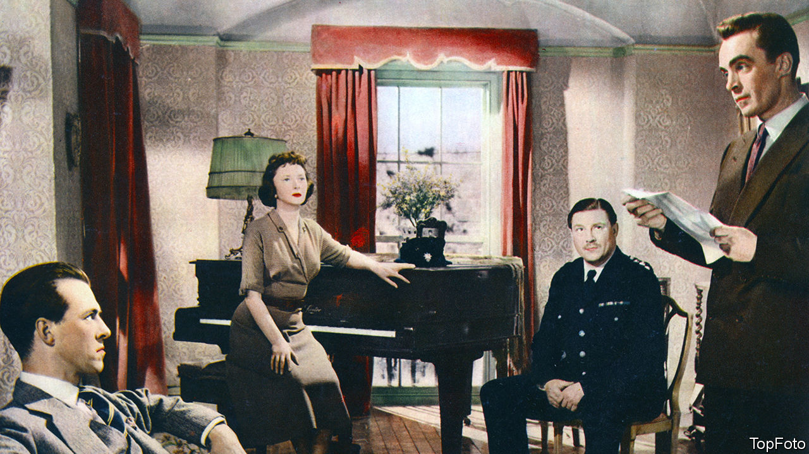

###### Home Entertainment

# Josephine Tey’s crime capers probed the dark side of human nature 

##### She is an overlooked star of the golden age of detective fiction 

 

> Nov 3rd 2022 

During the golden age of detective fiction in the early 20th century, four writers dominated the genre: Margery Allingham, Ngaio Marsh, Dorothy Sayers and the “queen of crime” herself, . Another novelist of this era was Josephine Tey—ranked by her biographer, Jennifer Morag Henderson, as “number Five to the Big Four”. In 1929-52 Tey (the pen name of Elizabeth MacKintosh) published a series of six meticulously crafted detective novels. “I had no intention of writing one”, she said, “but one night an idea struck with such force that it hurt.” 

Tey’s pain proved to be readers’ gain. Her debut, “The Man in the Queue”, was a critical and commercial success. It introduced Inspector Grant of Scotland Yard, whose intuition, ingenuity and perseverance help him to crack the most fiendish cases. In one book Grant’s superior says he has “the most priceless of all attributes for his job: flair”. In another tale Grant catches a culprit based on a small brown fleck in the iris of their left eye.

Three of Tey’s books have just been reissued by Penguin: all are thick with mystery and show a great mind at work. “The Franchise Affair”, published in 1948 and adapted into a film three years later (pictured), begins with a missing teenager. When she turns up again, distressed and exhausted, she explains how she fled a mother and daughter who locked her up and tried to make a servant of her. The girl’s version of events ruins reputations. But then her story begins to unravel.

“To Love and Be Wise” (1950) revolves around another disappearance. Leslie Searle, a Hollywood photographer, vanishes from an English village that is home to many writers and artists. Grant arrives to determine whether a crime has been committed and quickly finds himself sifting alibis, collecting clues and taking stock of the residents’ jealousies, grievances and other “subterranean tremors”.

And then there is Tey’s masterpiece, “The Daughter of Time” (1951), once voted the greatest crime novel ever written by the Crime Writers’ Association. On this occasion, Grant is out of action, recuperating from a broken leg. To relieve his boredom, he turns his attention to a very cold case, that concerning . Did the last Plantagenet king really murder his two nephews in the Tower of London? Grant combs through the centuries-old evidence, separating fact from myth to work out whether this infamous villain could in fact be an innocent victim. 

MacKintosh also achieved literary acclaim under another pseudonym, Gordon Daviot, and her first play, “Richard of Bordeaux”, launched the career of . However, it is as Tey, and for her detective novels, that she is remembered today. They endure because of their keen psychological insight into the complexity of human nature. “The Franchise Affair” presents a captivating portrait of a chilling villain. “To Love and Be Wise” probes themes of identity and gender. And “The Daughter of Time” covers new ground through its use of history and its original ending: the antithesis of a neatly resolved drawing-room denouement. ■

