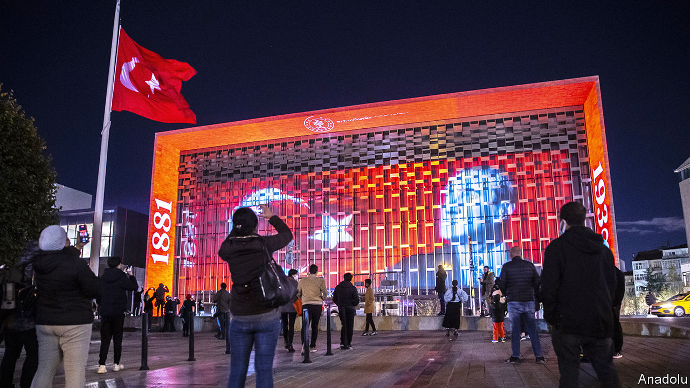

###### Building his case

# Recep Tayyip Erdogan has given Istanbul a controversial makeover 

##### His vision for a “New Turkey” is reflected in his transformation of the country’s biggest city 

 

> Nov 3rd 2022 

THE ATATURK Cultural Centre (AKM), initially known as the Palace of Culture, was the talk of the town when it opened in 1969. Seated on the edge of Taksim Square, in the heart of Istanbul’s entertainment district, the building was considered a shrine to modernity and to the man after whom it was later named, . But in late 1970 the AKM partially burned down. After years of neglect, it was demolished on the orders of Turkey’s president, Recep Tayyip Erdogan. Many feared the worst when Mr Erdogan vowed to build a “baroque” opera house in its place.

They heaved a sigh of relief when the new centre (pictured), costing $200m, opened last year. From the outside the building seems less a homage to its predecessor than an oversize replica (it was designed by the son of the architect responsible for the previous building). What sets it apart is a 2,000-seat opera hall housed inside an enormous globe in the atrium; its outer shell, covered with thousands of crimson ceramic tiles, glows like a setting sun over Taksim. The surrounding complex includes a theatre, a gallery, a cinema and a large number of cafés.

Modern Turkey, the state Ataturk salvaged from the ruins of the Ottoman Empire, celebrates its centenary in 2023. To set the stage for the festivities, Mr Erdogan has given a makeover to the country’s biggest city, the ancient home of the Ottomans (and the Byzantines before them). Yet the transformation he has wrought has less to do with celebrating Istanbul’s or Ataturk’s legacy than with consolidating his own.

Mr Erdogan considers himself the founder of a “New Turkey”, a more confident, more independent and more religious incarnation of the country he was elected to govern two decades ago. New Turkey means restoring the country to the position of greatness he believes it was destined to occupy. Mr Erdogan has used architecture to hammer the point home. He has already presided over several : a new airport, costing $11bn, on the outskirts of Istanbul, which he hopes will become the world’s biggest; the country’s largest mosque ($100m), on the city’s Asian shore; and a 1,100-room palace in Ankara ($615m), in which he resides. His most recent project is a —a 45-kilometre canal that would connect the Black and Marmara seas and turn much of Istanbul into an island.

He has also made a mark on Istanbul’s downtown, Taksim Square in particular. Over the past century, successive governments and other political forces have fought over Taksim, seeking to remodel, reorder and claim the space as their own. Mr Erdogan has done so by building a huge mosque across from the AKM, delivering on a promise he made when he was mayor of Istanbul in the 1990s. A swathe of concrete spreads between the two buildings, spilling onto the edge of Gezi Park, the centre of mass protests which rocked Turkey a decade ago. The park, which Mr Erdogan wanted to replace with a replica Ottoman army barracks and a shopping mall, survives. But the area around it, ostensibly designed for pedestrians, now looks more suitable for a military parade than an idle stroll.

Down the hill from Taksim, a $1.7bn revitalisation project, dubbed Galataport, has transformed the city’s neglected port district into a swanky shopping centre and cruise terminal. One of the victims of the development (or beneficiaries, depending on whom you ask) is the Istanbul Modern, the city’s main contemporary-art museum. The old home of the Modern, a repurposed warehouse by the Bosporus, has been demolished. The new one, designed by Renzo Piano to resemble stacks of shipping containers, was expected to open in time for this year’s Istanbul Biennial, an art show which began on September 17th. Work is still under way.

The day your correspondent turned up, the new Modern’s façade, intended to reflect the waters of the Bosporus, reflected instead a 135,000-tonne cruise ship docked opposite the museum. A second ship, also the size of a small town, was parked directly behind. Visitors are meant to take in views of the Bosporus from the restored waterfront promenade; thanks to the boats, they could not see the strait at all.

The  in 2013 began as an attempt to stop the controversial projects Mr Erdogan had in store for the city. The demonstrations were smothered by force. Istanbul’s “contested urban public spaces”, ironically the focus of that year’s biennial, are no longer contested: a decade later, Mr Erdogan’s vision has prevailed. 

Scores of buildings have gone up, and scores have come crashing down, with no public consultation and no concern for local communities, says Murat Guvenc, head of the Istanbul Studies Centre at Kadir Has University. Some say opportunities have been wasted. Galataport could have been one of the city’s most important and inclusive public spaces, argues Yasar Adnan Adanali, an urban planner. “Instead, they built it up as much as they could, into an exclusive cruise port and yet another shopping-mall project.”

Construction criticism

Istanbul is not ageing with grace. Since 2000 its population has ballooned from 11m to nearly 16m. The city may continue to charm tourists. On a clear day, the Hagia Sophia and the Blue Mosque, framed by the slopes of Mount Uludag and the shimmering Sea of Marmara, still beguile. But for residents, Istanbul has turned into a permanent building site choked with traffic; less the city of the world’s desire than of the two-hour commute. 

This year the Economist Intelligence Unit, a sister company of , ranked Istanbul as the . In a separate survey of the world’s greenest cities, Istanbul took last place. Mr Erdogan’s projects are not wholly to blame; indeed some, such as the new AKM, are to be welcomed. But what Istanbul needs, more than shopping malls or mega mosques, is some room to breathe. ■

