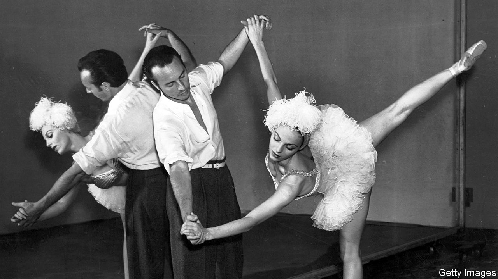

###### Contemporary ballet

# The life and times of George Balanchine 

##### The famous choreographer was innovative but tyrannical, a new biography shows 

 

> Nov 3rd 2022 

By Jennifer Homans. 

The first part of “Mr B”, Jennifer Homans’s engrossing (and occasionally exhausting) biography of George Balanchine, is a journey across the political and cultural landscape of the early 20th century. He came of age as a dancer and choreographer in , when the city was convulsed by revolution. Balanchine fled west and plunged into the avant-garde scene first in Weimar Berlin, then in Paris, where he joined Sergei Diaghilev’s famous company, Ballets Russes

In 1933, with what Ms Homans calls “an instinct for countries and continents in collapse”, he accepted an invitation from Lincoln Kirstein, a writer and future patron, to join him . There, he took on the Herculean task of elevating the art of dance and stirring up popular interest in the subject. In 1934 he helped to set up the School of American Ballet and in 1948 he co-founded the .

There are few major cultural figures that Balanchine did not encounter. During his career he profited from the talents of composers such as Sergei Prokofiev, Richard Rodgers and Igor Stravinsky, and writers including Bertolt Brecht and Jean Cocteau. He worked with visual artists, too, notably André Derain, Henri Matisse and Pablo Picasso. Many of these collaborations gave rise to masterpieces, as when he joined up with Stravinsky on “Apollon Musagète”, “Orpheus” and “Agon”. Others proved less happy. Working with Prokofiev on “Prodigal Son”, he clashed with the composer, who condemned Balanchine’s choreography as “indecent”. (For his part, Balanchine sneered that Prokofiev “wanted the ‘Prodigal’ to look like ‘Rigoletto’.”)

If the early chapters of the book brim with incident, the pace slows when Ms Homans focuses on the technical details of Balanchine’s craft and the messy specifics of his personal life. Fortunately, she has a gift for evoking not only the grace of ballet but also the demands of the discipline. His choreography for Hindemith’s “The Four Temperaments”, for example, required dancers to “climb in and out of their own movements, squatting, skittering, backs humped with effort”. The foundation of Balanchine’s art was the classical tradition he learned at the Imperial Theatre School in St Petersburg, but he introduced new movements and patterns—sometimes jarring, always expressive—in response to the mood of the music.

There is still drama in these later sections, but instead of revolution and world war it is the drama of ambition realised and thwarted, of professional triumph and jealousy, along with countless romantic entanglements. For Balanchine, dance was inextricably bound up with love and sex. “Everything a man does”, Balanchine said, “he does for his ideal woman.” His preference was for much younger women; in a statement both troubling and pathetic, he lamented that “the history of man over 40 is ‘Lolita’.”

Balanchine was a difficult boss. He could be generous—particularly with money, which he spent and gave away freely—but also petty and tyrannical. He created tensions in the company when he lavished attention on his latest favourite and shunted others aside. When his futile pursuit of Suzanne Farrell caused Balanchine to lose focus, one of her colleagues confronted her: “Things are falling apart, why don’t you just sleep with him?” 

Ms Homans doesn’t look away from the darker side of Balanchine’s character, but is willing to forgive him for the sake of his genius. “He existed to make dances, that’s all,” she writes—a verdict that redeems, if it does not excuse, his many sins. She offers a poignant, fully rounded portrait of a fascinating man and a revelatory account of the art to which he dedicated his life. ■

