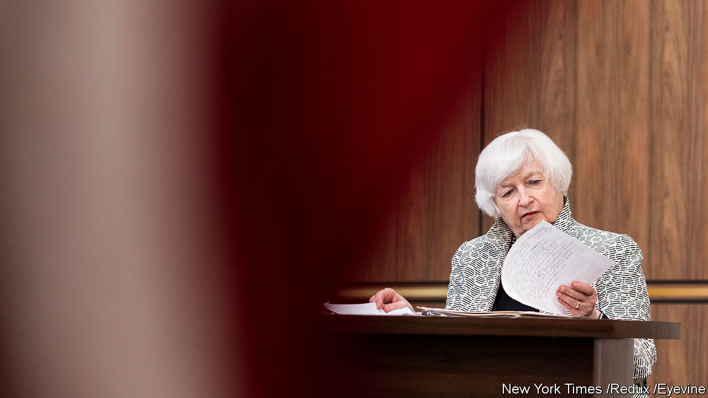

###### She make money moves

# Two new biographies explore the rise and reign of Janet Yellen 

##### America’s treasury secretary is known for her meticulousness and “moral passion” 

 

> Nov 3rd 2022 

 By Jon Hilsenrath. 

 Owen Ullmann.

Janet Yellen has a strong claim to being the world’s most powerful woman of the past quarter-century. In the late 1990s she led the Council of Economic Advisers in Bill Clinton’s administration. In the 2000s she held a series of positions within the Federal Reserve before ascending to its apex as chair in 2014. Over the past two years she has . She is the only person to have served in all three of these roles, and has spent decades wielding influence over the American and, by extension, global economy.

Perhaps the most striking feature of all her power is how little it has changed her, a wonkish economist with a moral compass. Ms Yellen is esteemed by peers and subordinates alike as a fundamentally decent person, committed to the value of public service. She has remained scrupulously faithful to evidence, not ideology—sometimes to the detriment of her career, at least temporarily. And she seems determined not to play political games in Washington, that most political of cities.

Two new biographies ask the questions of how the unassuming Ms Yellen managed to rise so far and what she has accomplished. “Yellen”, by Jon Hilsenrath of the , traces not just her arc but also that of her husband, , a fellow economist and a Nobel laureate. It is an elegant and erudite depiction of their intellectual voyages in pursuit of the idea that markets can fail and that sensible government action can improve people’s lives. That might seem banal but, when they started out, it was a controversial pushback against the laissez-faire creed that had swept through economic theory in the 1970s. “Empathy Economics” by Owen Ullmann, a veteran journalist, is a more straightforward, pacey account of Ms Yellen’s trajectory, full of reflections from colleagues and friends.

What, then, are the ingredients of Ms Yellen’s formidable career? One thing that stands out, known to all around her, is her consummate planning for tasks big and small. She arrives at the airport hours ahead of flights and is often the first person in the departure lounge. Before providing her official signature for paper currency as treasury secretary, she reviewed the scribbles of those who had preceded her and practised hers again and again. As Fed chair, she would take three days to get ready for quarterly news conferences, asking staff to throw every conceivable question at her. A little fastidious, perhaps. Yet in the male-dominated world of economics, Ms Yellen has thrived by being the best prepared and usually the most knowledgeable person at the table.

Ms Yellen is driven by what she herself has called “moral passion”. It is the view that economics—properly analysed and applied—makes the world a better place. Her primary focus, both as an academic and as a policymaker, has been on how to reduce unemployment. “These are fucking people!” she exclaimed once at the Fed during an abstract discussion about joblessness. She is also known for her integrity, exemplified by a speech she gave as Fed chair in 2017 defending tough regulation of banks, risking the ire of Donald Trump’s advisers who were seeking to water down rules. That, plus Mr Trump’s apparent view that the diminutive Ms Yellen did not look the part of a central banker, sealed her fate: he declined to renew her for a second term at the Fed’s helm.

But that same integrity, combined with her powerful intellect, is what allowed her to re-emerge as Joe Biden’s treasury secretary—just when she thought she was done with public life. She has at times seemed to be on the margins of his cabinet. On a few crucial issues, though, she has shone. With a flair for diplomacy, she brought more than 130 countries together last year in a deal to establish a  around the world (alas, international agreement has proved easier than assent from Congress).

Ms Yellen has a knack for being right about the big picture. She was early in detecting signs of recklessness in the American housing market in the 2000s, even if she later faulted herself for not grasping the enormity of the problem. In the early 2010s she was adamant, correctly, that the central bank should stick to very loose policy to propel the economy’s sputtering recovery. The darkest blot on her record was her support for the stimulus package that Mr Biden introduced at the start of his presidency, which ended up adding fuel to inflation. Ms Yellen had initially been uncomfortable with the size of the stimulus, though she eventually defended it.

Ms Yellen granted considerable access to both writers, but there are gaps to fill in each account. The books hint at her immense frustrations in dealing with Mr Trump. They also refer to her being sidelined from time to time by both the Clinton and Biden administrations. Given her attention to detail, it is reasonable to assume that Ms Yellen has copious notes on all of this. Rumours abound that she may step down soon from the Treasury. That would be America’s loss, yet one good thing might come of it: getting her story in her own words. ■

