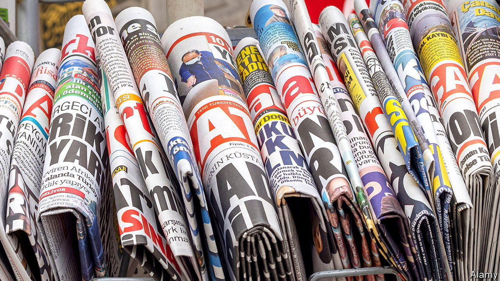

###### Fake news and censorship

# As Turkey imposes a harsh “disinformation” law, critics fear the worst 

##### The government says it is necessary to fight the spread of fake news on social media 

 

> Nov 3rd 2022 

Turkish journalists are used to working under political pressure. Now, the rest of the country is feeling it too. A new media law passed last month criminalises the sharing of “fake news”, with punishments of up to three years in prison, and 18 months more if the news has been shared anonymously.

The government says that the law is necessary to fight the spread of disinformation on social-media platforms. Other countries, including Germany and America, are also considering legislation to hold the platforms to account. But opponents say that Turkey’s law is aimed solely at chilling criticism of President Recep Tayyip Erdogan’s regime, seven months ahead of  that will be the toughest he has faced in his two decades in power.

“It is upside-down,” said Taylan Yildiz, a former Silicon Valley tech worker and member of the opposition Iyi party. “The whole world is speaking about regulating social-media companies. But in Turkey the law targets individuals.” 

Turkey is already one of the world’s biggest jailers of journalists and dissidents. Those imprisoned are usually accused of falling foul of broad anti-terror laws, or of insulting the president. Once-independent newspapers and television channels have been forcibly closed or sold to pro-Erdogan businessmen. 

In recent years many ousted journalists have regrouped on social-media sites, podcasts and YouTube channels, where they find a wide audience: nine in ten Turks use at least one social-media platform. In 2020 the government  requiring the biggest sites to appoint representatives in Turkey, who would be answerable in legal cases and to regulators’ requests to remove content. Many platforms, including YouTube, Facebook and TikTok, have complied with this.

The new law extends the onus on the platforms to hand over information on users and broadens penalties for non-compliance, including throttling the bandwidth of sites. That means that social-media access could be severely limited by election day, although previous blocks on Wikipedia and Twitter meant little for tech-savvy Turks, who simply switched on their VPNs.

It is not only journalists who are worried about the new law. Independent economists and pollsters are concerned that they will be liable to prosecution when their findings contradict official data on inflation and public opinion. Private citizens are in the firing-line too—merely sharing or liking someone else’s post can now lead to prosecution. An army of bureaucrats in the presidency’s communications office combs through social media for critical content.

The irony, Turkish press unions say, is that the biggest producers of fake news are the pro-government outlets, which parrot official statements and run smear campaigns against opponents. One of the largest media groups is owned by relatives of the president. 

“When the disinformation is coming from politicians, will they be prosecuted as journalists and citizens are? We know that the answer is ‘no’,” said Gokhan Durmus, the president of the Turkish Journalists’ Union. “The government calls it the disinformation law, but from the start we have been saying it is a censorship law.” ■

