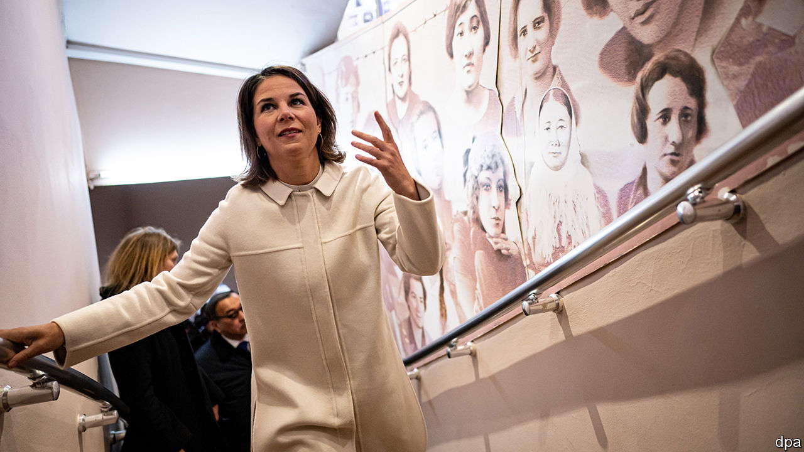
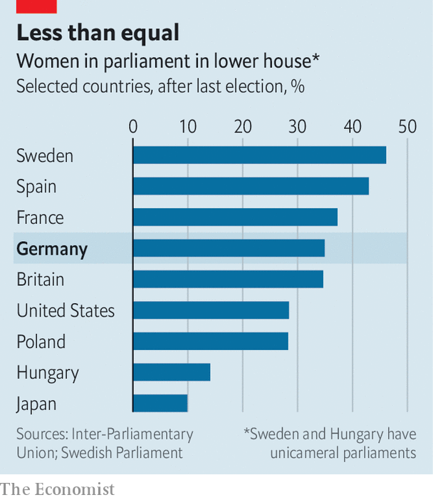

###### Women in German politics

# Germany’s parliament is more female than it was 

##### But parity is still a long way off 

 

> Nov 3rd 2022 

“A political man is disgusting, but a political woman is appalling…In history there are no more cruel phenomena than political women,” wrote Richard Wagner to Franz Liszt, his fellow composer, about Ortrud, the sorceress in his opera “Lohengrin”. Wagner was a misogynist and an anti-Semite as well as a musical genius, but he was not alone in his dislike of political women. Well into the 20th century, many Germans thought women should concern themselves only with “” (children, kitchen, church).

Much has changed. Angela Merkel, Germany’s first female chancellor, came to power in 2005 and stayed for 16 years. Yet German politics remains male-dominated (and the top echelons of business even more so). The proportion of members of the Bundestag (parliament) who are women has hovered at around a third for the past 24 years, though there are large discrepancies between the parties. More than half of Green MPs, for instance, are female; only 10% of the hard-right AfD’s are. 

 


Some Germans thought that the  late last year, a progressive coalition of Social Democrats, Greens and Free Democrats (FDP), might include more women. At the highest level, it is fractionally more female. Half of Chancellor Olaf Scholz’s cabinet are women, up from seven women and nine men in Mrs Merkel’s last—and most female—cabinet in 2018. The current line-up includes Annalena Baerbock (foreign affairs, pictured), Christine Lambrecht (defence), Nancy Faeser (home office) and Bettina Stark-Watzinger (education). Yet the female share of MPs, at 35%, is still only average for the European Union, where the figures range from 14% in Hungary to 47% in Sweden (see chart).

The Social Democrats, the hard-left Linke and the Greens have quotas. At least 40% of their party posts are reserved for women, which includes at least 40% of places on party lists for seats in parliament and lower bodies that are allocated by proportional representation. The other parties do not have quotas, though in September the convention of the centre-right opposition Christian Democrats (CDU) approved a proposal to fill half of its party posts with women by 2025.

Parliament has become a bit more female than it was in the Merkel years. Under the last Merkel government 31% of mps were women, compared with 35% now. And in some ways it is more diverse. It includes the first two transgender mps, Tessa Ganserer and Nyke Slawik (who is only 28), both Greens. The number of Muslims has risen from two to eight. And for the first time a woman in a wheelchair was elected. 

The Greens are the most welcoming party to women. The party was co-founded in 1980 by Petra Kelly, a feminist icon. The party has two co-chairs, one of each sex, and it has a record of giving women preferential treatment. Some suspect this helped Ms Baerbock beat a male rival, Robert Habeck, who is now vice-chancellor and the economy minister, to become the Green candidate for the chancellorship. (The decision was taken behind closed doors, so it is hard for outsiders to judge.)

As the chancellor candidate, Ms Baerbock faced a tougher audience. She was derided for missteps such as embellishing her curriculum vitae and plagiarising parts of her book. She was a target of misogynistic abuse online; in one instance, her face was photoshopped onto a picture of a naked porn star. A tornado of fake news raged around her, some of it Russian-supplied. Breathless reports suggested that she wanted to ban pets because of their effect on the climate. She also received threats of violence. Though the virulence of the attacks on her was extreme, she is not alone in any of this. In a survey by Allensbach, a pollster, 98% of female federal politicians said they had been harassed online. 

Ms Baerbock has bounced back fast. After her  for the chancellorship she has surprised many with her competence and communication skills as Germany’s foreign minister. On a recent trip to Warsaw she responded calmly when the populist Polish government demanded reparations of €1.3trn ($1.3trn) for the atrocities committed by Nazi Germany during the war. 

Her style, too, is very different from Mrs Merkel’s. Whereas Mrs Merkel preferred to be thought of simply as the chancellor, Ms Baerbock talks a lot about being a woman and a mother as well as a politician. She chooses to dress in a more feminine way. And she makes a point of promoting other women. Under her stewardship Germany’s foreign ministry says it is pursuing a “feminist foreign policy”, a label borrowed from Sweden (though the Swedes have abandoned it). The German version is still a work in progress, but is similarly focused on promoting the three rs (rights, representation and resources) for women around the world.

Ms Baerbock is, according to a recent poll, the politician in Germany that most of those surveyed were “content with”, scoring 47%. (Only 34% were content with Mr Scholz.) She understands the power of style, the attractiveness of personal anecdotes in speeches and how to show emotion at the right moments. On the trip to Warsaw Ms Baerbock visited the cemetery of the Poles who died during an uprising against the Nazi occupiers in 1944. While holding the hand of Wanda Traczyk-Stawska, a 95-year-old survivor, she said that listening to the old lady “takes her breath away”. She promised there and then to provide the €200,000 needed to maintain the cemetery for the long term.

In many ways, Ms Baerbock has had it easier than Mrs Merkel did. The former chancellor, an eastern German in a conservative party, was patronisingly dubbed “Kohl’s girl”, after Helmut Kohl, the then chancellor, called her after he made her minister for women and youth in 1991, when she was 36. Even her nickname in later years,  (mummy), was a shade condescending. 

Towards the end of her long tenure Mrs Merkel was more willing to talk about being a woman. In her typically rational style she said in an interview in January 2019 that “parity [for women] in all areas seems logical to me. I don’t need to constantly mention this specifically.” She also explained that she does not like to call herself a feminist, because the true feminists for her are women like Marie Juchacz, who a century ago fought for women’s right to vote in Germany. 

It was a clever dodge. Mrs Merkel wanted to avoid the label “feminist”, which for some German voters has undertones of “annoying” or “overbearing”, while not offending those for whom it simply means treating women as human beings. Mrs Merkel was good at reading the popular mood. When she was first elected, Germany was perhaps not ready for a chancellor who used the “f” word. Today it may be. ■

