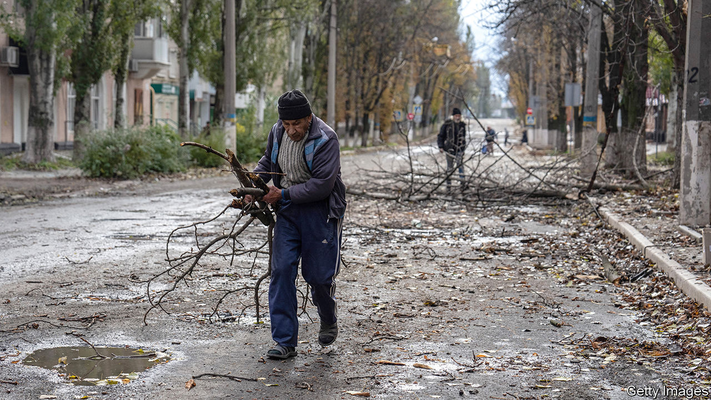

###### Putin’s cold war

# Keeping Ukraine from freezing this winter 

##### The country is in a race against time, weather and Russian missiles 

 

> Nov 1st 2022 

A small town west of Kyiv, Makariv still wears the scars of the early days of Russia’s invasion of Ukraine. In a bombed-out community centre in the middle of town, its façade blown off by an artillery strike, a local choir sings an Orthodox hymn. Misha, a boy of six, tours the wreckage of his old kindergarten, its floors lined with debris and scattered toys. Charred apartment blocks surround the scene. New problems compound old ones. Since early October,  have struck targets near Makariv, including an electric substation, triggering blackouts. Russia resumed its attacks on October 31st, firing more than 50 cruise missiles against Ukraine. 

Makariv, like the rest of the country, is bracing for winter. The Russian attacks have become less effective. Thanks to new weapons supplies, Ukraine’s army says that it has in recent days been able to shoot down all but a few of the missiles and Shahed-136 drones used by Russia. But the damage has been significant.

Around 40% of Ukraine’s energy infrastructure has been impaired. The national power-grid operator, Ukrenergo, has had to impose rolling blackouts across the country. Ukrainians have been asked to scale back their consumption, both domestic and commercial. On October 31st, after the latest Russian assault, 80% of Kyiv’s homes were left without water, though access has since been restored. By nightfall, much of the capital was pitch dark. The head of Naftogaz, the state energy company, recently told a German newspaper his country faced the “worst winter” in its history.

As cold weather begins to grip parts of Ukraine—the night-time temperature in Kyiv has been hovering around freezing—access to heat is also becoming a concern. Over 5m households, or a third of the total, and especially those in large cities, depend on district-heating systems installed by Soviet engineers decades ago. Plants, usually powered by natural gas, or less often by coal or wood, heat water, which is then pumped into homes through thousands of kilometres of pipes. For now the systems appear to be in good shape. Of the 22 provinces under Ukrainian control, 18 are fully prepared for the heating season, says Oleksiy Chernyshov, the development minister. The situation is worst in areas close to the front line, and in liberated areas of Donetsk, in the east. District heating in Kyiv started to kick into gear on October 7th, with schools, kindergartens and hospitals the first to receive heat.

But the systems remain vulnerable. Cities, which usually depend on a few large combined heat and power plants, are at higher risk than towns, which tend to rely on smaller and more numerous boiler houses. The Russians have attempted to destroy every one of Kyiv’s main plants, says Kyrylo Tymoshenko, deputy head of Ukraine’s presidential administration. Were they to succeed, most of the capital’s 2m residents would risk going cold. Attacks on pipelines would also be highly disruptive, says Diana Korsakaite, of USAID’s Energy Security Project. Damage to a primary pipe can easily cut off heat to tens of thousands of people. Cold temperatures can cause pipes that have been exposed by explosive damage to crack. 

Nearly all heating plants in Ukraine run on natural gas, as do the 8m households which are not connected to district heating and rely on boilers instead. Supply, at least, should not be a problem. Ukraine has gas reserves of 14.5bn cubic metres (bcm), which ought to be enough to get through the winter. But cuts to power and water supplies can wreak havoc. District heating needs electricity to pump the water through the system, and to power the plants themselves. Most boilers also require an electrical supply.

Ukrainians, especially those living in private houses, are stocking up on firewood, power generators and electric heaters. The potbelly stove, known since Soviet times as the , has been making a comeback in the suburbs of Kyiv. About a tenth of Ukrainians used furnaces to heat their homes last year. That number is certain to rise. Mr Chernyshov says he has asked Western donors to provide 1,500 mobile thermal stations and 25,000 generators before winter, to be deployed in case of new Russian attacks. But these are yet to arrive, and may anyway not be enough.

Across Ukraine, engineers working to restore the heating and energy infrastructure targeted by the Russians are in a race against time, weather and missiles. Repairs to the 800,000 or so houses damaged or destroyed since the start of the war are also moving along, but cannot keep up with the devastation. Seven months after the , scores of homes around Makariv remain uninhabitable, especially as winter approaches. “Every day”, says Vadym Tokar, the town’s mayor, “people ask me, ‘Where are my windows, where is my roof?’” The town does not have the money to pay for the necessary repairs, he says. The heating in Makariv is still working. But that does not count for much in houses without roofs. ■


