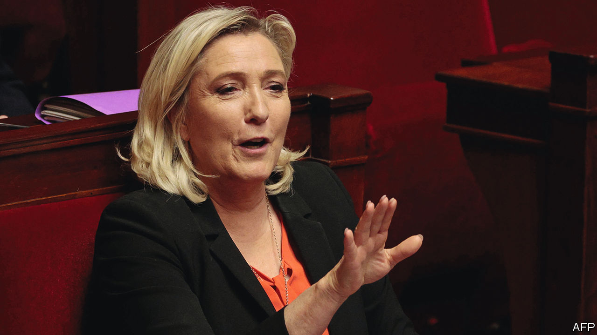

###### The French hard-right and Russia

# Marine Le Pen says sanctions on Russia are not working 

##### Renewed scrutiny of the links between her party and Moscow 

 

> Nov 3rd 2022 

SANCTIONS on Russia “aren’t working”, declared Marine Le Pen (pictured) on October 4th; “moreover, they are sanctions on the French.” If winter is difficult, said the leader of France’s populist-nationalist National Rally (RN), it will “be the responsibility of those who took these decisions”. As European resolve is tested by soaring inflation and energy prices, such arguments are worrying. They also bring fresh scrutiny of the rn’s attitude—and links—to Russia.

Ms Le Pen condemned Russia’s invasion of Ukraine, and called its massacre of civilians in  in March “war crimes”. Yet when she  this year, a flyer for Ms Le Pen was briefly in circulation which showed her posing with Vladimir Putin in Moscow, printed before he sent tanks into Ukraine. In 2014 the RN, then the National Front (FN), borrowed €9m ($9m) from the First Czech Russian Bank, based in Moscow, to finance its electoral campaigns. During a presidential debate in April Emmanuel Macron declared bluntly: “When you talk about Russia, you are talking about your banker.” 

On October 27th a French television documentary tracked down Jean-Luc Schaffhauser, a former FN MEP, who says he negotiated the loan in 2014 after other banks turned the party down. He said it came with “no conditions”, but would not have been granted without the Kremlin’s approval. “The interest for the Russians was to find Western allies,” he said. “The United States backs all our leaders in Europe, most of them anti-Russian; so it is logical for Russia to manage its interests too.” 

Three days earlier  reported that the Paris prosecutor is investigating a group called Franco-Russian Dialogue and two of its members, Thierry Mariani, an RN MEP and former centre-right minister, and Yves Pozzo di Borgo, a former senator, for alleged influence-peddling. A regular visitor to Russia, Mr Mariani has long defended the Kremlin, including the annexation of Crimea. Last year the European Parliament banned him, and four other RN MEPs, from official election-monitoring after Mr Mariani went in 2020 as an “international expert” to observe voting in Crimea. 

Contacted by , Mr Mariani said he learned of the judicial inquiry in , declares his trips to Russia, and rejects any allegation of wrongdoing. He described the current mood as a form of “McCarthyism”. Mr Pozzo di Borgo said he does not reply to journalists. Jean-Philippe Tanguy, an RN MP and deputy head of Ms Le Pen’s presidential campaign, rejects all accusations of Russian influence on the party. In the latest twist, Mr Tanguy has called for a parliamentary commission into foreign interference in French party politics—in the hope, he insists, of clearing the RN’s name. ■


