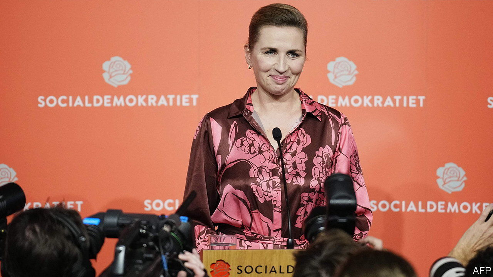
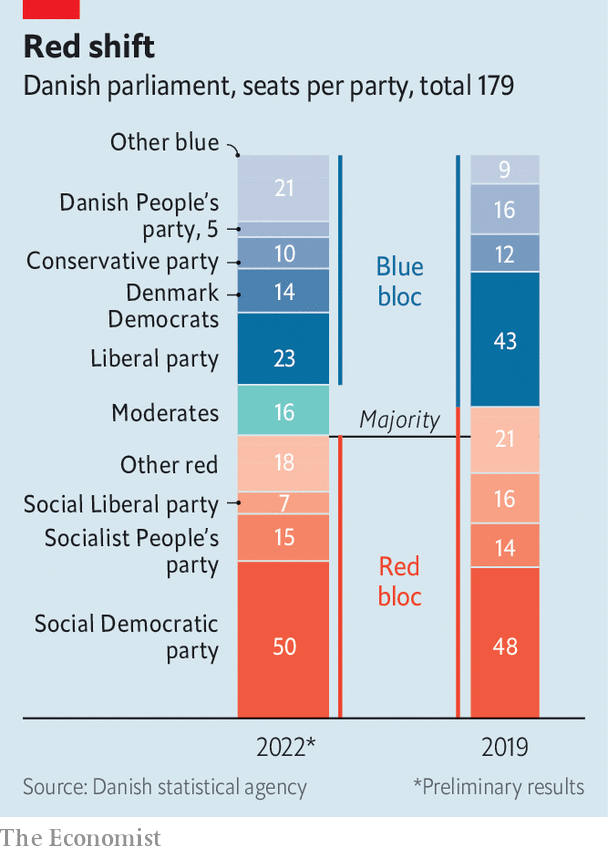

###### Matching the right

# The Social Democrats hold on in Denmark 

##### The price has been the aping of harsh immigration policies 

 

> Nov 3rd 2022 

Until close to midnight it looked like a bad day for Mette Frederiksen, Denmark’s prime minister. For months polls had shown growing restlessness among the 6m Danes, a general drift to the right and, with no fewer than 14 parties contesting the elections on November 1st, the prospect of protracted haggling to form a new governing coalition. But as final returns trickled in, the mood among her Social Democrats (SDP) turned triumphant. 

Not only had Ms Frederiksen boosted her party’s share of votes (by a modest 1.6 points, to 27.5%), increasing its dominance of the cluster of left-leaning parties commonly known as the red bloc. The rival, right-leaning blue bloc had fragmented, as voters abandoned its traditional liberal and conservative factions in favour of upstart new parties. 

 


Sweetest of all for Ms Frederiksen, perhaps, was the rout suffered by the Social Liberal (Radikale Venstre) party. Despite being an ally of the SDP within the red bloc, the smaller party had forced Ms Frederiksen into calling elections well before the end of her four-year term, by threatening to withdraw its support in a parliamentary confidence vote. This had been meant to censure the prime minister for her decision, as a safety measure early in the covid-19 pandemic, to order a  raised on Danish farms. Ruinous to the fur industry, the decree was later also judged an abuse of executive authority. The Danish electorate, however, decided not to punish Ms Frederiksen but to hit the Social Liberals at the polls. Their vote share dropped by more than half to just 3.8%.

Ms Frederiksen is now in pole position to once again form Denmark’s next government. With her reds holding a slight majority of the Folketing’s 179 seats, this could be an all-left coalition. More probable, says Ditte Sorensen of Taenketanken Europa, a policy-research group, is that the prime minister will use this base as a fallback, strengthening her hand to reach instead across the colour line that has defined Danish politics for the past three decades. Ms Frederiksen said as much during the campaign, asserting that a centrist coalition would be better placed to face Denmark’s many looming challenges, from rampaging inflation to the energy supply and the war in Ukraine. 

One obvious partner would be the Moderate party of Lars Lokke Rasmussen. A former prime minister who last year quit the liberal Venstre party, long the core of the blue bloc, to form his own non-aligned platform, Mr Rasmussen has also called for a bridging coalition. His new party, the Moderates, won a respectable 16 seats, making it the third-largest in parliament and a potential king-maker. Having shrunk to 23 seats, the once-dominant Venstre party might now also be coaxed into a government led by the 50-seat SPD.

Since taking the helm of the SDP in 2015 and becoming Denmark’s youngest-ever prime minister in 2019, Ms Frederiksen has shown plenty of the flexibility—some would say lack of principle—needed to make such a coalition work. To counter conservative populists who called for radical curbs on immigration, especially of Muslims, her SDP simply . This co-opting of harsh rules, such as one that allows Danish authorities to confiscate the jewellery of desperate asylum-seekers, ostensibly to cover costs, has invited international opprobrium. But such get-tough measures proved so popular that other parties on the left have followed suit, even as the right-wing party that first raised a cry over immigration splintered into factions.

In contrast to neighbouring Sweden, whose anti-immigrant Swedish Democrats made big gains in recent elections, the issue has now slipped down the list of Danish concerns. “We had that Swedish election ten years ago,” says Ms Sorensen, noting that Ms Frederiksen’s SDP has now gingerly floated the idea of inviting foreign workers to plug staff shortages in sectors such as nursing. Another contrast to Sweden, reckons the analyst, is that instead of taking months after the election to form a new government, Ms Frederiksen is in such a sweet spot that she could wrap it up in a couple of weeks. ■

