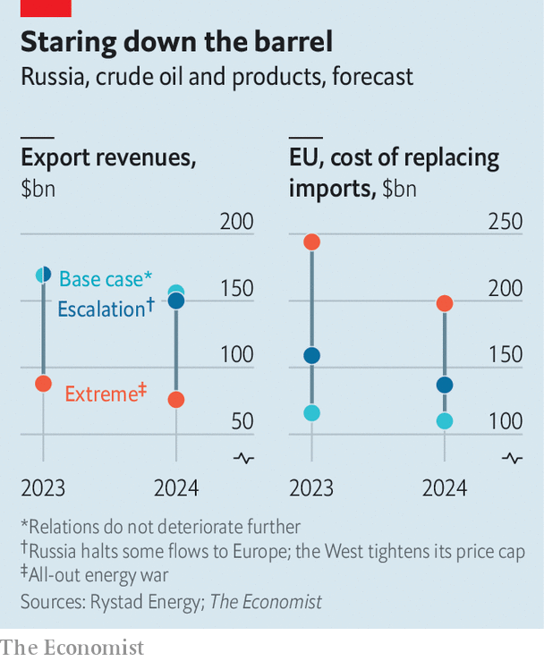
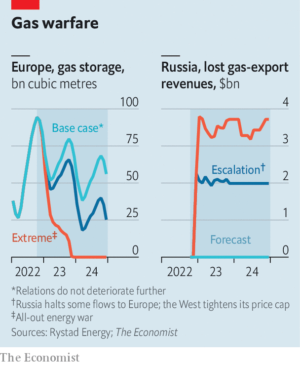

###### The West v Russia

# Europe’s energy crisis is very far from over 

##### We war game what will happen next 

 

> Oct 30th 2022 

IN MID-OCTOBER, off the Spanish coast, a number of slow-moving metallic domes emerged on the skyline. They were tankers, pregnant with superchilled liquefied natural gas (LNG) and awaiting delivery at busy “regasification” terminals, where their liquid fuel is turned to gas before being transferred across the continent. Iberia has the biggest facilities in Europe, but congestion is building elsewhere, too. The amount of LNG off European shores has hit 1.2m tonnes, according to Kpler, a data firm, up from 140,000 in August. At least the crews have beautiful weather in which to relax. Across Europe, temperatures are unseasonably warm: southern Spain is still seeing days above 30°C.

This combination of plentiful gas and warm weather, which reduces demand for the stuff, is a nightmare for Vladimir Putin, and has led some optimists to declare that an end to  is in sight. For months Russia has sought to sow division in Europe and undermine support for Ukraine: first by demanding payment for gas in roubles; then by slashing flows through Nord Stream, its main pipeline to the continent; and then, in September, by shutting the conduit indefinitely. By paying over the odds, Europe has nevertheless managed to fill its storage facilities. As a result,  have sunk to $39 per million British thermal units, from $100 in August. Meanwhile, Brent crude, the oil benchmark, sits at $95 per barrel, below the $139 peak it hit in March. 

Yet to declare an end to the crisis is premature. Prices will rise as cold spells hit and other LNG buyers, particularly in Asia, compete for cargoes. Russia, faced with military setbacks, could crank up the pressure further. Mr Putin’s options include stopping all gas deliveries to Europe or vandalising infrastructure. Such measures—or the use of a tactical nuclear weapon—would trigger another wave of sanctions from the West. To understand how the energy war might develop,  has worked with modellers at Rystad Energy, a consultancy. Our analysis suggests that complacency is dangerous. Things could get very bad, very fast.

We have simulated three scenarios. Even the first, under which relations do not deteriorate, is far from pleasant. It assumes that the Nord Stream pipeline remains shut. It also assumes that Europe follows plans to implement an embargo on Russian crude and prohibit local insurance firms, which have 90% of the global shipping market, from covering vessels carrying Russian oil—albeit with a big exemption. Non-Western buyers that agree to pay a capped price for Russia’s oil, set by America and the EU, are due to be allowed to purchase European insurance. 

For Europe this scenario triggers a crisis but not a catastrophe. Supply cuts mean that by the end of 2022 the continent will have missed out on 84bn cubic metres (bcm) of Russian gas, equivalent to 17% of its normal annual consumption. Higher LNG imports have already plugged part of this hole. A smaller chunk is filled by greater piped flows from Azerbaijan and Norway, and another by painful but voluntary consumption cuts. Our simulation suggests that—even if the winter turns frigid, boosting demand by 25 bcm—Europe’s storage will allow it to get through the summer of 2023, by which point LNG imports may start to ramp up.

 


Under this scenario, governments will not have to ration gas. Europe will, though, have to pay dearly for it. As Namit Sharma of McKinsey, another consultancy, notes, high prices have already led to shutdowns in energy-hungry industries, such as aluminium and ammonia. If Nord Stream remains shut throughout 2023, Europe’s energy deficit will widen, requiring even bigger cuts in consumption. Gavekal, a research firm, estimates that a 1% drop in energy consumption in Germany or Italy reduces GDP by 0.5-1%. 

It is hard to gauge the cost of this for Russia. Its piped exports to Europe, already down by four-fifths, cannot easily be sold elsewhere. Its pipeline to China, the only serious alternative, is too puny to handle big flows. However, the price for what it is able to sell would be much higher. 

In theory, the EU’s dual oil embargoes, coupled with a price cap, are a bigger threat to Russia’s oil exports, the country’s real moneymaker. But we assume, as the market does, that the cap will be watered down, and Russia will find buyers for many barrels it is unable to sell to Europe. Western officials are leaning towards a loosely policed cap set at near $60 a barrel. Since our base case expects global prices to stay below $90, that would not make much difference to the price of Russian oil, which currently trades at a 20-30% discount. 

Spanner in the spigot

This explains why, in such a scenario, Russia pockets $169bn in oil revenues in 2023, barely less than the $179bn it earned in 2021. It and other market participants still incur increased transaction costs caused by longer tanker journeys, smuggling shenanigans and other frictions. Europe pays a hefty price. Importing Russian seaborne barrels cost it $90bn in 2021. The replacement of these in 2023 would cost $116bn.

In our second scenario, “escalation”, Russia lobs a few grenades. It starts by shutting its pipeline through Ukraine, one of the two conduits still open, in the process depriving Europe of another 10-12 bcm a year. The country’s leaders would claim a pretext (such as the “leak” that halted flows through Nord Stream). After all, Gazprom, its gas monopoly, still wants to be seen as a supplier that respects contracts, at least outside the West, says Anne-Sophie Corbeau, formerly of BP, a British giant.

This initial strike would not surprise traders, many of whom have already discounted Ukrainian volumes. Traders would be stunned, however, if Russia stopped supplying LNG to Europe—the next step in this scenario. These deliveries, worth 20 bcm a year, equivalent to half of Russia’s annual LNG exports, have continued under the radar. Russia would not want to lose them altogether, if only because that would cause the global spot price to rocket, hurting friendly(ish) countries, such as India and Pakistan, which struggle to compete with Europe for cargoes. Thus we assume Russia would offer the supply to these countries at cut price.

In this scenario, the West retaliates by giving its oil price cap more bite, perhaps threatening Western infringers with huge penalties, toughening checks and lowering the cap. To counter the counter, Russia persuades opec and its allies, some 23 countries that produce 40% of the world’s crude, to cut their monthly production target by 1m barrels per day (b/d), on top of a 2m b/d cut implemented in October. 

 


Rystad’s model projects that, at the end of this shoot-out, Russia will emerge less bloody. This is partly because the tighter cap provides non-Western countries with a greater incentive to build an alternative oil-trading system. Giovanni Serio of Vitol, a trading firm, says G7-owned tankers are already being bought up by non-Western players, often in Asia or the Middle East. China and India, which have sucked up most of Russia’s excess barrels thus far, can probably self-insure their ships. Other countries may tap the “black” trade, where Russian oil—ferried on tankers with their transponders turned off, transferred from ship to ship on the high seas or blended with other crudes—cannot be traced. 

Although Russia would take a hit on its gas revenues, its oil income would be resilient. Our calculations suggest the country’s oil exports would fall in both 2023 and 2024 by 2m b/d, compared with 2021, forcing it to curtail production by more than 1.5m b/d. The tighter market would push Brent into the triple digits, and there would only be a small contraction in demand. This would allow Russia to make up for the volume shortfall. Its oil-export revenues would remain remarkably steady at $170bn in 2023, before falling to $150bn the year after. Europe, meanwhile, would face tens of billions of dollars in extra costs. 

Our third, “extreme”, scenario assumes that Russia, perhaps facing catastrophic losses on the battlefield, no longer cares about money or keeping allies sweet, and opts for all-out energy war. It begins by shutting TurkStream, its remaining gas link to Europe. The pipeline mostly serves Russia-friendly countries, such as Hungary and Turkey. But terminating it leaves Europe short of another 15 bcm a year. 

Then Russia decides to wreck Europe’s gas-import infrastructure. This possibility, once unthinkable, has become rather less so after saboteurs bombed Nord Stream in September. Our extreme scenario assumes that Russia manages to stop flows through Norway’s two largest pipelines, robbing Europe of another 55 bcm in yearly supply. This would be quite a move. The pipelines are far from Russia and Western countries may consider it an attack on NATO. 

Leaving aside potential military ramifications, we assume that Western powers would respond with “secondary” sanctions, threatening non-Western individuals or firms trading Russian oil with measures such as the loss of access to American dollars. This forces banks and insurers everywhere to dump Russian business, making embargoes far more effective. 

The Kremlin retaliates by convincing OPEC to declare another 1m b/d cut to its output target. It also chokes off exports through the CPC, a pipeline that carries 1.2m b/d of mostly Kazakh oil, but which ends at the Russian port of Novosibirsk, where the fuel is loaded onto ships. America, in an attempt to dampen the oil price, accelerates releases from its Strategic Petroleum Reserve. 

Yet the reserve is not infinite, notes Jason Bordoff, an energy tsar under Barack Obama. Having been raided for months, it is already at its lowest level since 1984. Thus we assume OPEC could wait it out, first cutting production and then raising it when the strategic reserve runs dry.

At the end of all this extraordinary back-and-forth Russia would enjoy a pyrrhic victory. Its oil exports, which only the black market can absorb, crater to 3m b/d or less for years. Despite the huge global supply gap, Brent rises to “just” $186 a barrel, before falling to $151 in 2024, because oil demand is crushed. Russia’s oil revenues plummet, to $90bn or less. 

Europe faces an excruciating squeeze. It must fork out $250bn in 2023 and $200bn in 2024 merely to replace Russian barrels. Its annual import-gas bill nears $1trn, almost double our base-case scenario, despite much lower incoming volumes. Making up for the lost gas proves impossible. Our simulation suggests that Europe’s storage, empty by November 2023, would remain bare for the whole of 2024. 

Europe unplugged

European solidarity would almost certainly break down, worsening the continent’s misery. A recent simulation by Germany’s economic ministry assessed what would happen if, in February next year, power utilities in the country’s south were to receive 50% less gas than normal, many French nuclear reactors remained shut (as they have been this year) and coal plants faltered. They concluded that the EU would have to distribute 91 hours of blackouts among its members. Germany, in panic mode, might decide to cut electricity exports to France, or stop gas flows to the Czech Republic and Slovakia. Britain, which has meagre storage facilities but big gas needs, would be vulnerable. 

This future-gazing has limitations. It only considers the energy war, leaving aside what will happen on the battlefield and in the broader economic conflict. Huge unknowns, from the weather to the durability of Ukraine’s military, could tip the balance. And nobody knows what might trigger a transition from one scenario to the next, if only because that depends on what happens inside Mr Putin’s head. 

Yet the simulation holds two clear lessons. One is that, in the ninth month of the energy stand-off, Russia retains more options for escalation than the West. It has already shut its main gas supply route to Europe, but the bloc needs all it can get, so cutting off the rest would still wreck havoc. And whatever energy Europe buys from others must still pass through hubs and spokes that Russia, at its rashest, could try to destroy. The other lesson is that embargoes will not drain Russia’s treasury, at least until Europe is prepared to bear much more pain. The more Russian fuel cannot get to market, the more Europe has to pay to replace it—while rising prices limit the Kremlin’s losses. It is only when oil prices cannot go higher without destroying demand that Russia truly suffers.■


