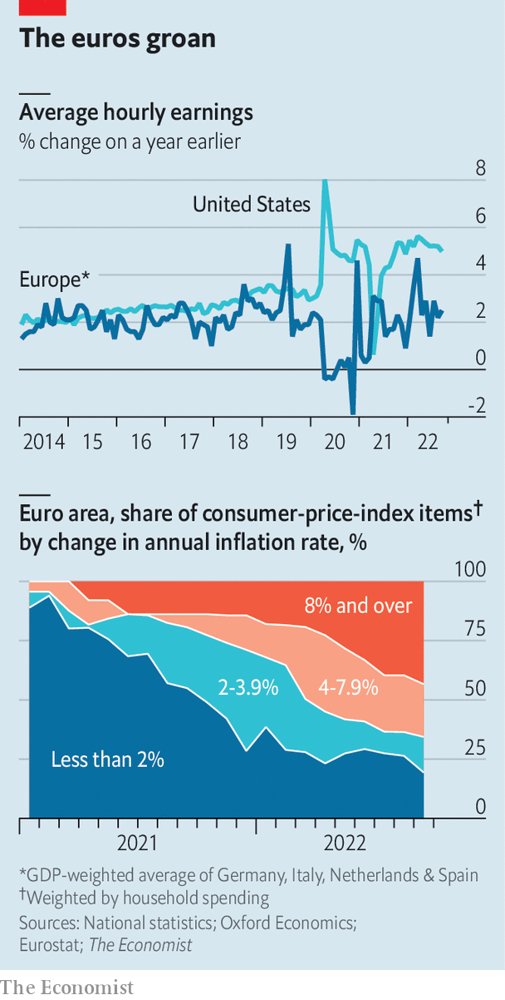

###### Double trouble

# Even recession may not bring down Europe’s inflation 

##### Will the ECB take lessons from another central bank in Frankfurt? 

 

> Nov 3rd 2022 

It is difficult to spot the peak when hiking in the fog. What is true in the Alps is just as true for policymakers who are . In the euro zone, consumer prices in October were 10.7% higher than a year earlier. The European Central Bank (ecb) has increased interest rates by 0.75% for the second meeting in a row, as it dutifully follows the path trodden by America’s Federal Reserve. Officials very much hope the peak is around the corner. 

Optimists among them point out that the euro zone implemented no major fiscal stimulus after the covid-19 pandemic, unlike America, which means inflation has been driven by supply shocks and energy prices, rather than an . Recent spending packages in Europe have sought to cushion the blow from eye-watering energy prices, not stimulate spending. In the second quarter of the year, consumption was less than 2% above the same period in 2019. In America it was 7%. 

Moreover, sentiment indicators suggest the European economy is heading for recession. Wages have grown moderately, and there is little sign of a wage-price spiral. Current and future energy prices on wholesale markets have fallen from summer peaks. Bottlenecks affecting everything from microchips to furniture have eased. Perhaps the peak really is nearby. 

 


Sadly, the optimism will probably prove unfounded. Lower energy prices take time to feed through to consumers. Most are still seeing whopping rises. France has the lowest inflation in the bloc, at 7.1% in October, in part because the government has capped gas and electricity prices. Next year, however, prices will be allowed to increase by 15%, adding to inflation. In Germany, many households have long-term contracts that are gradually renewed to reflect higher prices.

And though, in the glowing sun of a warm October, wholesale prices for energy dipped, the medium-term forecast is for a cold and dry winter, which means they will probably rise again. Worse still, Vladimir Putin may . 

Energy and food prices comprise less than a third of the basket of goods and services used to measure inflation. But the trends in the rest of the basket are also worrying. Prices for services and goods other than food and energy increased by an annualised 6% over the past three months. Although energy prices may lie behind part of this shift—restaurants need heat, for instance—the size of the increase suggests inflation is spreading. As Chris Marsh of Exante, a research firm, notes, the situation looks unfortunately similar to that in America a few months ago. 

Wage rises are likely to add to inflation. So far, European pay has increased little. Unlike in America, six in ten workers have collective-bargaining agreements, which tend to run for a year or more—meaning it takes time for economic conditions to influence their pay. Trade-union negotiators have limited demands, aware that a wage-price spiral would come back to haunt them. But negotiators’ patience is beginning to wear thin. Germany’s public-sector unions will enter forthcoming negotiations seeking a raise of 10.5%.

The problem for bosses is that the labour market remains exceptionally tight. The share of firms reporting that staff shortages are limiting their production is near record highs in both the manufacturing and service sectors. One reason is the enormous backlog of orders from the pandemic. Manufacturing firms have on average more than five months of work on their order books, according to a recent survey, up from four before covid struck. Add to that the cohort of workers retiring each year in ageing countries such as Italy and Germany, and a recipe is in place for a tight labour market throughout 2023.

All of this means the peak in inflation is probably some way off. Nor will there be much relief at the top, for the descent will be similarly tricky to navigate. Energy prices should settle at a lower level next year, which will bring down headline inflation. But inflation in the rest of the economy may still be accelerating, limiting the immediate drop. Thus the fog will remain.

Even a recession, if people expect it to be brief, may not tame inflation. In that case, the ecb would have to tighten the screws once again. “The Bundesbank in the 1970s didn’t even flinch when the economy weakened. They were successful in conquering inflation,” notes Mr Marsh. This time round, it may take something similar from the other central bank in Frankfurt. ■


