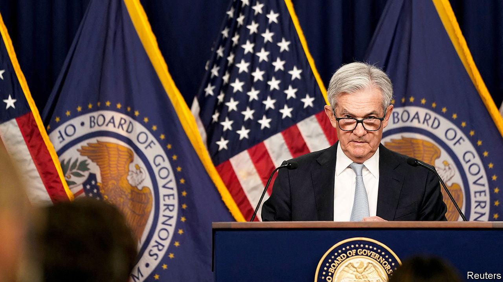

###### Inflation

# The Fed delivers another jumbo rate rise, and it’s far from done 

##### There is a good chance it will keep rates high for longer than investors expect 

 

> Nov 2nd 2022 

As recently as the start of June investors and analysts believed that a “jumbo” interest-rate rise for the Federal Reserve meant half a percentage point. How quaint. After four straight increases of three-quarters of a percentage point—the latest on November 2nd—perceptions have changed. Indeed, a stockmarket rally in the two weeks before the announcement was rooted in the belief that the Fed may scale down to a half-point rate increase at its next meeting in December. What was once jumbo is now moderate.

Whether the Fed will in fact downshift to a half-point increase is a matter for debate. Bond pricing assigns roughly even odds to the central bank opting for that smaller increment versus yet another three-quarter-point increase. At a news conference following the Fed’s latest move, Jerome Powell, the central bank’s chairman, resisted tipping his hand in either direction. And for good reason: inflation figures for both October and November will be published before the Fed’s next meeting, and go a long way to determining what it does. There is little sense in guessing the outcome before seeing that data.

But the focus on the size of the rise is also too narrow. As Mr Powell notes, the Fed’s tightening of monetary policy can be looked at in three dimensions: how quickly it raises rates, how high it raises them and how long it then keeps them there. The first dimension is already clear. Although the Fed was late in launching its rate-rise cycle, it has moved with alacrity since starting, raising short-term borrowing rates from 0% in March to 3.75% now—its most aggressive increase in four decades.

The second dimension is also becoming clearer. In September the median expectation of Fed officials was that rates would peak at 4.6% next year. Bond pricing now has the peak pegged at 5%, reflecting the fact that a variety of inflation indicators have stayed . Mr Powell suggested that the Fed’s thinking is in line with the bond market. Even so, there is a logic for slightly smaller increases from here on. Just as an aeroplane slows before landing, so, ideally, does a central bank before settling on its peak rate.

The biggest uncertainty surrounds the final dimension. How long will the Fed need to keep rates at a restrictive level? It estimates that the long-term neutral level—that which is neither inflationary nor stimulative—is about 2.5%. By this yardstick, nominal rates are already in restrictive territory. But in real terms, with inflation , policy remains loose. So the question is when the economy will react to them.

Some developments have been predictable. Mortgage rates have more than doubled over the past year, exceeding 7%. That has led to a sharp . But the resilience of the labour market has been harder to predict. There are still nearly twice as many job openings as there are unemployed people, placing upward pressure on wages and, in turn, inflation.

At several points during the conference, Mr Powell emphasised that the Fed would keep rates high for as long as is required. Markets have priced in a pivot before the end of 2023. The view is the Fed will trim rates in the second half of the year. But it has raised them faster and higher than investors had expected. There is a good chance it will also keep them high for longer than investors currently expect. ■


