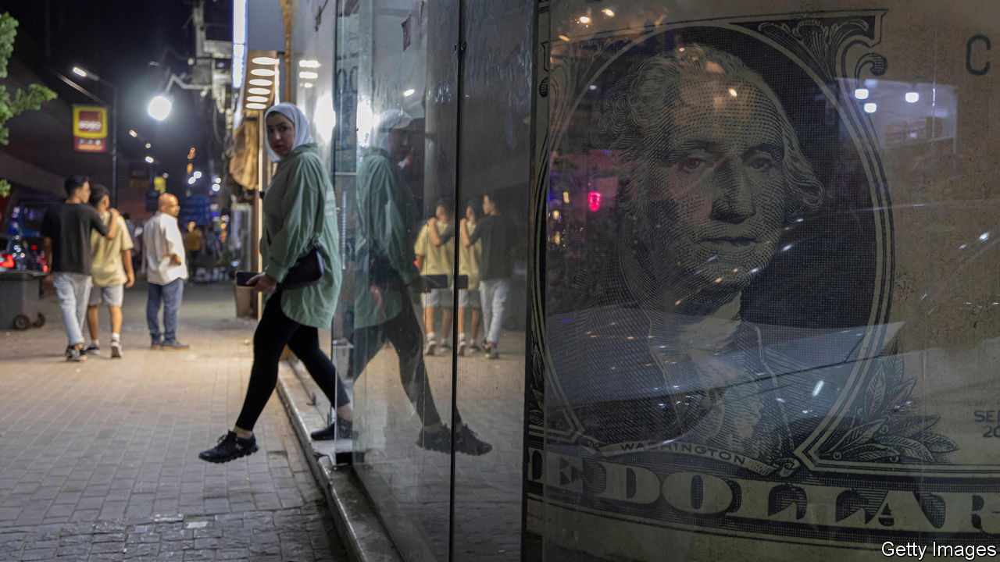

###### A few billion between friends

# The growing popularity of a strange form of debt diplomacy 

##### Why Saudia Arabia and the IMF may end up in a stand-off over Egypt 

 

> Nov 3rd 2022 

Reality caught up with the Egyptian pound on October 27th. Since Russia invaded Ukraine, prompting foreign investors to flee risky assets, the country’s central bank has burnt through its foreign reserves in a bid to keep the currency fixed against the dollar. But last week officials agreed to float the pound—the first of several concessions to secure a $3bn loan from the imf. The currency promptly fell off a cliff, plunging to an all-time low.

Now Egypt faces the task of rebuilding its foreign reserves. The country’s expected current-account deficit and debt repayments over the next 18 months are roughly the same as its $33bn of reserves. Tapping international debt markets is out of the question. Economic turmoil will ward off foreign investors. Thus Cairo will probably turn to old friends in the Gulf. Between October 2021 and March this year, Kuwait, Saudi Arabia and the uae lent Egypt $18bn to sit in its foreign reserves. The imf reports that another package worth $5bn is in the works, although it has not said where the money will be coming from.

Egypt is not the only country reliant on this unusual form of foreign generosity. In August Saudi Arabia renewed a $3bn deposit in Pakistan’s central bank. It sits alongside a yuan-denominated offering from China worth $2bn. And as Argentina struggles to keep the peso fixed against the dollar, some 60% of its reserves come from a Chinese currency swap worth $23bn.

Depleted foreign reserves can become a central bankers’ nightmare. Governments are left unable to make loan repayments, withdrawals sometimes have to be limited and import controls introduced. Basic goods shortages may follow. In the worst-case scenario, spooked foreign investors set off a currency crisis. 

Deposits and swaps offer a quick fix. The fine print of agreements tends to be kept hushed and interest rates low. Officially, Gulf lenders want their money back. But renewals are common. Given the speed with which Egypt and Pakistan have burnt through their reserves, it is unclear whether they could return the funds if required.

When a deal is agreed, the debtor suddenly gains a great deal more foreign liquidity. For years, Argentina’s yuan swap obscured the country’s rapidly declining pile of foreign funds. But unlike Gulf lenders, China attaches strict conditions to its money. In some circumstances Argentine officials need China’s permission to use the cash. Thus the imf says that, although Argentina’s headline reserves are $39bn, after deducting the swap lines and other adjustments, the net figure—which it focuses on—is a rather less impressive $2bn.

Informal lending also becomes a problem if a friendship flounders. In 2016, as Hezbollah, an Iranian-backed militia, gained ground in Lebanese politics, Saudi Arabia signalled its displeasure by withdrawing deposits it had made in the country’s central bank. Three years later, pressure on foreign reserves contributed to Lebanon’s financial meltdown. Egypt and Pakistan have in effect tied their foreign reserves to approval from the Gulf and China—a shaky basis for economic stability.

The situation in Egypt may end up illustrating another problem with this sort of informal lending. It is not entirely clear how the lenders’ deposits will be treated if the country defaults. Their status would have to be tested during the restructuring process. As Brad Setser of the Council on Foreign Relations, a think-tank in New York, notes, this sets up the potential for a stand-off between donors.

The imf’s Egyptian loan on October 27th was more modest than expected, and was dependent on additional bilateral funding. Saudi Arabia’s loans were made earlier in the year, when Egypt’s economic situation was not quite as dire. Both sides now look keen to extract themselves from an awkward situation; neither wants to be on the hook for more big loans. But nor do they want to lose their money—or Egypt to go under. As the two sides inch away, checking the other is still in sight, they will have to ensure Egypt does not collapse from beneath them. ■


