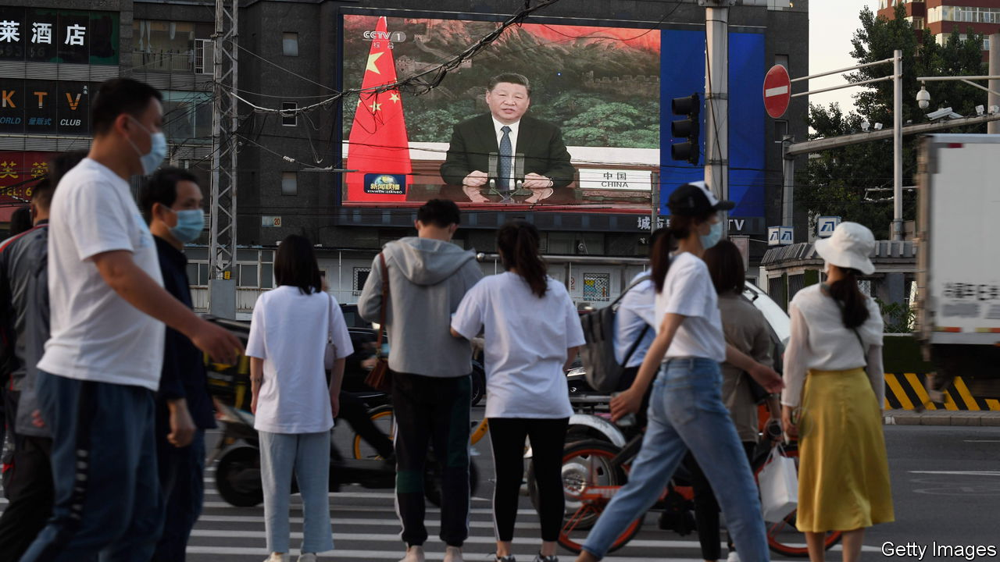

###### Breaking the banks

# Xi Jinping promises financial stability. He is not delivering it 

##### China’s property crack-up causes problems elsewhere 

 

> Nov 1st 2022 

Fang Hong is not a typical activist. For years she has run a packaging-materials factory in Qinzhou, a mid-tier city in southern China. Recently, though, the 51-year-old lost millions of yuan investing in “low-risk” financial products. The experience was a shock—and pushed her to connect with hundreds of mainly wealthy people, who, like her, are indignant about their losses. Ms Fang has been gathering information and petitioning local regulators. In September she gathered in the lobby of her bank with customers from around the country to demand their money back.

Such incidents are becoming more common among . Over the past five years the state has cracked down on shadow-banking assets, which are not accounted for on lenders’ balance-sheets and include a dizzying array of financial products. As a result, the stock of these assets has fallen by 15% since 2017, but still amounts to an astonishing 56trn yuan ($8trn), or a seventh of all banking-system assets. And now that , investors are discovering that many financial products marketed as low-risk are, in fact, quite high-risk. 

Xi Jinping, China’s leader, who has just secured a third term, lists financial stability as one of his main aims. The problem is that finding safe investments in China is becoming harder and harder. Strict capital controls prevent people from putting their money to use overseas. Chinese stockmarkets are volatile and offer miserable returns. According to East Money, a financial-data firm, just 1% of local funds have produced any returns this year, with investors losing money on the rest. The property market, long the main destination for investments thanks to ever-increasing home prices, has been  by a government crackdown on leverage. Prices have fallen in many cities. 

This means that China’s trust industry, a major part of the country’s shadow-banking system and another popular investment destination, has also been thrown into turmoil. Trust products have high investment thresholds (usually above 1m yuan) and attract wealthier investors. They are often sold by banks, promising returns higher than deposits and channelling funds to riskier borrowers who otherwise might not be able to take out loans. Property developers have been big borrowers. 

Defaults used to be rare. But as developers go bust, they often fail to pay back loans. Between 40-60% of assets at three large trust firms—Minsheng, Wanxiang and Huachen—are non-performing this year. Anxin, another large company, reports that almost all of its assets have gone south. Out of the 57bn yuan in investments on which trust firms defaulted in the first seven months of this year, some 80% were linked to property loans. Wang Zhen of Hwabao Securities, a broker, recently labelled these investments a “disaster zone”.

Ms Fang invested almost 10m yuan in two products in 2020 and 2021. They were sold by a Chinese branch of the Bank of East Asia (bea), which is based in Hong Kong, but were issued by Minsheng. She was assured by a bea salesperson that she could cash out by mid-2021, when she expected to need the funds to build a polyethylene plant. But when that time came, the funds were frozen. Bank employees told her to wait. A year on, she and more than 200 other investors, with hundreds of millions of yuan on the line, have seen neither the principal or interest on the products.

Protests at the bea have caught the authorities off guard. Hundreds of people have shown up at bank branches over the past month. At one gathering in Shanghai protesters demanding their money back surrounded the building for several hours. The incident in some respects resembled a mini bank run, with many customers asking to cash out of financial products and deposits. The bank released a statement saying customers could still withdraw from their accounts.

These protests are part of a broader trend. In May people from across the country gathered in the central Chinese city of Zhengzhou to protest against the freezing of 40bn yuan in deposits at six village banks. The banks, all owned by one tycoon, had attracted deposits through online platforms, promising high interest rates. But the funds were misused and the tycoon fled. The local government is now attempting to repay at least some of the customers.

In August angry homebuyers gathered at a branch of Bohai Bank in Shanghai to demand more information on their mortgages for homes at a development that has halted construction owing to a lack of money. Online rumours of a freeze on withdrawals also led to a run on deposits in September at one of Jiangsu province’s largest banks. The bank eventually was able to calm its customers, but was also forced to increase its capital base. 

A shuddering seismograph

The situation seems likely to worsen. China’s central bank has identified 122 “high-risk” outfits among the country’s 1,651 village banks. Trust in these smaller banks is depleting; many customers are attempting to move their deposits to larger, more established institutions. At banks with weak balance-sheets it does not take long for this dynamic to turn into a crisis. As Zongyuan Zoe Liu of the Council on Foreign Relations, a think-tank in New York, notes, some village banks have been forced to cap withdrawals, shorten business hours or even freeze accounts to avoid runs on deposits. Such measures are only a short-term solution, as they tend to trigger new panics and additional runs on deposits.

All of this is bad news for Mr Xi. There is a reason he has made financial stability a central aim. A wobbling banking industry undermines support for his government. And to people like Ms Fang, as well as those who notice her protests, China’s financial system has rarely seemed shakier. ■


