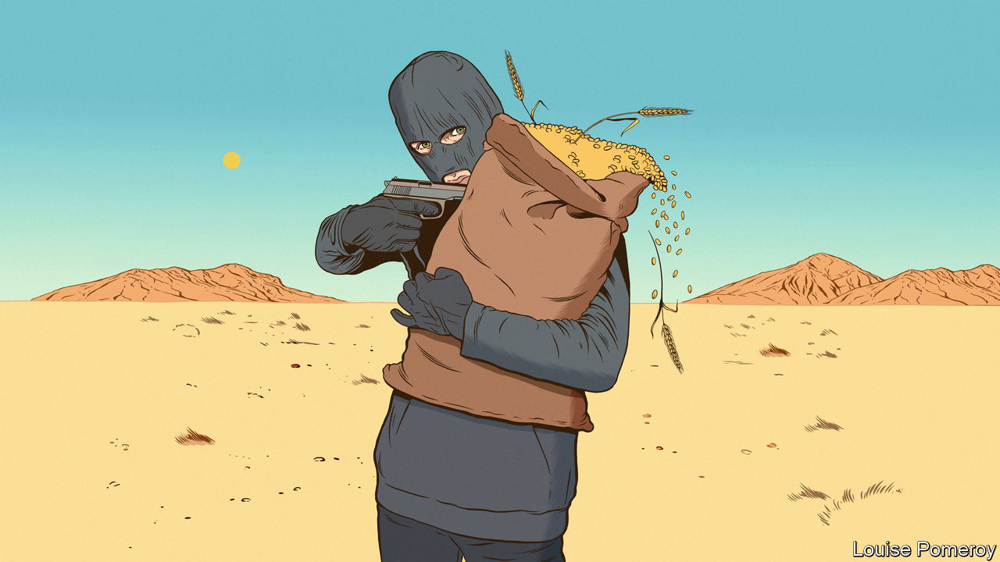
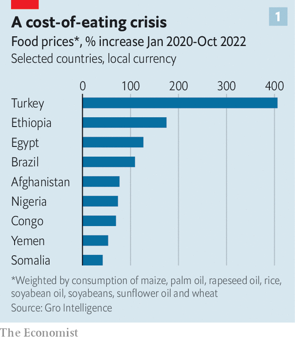
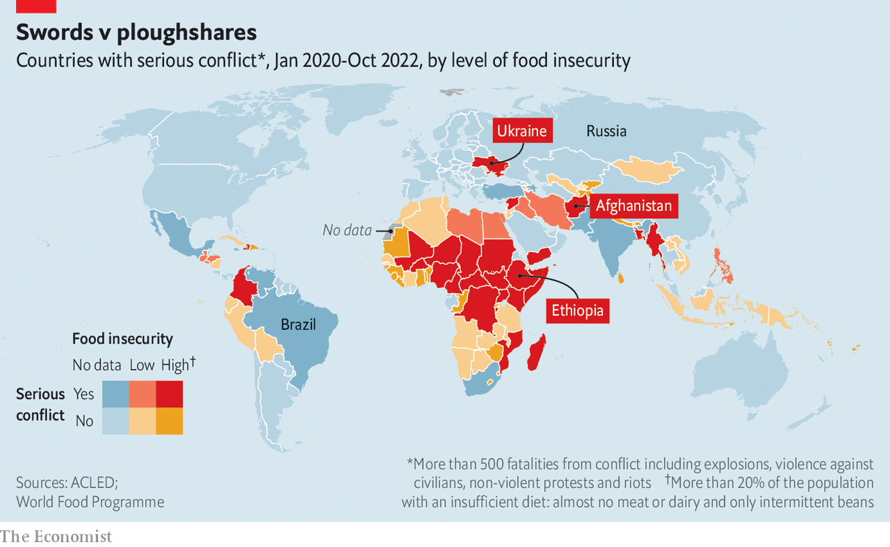
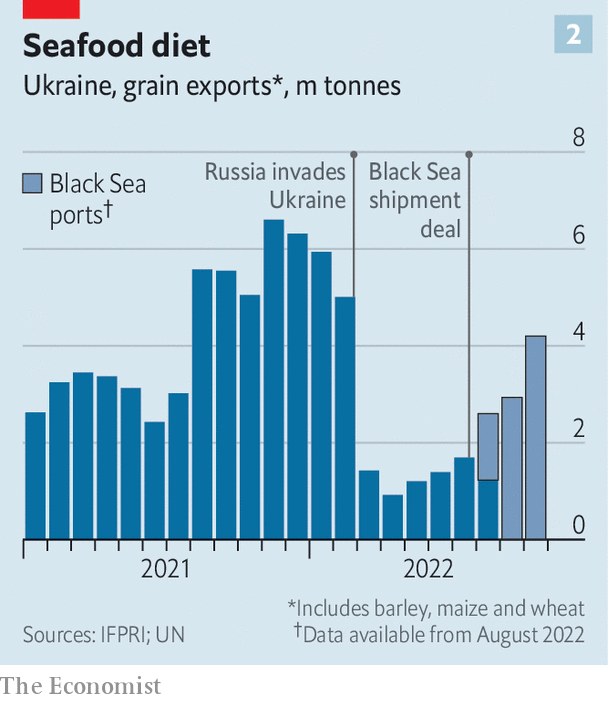
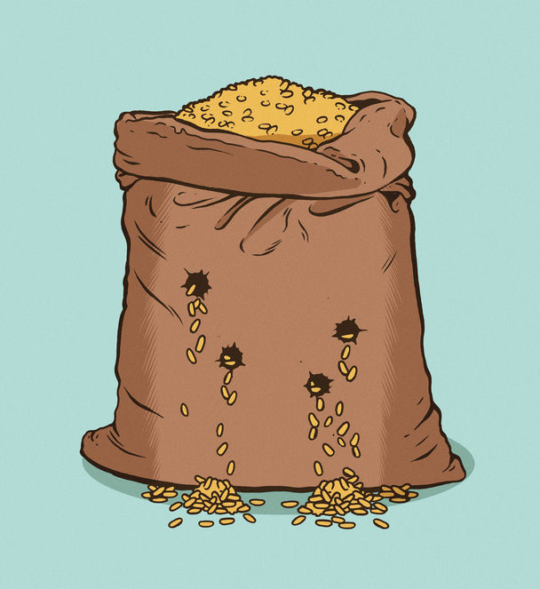

###### Bread-blocking bandits

# How men with guns aggravate global hunger 

##### Vladimir Putin’s attempt at grain blackmail highlights a wider problem 

 

> Nov 2nd 2022 

At first glance, Vladimir Putin has little in common with an Ethiopian foot-soldier. One man has palaces and nuclear weapons, the other a shack and an old Kalashnikov. Yet both illustrate a global problem: that food supplies are often disrupted by men with guns. 

On October 29th Russia said it was suspending its participation in a deal to allow Ukraine to export grain by sea. The foreign ministry said Russia could “no longer guarantee the safety of civilian dry-cargo ships” leaving Ukrainian ports. Since the only threat to such ships is Russia itself, the meaning was plain. Global wheat prices jumped by 6% on October 31st, the first trading day after the announcement. 

On the same day, however, Turkey, Ukraine and the UN organised a convoy of 12 grain ships from the Ukrainian port of Odessa to the safety of Turkish waters. Russia did not fire on them, and on November 2nd it became clear its bluff had been called: Mr Putin said he would allow grain shipments to resume. The world breathed a sigh of relief. Diplomats congratulated themselves for resisting the Russian despot’s blackmail. 

But the saga illustrated an uncomfortable truth. The global food supply is vulnerable to men with guns. Indeed, of the 828m people who do not get enough food, nearly 60% live in countries racked by conflict. Armed violence is the single greatest obstacle to ending hunger, says the UN’s World Food Programme. 

Start with the Ukraine grain deal, which may have won only a temporary reprieve. Turkey and the UN are feverishly trying to persuade Russia to extend the agreement, which lasts until November 19th, for another four months. So far they have failed. 

The deal has always been “one rocket away from termination”, says Joseph Glauber of the International Food Policy Research Institute (IFPRI), a think-tank in Washington. Mr Putin’s excuse for suspending it was risible: Ukraine had attacked some Russian warships in Crimea, an occupied part of Ukraine. That an invaded country might shoot at the invaders’ navy is hardly surprising, yet Mr Putin professed to be outraged. He also complained that much of the grain from Ukraine was going to rich countries rather than poor ones. This too, was disingenuous. Since grain markets are global, any extra supply reduces prices for everyone. 

Guns or butter

The deal’s fragility matters because it has done a lot of good. Between early August and late October Ukraine shipped 9.3m tonnes of grain across the Black Sea, helping to ease painfully high global food prices. In normal years, Ukraine is a huge supplier of calories. Last year it provided 10%, 14% and 47%, respectively, of global exports of wheat, maize and sunflower oil. It usually ships 95% of these through its ports on the Black Sea. Roads, rail and river are dismal alternatives: Ukraine’s total exports of grain fell from 5m tonnes in February to 1.4m tonnes in March, after Russia invaded. By last month, the deal allowed 4.2m tonnes to flow through the Black Sea route alone. Keeping it open is essential. 

Other rogue regimes have weaponised food even more directly than Russia does. In Mekelle, the capital of Tigray, streets are filled with hungry women and children. The price of the local staple, teff, is three times higher than in other parts of Ethiopia. Hundreds of thousands are starving. “People ask for food everywhere,” says a doctor at the region’s main hospital. “Tigray is hell on earth,” says the head of the Tigray Development Association, an NGO. 

Tigray has been fighting for more autonomy, and the Ethiopian government has been trying to thwart it. On November 2nd the two sides signed a ceasefire. Locals dare to hope this will mean that deliveries of food aid, which the government blocked to starve out the rebels, will resume. But they have been disappointed before. Meanwhile Eritrean forces, which are allied with Ethiopia’s government, have reportedly been looting and burning crops. A video recently shared online appears to show Ethiopian troops looting trucks carrying bags of food aid. 

 


Global hunger has many causes, from poverty (recently exacerbated by covid-19) to drought (made more common by climate change). All these are made worse by war. Of the ten countries with the largest absolute numbers of acutely hungry people, all but Sri Lanka are conflict-riven (and Sri Lanka has seen huge riots).

In Somalia the government is not trying to stop food from reaching citizens, but local terrorists are. Al-Shabab, a jihadist group linked to al-Qaeda, controls great swathes of the country. A “gentlemanly agreement” with aid agencies once allowed at least some aid to cross front lines, says an adviser to Somalia’s president, Hassan Sheikh Mohamud. But these days al-Shabab blocks almost all aid from entering its territory. That includes much of Somalia’s best farmland, which is enduring its worst drought in four decades. 

Sometimes, the jihadists steal the food. “The strategy is: if we can get hold of this food, we can make money. And if we can make money off food, we can buy more guns,” explains Donal Brown of the International Fund for Agricultural Development, another UN agency. In September al-Shabab blew up an aid convoy, killing at least 20 civilians. Aid workers are scared to travel anywhere near jihadist turf. 

In recent weeks government forces and local clan militias have won back scores of districts from . In principle, this is good news for the 41% of Somalis who are acutely hungry. But as al-Shabab is weakened it becomes more desperate, preying more viciously on locals and stealing their livestock and crops. As its fighters have retreated, they have blown up wells. And the clan militias driving back the jihadists are also obstreperous men with guns. They are “yet another actor to negotiate with”, sighs a UN official. 

“Farmers need peace to produce,” says David Laborde of IFPRI. Where war rages, fields are burned, cattle are slaughtered and farmers are drafted. Armies grab fuel, leaving little to power tractors and irrigation systems. Roads become hazardous. In Congo, where dozens of armed groups plunder and rape, local women “might not want to walk five minutes down the road to sell [their] food”, observes Mr Laborde. 

 


Elsewhere, conflict has simply brought food production to a halt. In parts of the Sahel, including northern Nigeria and Chad, jihadists terrorise farmers so they will flee to cities and destabilise the government. “They attack and kill you if you’re in your fields,” says Mr Brown. “They want the whole place to fall apart,” he adds—so they can take over. 

Afghan farmers have endured many conflicts in recent years. Many were forced off their land by fighting between an elected, American-backed government and the Taliban, a jihadist group. Those who could grow food struggled to profit from it, says Ibraheem Bahiss of Crisis Group, a think-tank. On the way to market, they would be “taxed” at a government checkpoint and then robbed again by Taliban fighters a few kilometres down the road. 

Since the American withdrawal in August 2021, the guns have largely fallen silent—because the men who wielded them most effectively are now in charge. The Taliban bar women from travelling without a chaperone, making it harder for families to buy or sell food. Soaring diesel prices add to their woes. In mobile-phone surveys of Afghan households conducted in July by the World Food Programme (WFP), a third said they had trouble getting to markets in the previous fortnight.

The rule of gunmen breeds uncertainty. A farmer in Afghanistan’s Takhar province says the old government’s soldiers grabbed his land a few years ago. The Taliban gave it back to him and he planted wheat. But then fuel and fertiliser prices rocketed, because of the war in Ukraine. And in September the Taliban signed a provisional deal for cheap wheat with Afghanistan’s fellow pariah state, Russia. This caused the value of his produce in local markets to plummet.

Today roughly 90% of Afghans are hungry. A doctor in Kabul, the capital, says he is treating a growing number of patients with ailments caused by poor nutrition, such as anaemia and tuberculosis, and that the number of undernourished babies showing up at clinics is rising fast.

All bread-blocking bandits share a similar moral code: might makes right and fussing about malnourished infants is for the weak. But only Mr Putin is powerful enough to aggravate hunger on a global scale. Despite this week’s climbdown, his warmongering affects the world’s food supply by making it harder to grow food in Ukraine, by imperilling its delivery and by raising global prices for hydrocarbons, which are used both to transport food and to make fertiliser. Mr Putin’s vanity war sends ripples of pain around the world.

Russian rations

It is a terrible time for disruptions. Ukraine is hoping to start shipping the 20m tonnes of wheat it harvested over the summer. Big importers in north Africa and the Middle East have exhausted their own harvests and need to restock. The countries that most need Ukrainian exports, such as Egypt, Lebanon, Sudan and Yemen, have restive populations who may take to the streets if bread becomes unaffordable. Food-price inflation is an explosive grievance in Turkey, which holds an election next year. The WFP usually relies on Ukraine for half the wheat it distributes to the needy elsewhere. 

If the Black Sea deal is not extended, Ukraine could in theory export more grain by alternative routes than was feasible before July. Carlos Mera of Rabobank, a Dutch lender, reckons the country could now move 3m tonnes a month by rail and 2m tonnes by road or river. But Russia is intent on wrecking Ukraine’s civilian infrastructure with missiles and suicide drones. Grain that was once shifted from plough to port by automated logistical systems might have to be moved in tiny batches. That could raise transport costs from $3-5 a tonne to $50 or more. 

 


Mykola Solsky, Ukraine’s agriculture minister, recently estimated that Ukrainian farmers, with too little water, too few hands and too many unexploded shells in their fields, would sow 20% less wheat this autumn than they had planned. Now soaring costs, dwindling revenue and uncertainty over export capacity may prompt them to plant fewer spring crops. 

Other breadbaskets could perhaps export more. This year Australia had its biggest wheat crop ever (36m tonnes, up from 33m in 2021) and Russia a record summer grain harvest (yielding 94m tonnes, 10m more than the previous record in 2018). For several months Russia’s wheat exports were a little slow, partly because ships crossing the Black Sea, close to the fighting, struggled to get insurance (the country’s food trade is not subject to Western sanctions). In October, however, they boomed. Meanwhile America and Europe reported less disastrous harvests than feared; Brazil and India, not usually big wheat exporters, managed to sell some of their crops abroad. 

All this has helped restrain global prices (though they remain much higher than in 2021). But next year this mix of lucky weather and damage control looks unlikely to repeat itself. Russia may not see another whopping crop. America and Europe are still getting too little rain, which may reduce the yield of the wheat that has just been planted. In Argentina, the biggest wheat exporter in the southern hemisphere, drought is forecast to cut the next harvest from a projected 20m tonnes to 13.7m. Floods and a lack of port capacity will make it hard for Australia to export much more. 

Mr Putin’s war has also made fertiliser costlier, by raising the price of natural gas, a key input. Fertiliser is 2.5 times as expensive as in early 2020, according to CRU, a consultancy. During the first half of the year Europe’s fertiliser industry worked at 30% capacity. 

Farmers in rich countries have coped by using old stocks of fertiliser, or skipping some applications not vital to near-term productivity. Next year they may simply decide to use less, reckons Seth Meyer of America’s Department of Agriculture. That could hurt yields. Many poorer countries have already run out of fertiliser. In Colombia and Peru, governments have sought to calm rural unrest by subsidising the stuff. Gro Intelligence, a data firm, calculates that the projected reductions in nitrogen applications next season could result in a loss of production of wheat, maize, soyabeans and rice of up to 216trn calories worldwide—enough to feed 240m adult males for a year.

When supply cannot grow, demand must adjust. Many people are eating less meat, milk and cheese, which are pricey. Demand for biofuel made from maize and soyabeans has also fallen. But wheat demand is not contracting, partly because so many governments subsidise it. In much of north Africa and the Middle East people see cheap loaves as a birthright, or at least as a small compensation for having oppressive governments. Drought-stricken local harvests mean such countries will import more this season.

 


The result is that, for a third year in a row, the world will consume more grain than it produces. More concerning still, stocks held by big exporters have been dwindling for years because of bad harvests. In Russia and Ukraine, grain that cannot get out may pile up. But elsewhere the stock-to-use ratio of exporters is projected to fall from 22% in 2019 to less than 12% in 2023 and 11% in 2024. 

To bring stocks back to reassuring levels, the world needs several bumper harvests in a row. Instead, says Jean-François Lambert, a commodities consultant, expensive energy, scarce water and war have sown the seeds for a “structural food deficit”. The total production of cereals and of animals that feed on them could durably fall short of the world’s needs. 

In importing countries, food-price inflation will be amplified by the strength of the American dollar, in which many commodities are priced. For now these countries are still buying. This year Egypt, the world’s biggest importer of wheat—most of which it usually buys from Russia and Ukraine—has run aggressive tenders, trying to secure enough grain. How long that can last is unclear. Governments in several countries may have to choose between subsidies they cannot afford or food-price inflation that provokes riots. 

Just as violence fosters high food prices, high food prices can foster violence. In June built a statistical model of unrest, and found that food (and fuel) prices were a good predictor of it. Back then we estimated that outbreaks of unrest—as recorded by ACLED, a global research project—would double in many countries in the year to come. So far that has happened in 17 countries (comparing levels since June with those in the same period of 2021). The biggest rise has been in poor countries, where unrest is up 39%, compared with 5% across all countries.

Even if the current hunger crisis only lasts for a year, the consequences will be felt far longer. A short spell of malnutrition can stunt young bodies and brains. The World Bank says that the share of ten-year-olds in poor and middle-income countries unable to read a simple text has increased from 57% in 2019 to an estimated 70% this year. The pandemic and hunger are probably the main causes.

In Brazil, a middle-income country, the proportion of people who sometimes go hungry has jumped from 9% at the end of 2020 to 15%, or 33m people, according to the Brazilian Research Network on Food and Nutrition Sovereignty and Security, a non-profit group. As a result, “we see a lot of kids who are not developing properly,” says Rodrigo Afonso, the boss of Ação da Cidadania, a charity. “If you don’t feed a kid, for the rest of his life he is going to be underdeveloped, physically and mentally.” 

That may be among the worst legacies of Mr Putin’s senseless war. Millions of children worldwide will grow up to be less intelligent, and thus lead poorer and less productive lives. ■

