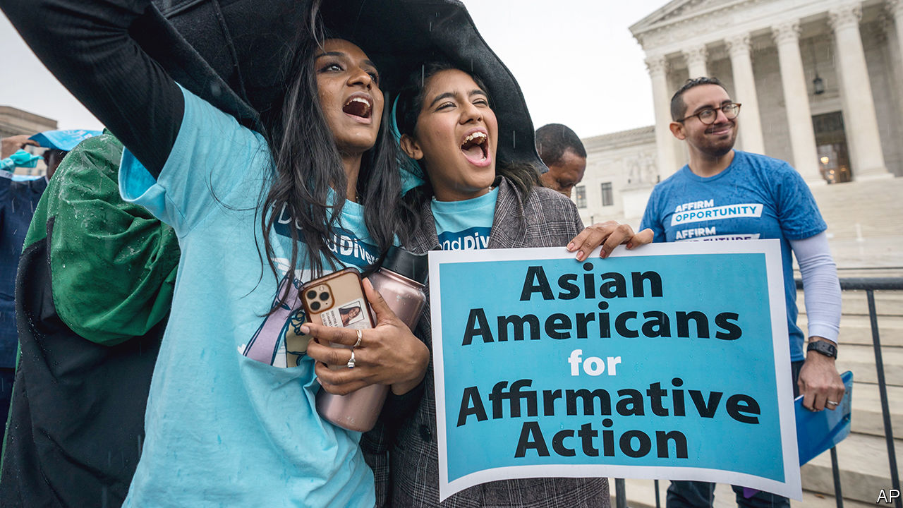

###### Making a meritocracy

# American society is so focused on race that it is blind to class 

##### The end of affirmative action in college admissions could be a chance to build a better system 

 

> Nov 2nd 2022 

Affirmative action in American college admissions may be about to end. On October 31st the Supreme Court heard two cases in which lawyers argued that the current practice—which allows universities to favour applicants of some races over others—violates civil-rights laws and the constitution. Judging by the sceptical questioning of the conservative justices, who thanks to Donald Trump now , the question is not whether such preferences will be restricted, but whether they will survive at all.

For more than 40 years the court has allowed some positive discrimination. But it has done so with discomfort. Too-obvious tactics like racial quotas, or awarding points for skin colour, were ruled excessive. The compromise was to consider race as one part of “holistic admissions” in a way that made its weight hard to discern. In 2003 Justice Sandra Day O’Connor declared the practice ought to be time-limited, expecting it to be unnecessary 25 years from then. If the court rules as expected in June 2023, five years ahead of Ms O’Connor’s schedule, there will be some sorrow, but hardly the same backlash as met the overturning of the right to abortion set in . Surveys show that majorities of African-Americans, Californians, Democrats and Hispanics all oppose the use of race in college admissions (and in other areas). The demise of this unpopular scheme will offer a chance to build something better.

A diversity of backgrounds in elite institutions is a desirable goal. In pursuing it, though, how much violence should be done to other liberal principles—fairness, meritocracy, the treatment of people as individuals and not avatars for their group identities? At present, the size of racial preferences is large and hard to defend. The child of two college-educated Nigerian immigrants probably has more advantages in life than the child of an Asian taxi driver or a white child born into Appalachian poverty. Such backgrounds all add to diversity. But, under the current regime, the first is heavily more favoured than the others. 

Racial preferences are not, however, the most galling thing about the ultra-selective universities that anoint America’s elite. The legal case against Harvard, one of the universities defending itself before the Supreme Court, has prised open its admissions records to show the scale of unjustified advantage showered upon the already privileged—disproportionately those who are white and wealthy. A startling 43% of white students admitted to Harvard enjoy some kind of non-academic admissions preference: being an athlete, the child of an alumnus, or a member of the dean’s list of special applicants (such as the offspring of powerful people or big donors).

A cynic could argue that racial balancing works as a virtue-signalling veneer atop a grotesquely unfair system. A study published in 2017 found that most of Harvard’s undergraduates hailed from families in the top 10% of the income distribution. Princeton had more students from the top 1% than the bottom 60%. When this is the case, it seems unfair that it is often minority students—not the trust-funders—who have their credentials questioned. University presidents and administrators who preen about all their diverse classes might look at how Britain—a country of kings, queens, knights and lords—has fostered a university system that is less riven with ancestral privilege.

Unfairness in American education will not be fixed by one court ruling. But it will shock a system in need of reform. Legacy admissions should be ended. Colleges claiming that alumni donations would wither without them should look to Caltech, MIT and Johns Hopkins—top-notch institutions that ditched the practice and, as  went to press, still seemed reputable and solvent. Blunt racial preferences will probably need to be replaced in response to the Supreme Court. But a less socially divisive system based on income could take their place. That would do a better job of taking actual disadvantage into account. It would still favour non-white and non-Asian Americans, because they are more likely to be poorer, but would do so using a racially neutral method. 

In some ways, the question of who gets into a handful of elite universities is a distraction from the deeper causes of social immobility in America. Schooling in poorer neighbourhoods was dismal even before covid-19. The long school closures demanded by teachers’ unions wiped out two decades of progress in test scores for nine-year-olds, with hard-up, black and Hispanic children worst affected. Efforts to help the needy should start before birth and be sustained throughout childhood. Nothing the Supreme Court says about the consideration of race in college admissions will affect the more basic problem, that too few Americans from poorer families are sufficiently well-nurtured or well-taught to be ready to apply to college. However the court rules, that is a debate America needs to have.■

