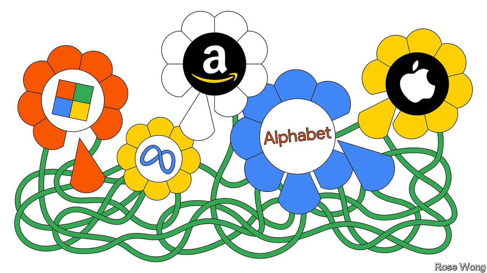

###### Business in America

# Facebook and the conglomerate curse 

##### Beset by bloating and egomania, big tech would benefit from active boards and investors 

 

> Nov 3rd 2022 

In 1997, in his first letter to shareholders, Jeff Bezos, Amazon’s founder, wrote that it was still “Day 1” for his firm. Day 2, he later explained, would mean stasis, followed by irrelevance. His rousing call to avoid complacency seems apt today. Silicon Valley’s five big tech giants, Alphabet, Amazon, Apple, Meta and Microsoft, have long been the bedrock of America’s stockmarket and economy, miraculously combining reliable growth and profitability. But after a torrid third quarter their market capitalisations have now collectively dropped by 37% so far this year. About $3.7trn of value has evaporated. 

The law of large numbers made it inevitable that the tech giants would mature. Sales growth in the last quarter slowed to 9%—barely above inflation. As they have grown bigger, they have become ; a fact which the digital surge during the pandemic only temporarily masked. Penetration rates for smartphones, digital advertising and streaming are plateauing. With slowing core businesses, the giants are venturing onto each other’s turf, increasing competition.

Meanwhile, they are threatened by “”. The symptoms of this disease are bloating and egomania. Consider the recent orgy of spending on hiring, experimental ventures, vanity projects and building data centres. In March the five firms’ combined annual expenses reached $1trn for the first time, and the value of the physical plant of these supposedly asset-light businesses has reached $600bn, over triple the level of five years ago. Swollen costs and balance-sheets mean returns on capital have fallen from over 60% five years ago to 26%. Three of the five do not deign to pay dividends.

It is hardly unprecedented for successful companies to lose their focus, or to fail to control costs. In the 1980s rjr Nabisco’s executives splurged on jets and golf before being ousted by private equity’s barbarians. General Electric sprawled and had to be partially bailed out during the financial crisis of 2008-09. The best safeguards against such indiscipline are active boards and investors. When successful managers start to believe that they always know best, it is the board’s job to rein them in. 

But here, the tech firms’ governance rules add a twist. Often they entrust disproportionate power to bosses and founders, some of whom enjoy special voting rights that give them near-absolute control. Such bosses often cultivate an image as visionaries, whose daring bets horrify myopic outsiders but end up lucratively transforming the world. 

At the worst end of the spectrum is Meta, the owner of Facebook, run increasingly erratically by Mark Zuckerberg. Its value has dropped by 74% this year. Its core business is wobbly, attracting too much toxicity, too few young people and too little advertising. It has become clear that Mr Zuckerberg is betting the firm on the metaverse, an attempt to diversify away from social media, on which he plans to lavish 20 times what Apple spent to build the first iPhone. Because dual share classes give him 54% of voting rights, Mr Zuckerberg has been able to ignore the pleas of outside investors. Alphabet, the owner of Google, has performed better but is flabby. Its founders retain 51% of its voting rights, allowing them to overrule the wishes of other owners. 

In the middle is Amazon, which has over-invested in e-commerce and expanded too far, crushing its cashflow and returns. Mr Bezos, who remains executive chairman, owns less than 15% of the firm’s voting rights, so he has to be at least somewhat responsive to investors. Apple and Microsoft are at the benign end of the spectrum. Both firms are older, no longer have founders with controlling stakes and operate on the principle of one share, one vote. Both listen to outsiders. In 2013 Tim Cook, Apple’s boss, sat down for dinner with Carl Icahn, a fiery investor, and took on board his request to return money to shareholders through buybacks. In 2014 Microsoft invited an activist investor, Mason Morfit, onto its board. The two firms have performed the best of the big five this year. 

When you have disrupted industries and created hundreds of billions of dollars of wealth it is hard to accept financial constraints and outside scrutiny. Nonetheless, many in big tech’s elite need to show more humility and better performance. Otherwise Day 3 might bring an escalating confrontation between them and investors over who controls the most successful firms of the past two decades. ■

