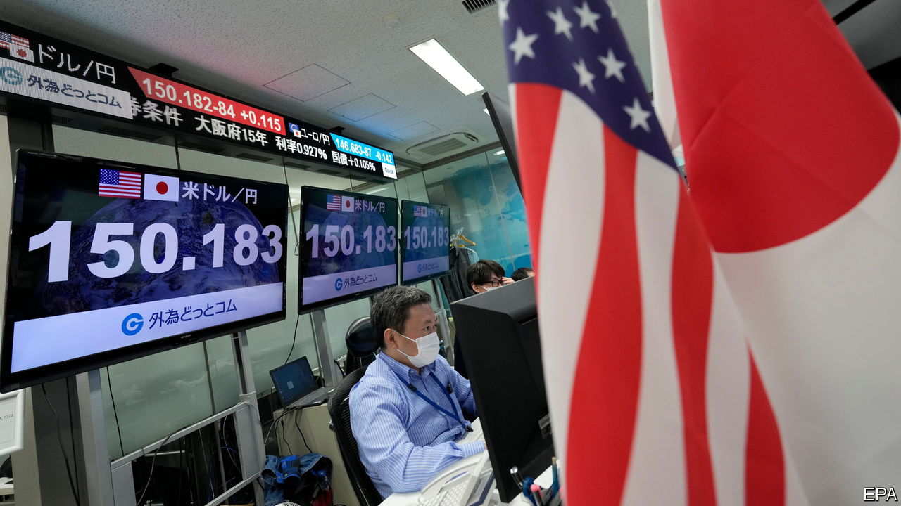
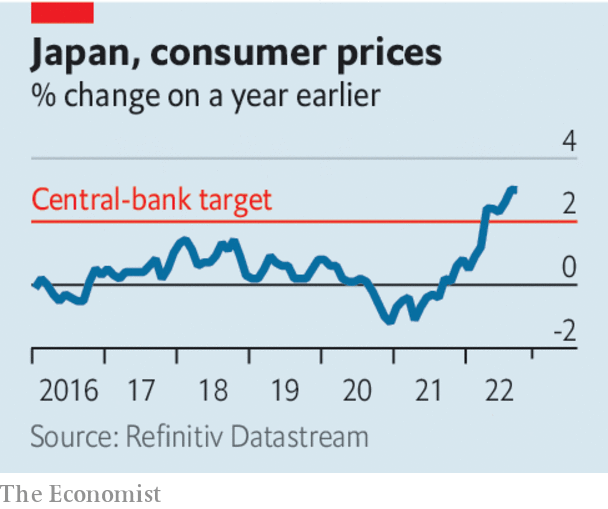

###### Debt, Japanese style

# Japan’s bond-market peg could snap 

##### Financial danger is brewing in the last bastion of low interest rates 

 

> Nov 3rd 2022 

Until inflation subsides, central bankers will keep turning the screws on the global economy. On November 2nd the Federal Reserve  by 0.75 percentage points for the fourth consecutive time, six days after the European Central Bank made the same move. As we published this leader, the Bank of England was poised to raise rates by a similar amount. Grim news on inflation keeps  from higher rates. The latest nasty surprise came from the euro zone, where prices in the year to October rose by a record 10.7%.

The higher rates rise, the sterner the test for global markets and the more likely that something breaks. Britain has already had to stave off fire-sales of assets by pension funds. Investors fret about America’s Treasury market, which has become less liquid, and the risks from junk corporate debt. Yet there is another danger that has gone underappreciated, in part because it lurks in a place where monetary policy Japan. Since 2016 its central bank has pegged the yield on ten-year government debt near zero. The end of the peg, once hard to imagine, now looms menacingly on the horizon.

Central-bank pegs often collapse in spectacular fashion. In 2015 the Swiss National Bank abandoned a limit on the value of the Swiss franc against the euro. The franc surged by over 20% in a day. In 2021 Australia’s central bank gave up defending its cap of 0.1% on three-year bond yields. They soared by 0.7 percentage points in a week.

 


For years the Bank of Japan has found it easy to enforce “yield-curve control”, because the idea that it would need to raise interest rates seemed so far-fetched. From 1999 to 2012 Japan suffered bouts of deflation; for most of the rest of the 2010s inflation was positive, but well below the central bank’s 2% target. Stubbornly low inflation, and the return of deflation during the pandemic, meant that the bank looked set to stimulate the economy for ever.

Today, however, the prospect of tightening no longer seems so remote. The widening disparity between bond yields in Japan and in America has forced down the yen, which has fallen by more than a fifth against the dollar this year, to its lowest level since 1990. That has raised import costs in Japan and helped lift annual inflation to 3%. 

The government has sought to prop up the yen by selling vast quantities of dollars: in September and October it got rid of over $60bn. As long as the gap between Japanese and American interest rates remains, though, such interventions are futile. And although homegrown inflation is modest—wage growth is under control and services prices are up by just 0.2% annually—resurgent inflation elsewhere cautions against assuming that it will simply dissipate. On October 28th Japan’s government announced a stimulus package to support households’ incomes as prices rise, which will only add to the upward pressure.

Some analysts predict that the Bank of Japan will adjust its yield cap in 2023, perhaps by raising it. Yet pegs are hard to move gracefully. As soon as investors expect them to be abandoned, they dump assets on the central bank in an attempt to avoid losses. The public often bears them instead. When the Bank of England abandoned a sterling peg in 1992, £3bn ($5.3bn then) went up in smoke. Already, the Bank of Japan has had to increase its bond-buying to suppress yields—a sign that the credibility of its cap could be ebbing. If one peg is ditched, investors are more likely to bet against any successor. 

A chaotic exit from yield-curve control would be a drama for the world’s third-largest economy. It would expose leveraged bets on long-term bonds, like those that blew up in Britain. Trouble could spread: the opacity of cross-border financing flows involving the yen makes the global consequences unpredictable. In the nightmare scenario, bond-market tumult could also cast doubt on the sustainability of Japan’s vast net government debts of about 170% of GDP. In the days of cheap borrowing, those debts were thought to indicate the heights to which other countries might safely climb. Now Japan’s economic policy looks like a tripwire for global financial markets. ■

