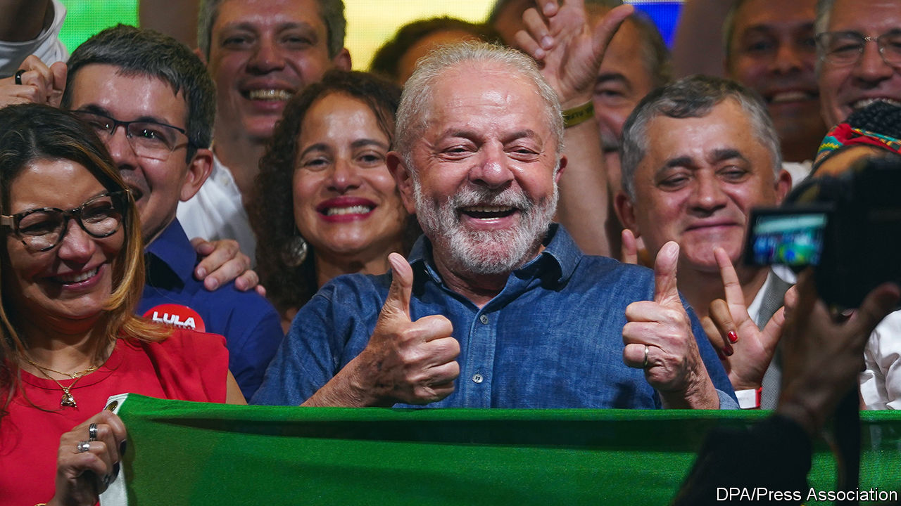

###### Silva winning playbook

# Lula will be Brazil’s next president. Now for the hard part 

##### The country is bitterly divided and short of cash 

 

> Oct 31st 2022 

When Luiz Inácio Lula da Silva was last in office, between 2003 and 2010, he used to quip that “God is Brazilian”. If so, the Almighty has a dark sense of humour. The presidential-election campaign that ended with a run-off on October 30th was one of the nastiest Brazil has ever endured, drenched in calumny and punctuated with violence. Lula, as the left-wing victor is known, won by a: 1.8 percentage points.

After the election tensions mounted as Jair Bolsonaro, the right-wing populist incumbent, took two days to speak. He did not explicitly concede. However, it looks likely that the transfer of power will be relatively peaceful.  lorry drivers spread across the country, but Mr Bolsonaro, who has previously encouraged violence, told his supporters not to block roads.

In many ways, the result is a triumph for Brazil’s democracy. The vote count was clean and Lula won fair and square. Mr Bolsonaro has for months suggested the opposite: that the polls would be rigged and the only way Lula could win was by cheating. He should admit that he was wrong, though he probably won’t.

Lula will find running Brazil much harder than last time he was in charge. The country is more divided than it was then, and its public finances are in worse shape. The campaign aggravated Brazil’s divisions with a torrent of falsehoods: that Lula is a satanic communist, and that Mr Bolsonaro is a cannibalistic paedophile. Tempers flared dangerously. Since August seven people have been killed for their political views. 


As for the public finances, Brazil has racked up debts since Lula was last in power, because of a recession in 2014-16 and . So, although commodity prices have jumped since Vladimir Putin invaded Ukraine in February, boosting Brazil’s exports, the government has little room for fiscal manoeuvre. 

Lula’s first task is to try to calm and unite the country. He made a good start in his victory speech, vowing to be the president for all Brazilians, not just those who voted for him. He may struggle, however, to reassure the legions of  who have been told, absurdly, that he will close their churches and impose Venezuelan-style far-left despotism. He has acknowledged that his victory was down to a broad coalition of democrats; he ought to govern in that spirit.

His next step should be to appoint a prudent economy minister. He should reiterate that he will not reverse privatisations, which he opposed at the time, and explain how he will pay for any . If he is going to remove a cap on spending, introduced in 2016 after the recession, he needs to assure markets that there will be a sensible new fiscal rule to replace it. More clarity is needed over how he will pay for green policies. He is wisely seeking foreign help to curb deforestation in the Amazon, which has increased fast under Mr Bolsonaro. 

Lula will have to find a way to work with Congress, which is dominated by conservatives. He should make clear that the graft that flourished under the rule of his Workers’ Party, seen most egregiously in the  (Car Wash) scandal, will not occur again. (Lula was jailed for 19 months on charges of corruption; his conviction was annulled in 2021 and he maintains his innocence.) He should appoint an independent attorney-general from a list the public prosecutor’s office provides. Similarly, his cabinet should be chosen on the basis of merit, rather than loyalty.

The next few years will be tough. Whatever Lula does,  is likely to remain a disruptive force in Brazilian politics, just as Trumpery is in the United States. Lula should learn humility from the narrowness of his win, after coming to power with two landslides in the early 2000s. He needs to forge consensus among those he disagrees with. If he governs pragmatically and inclusively, he has a chance to restore order and progress to Brazil. ■

