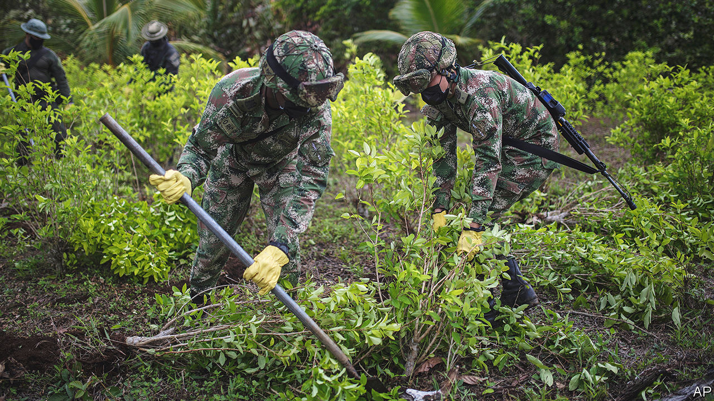
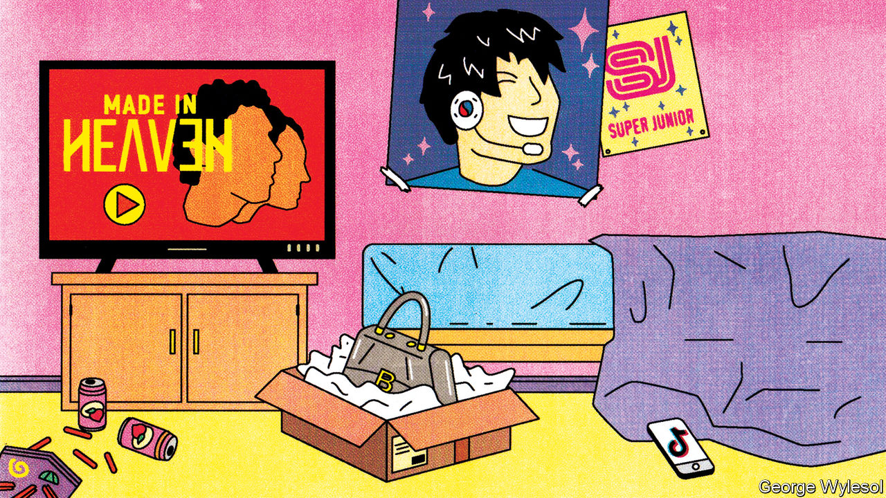
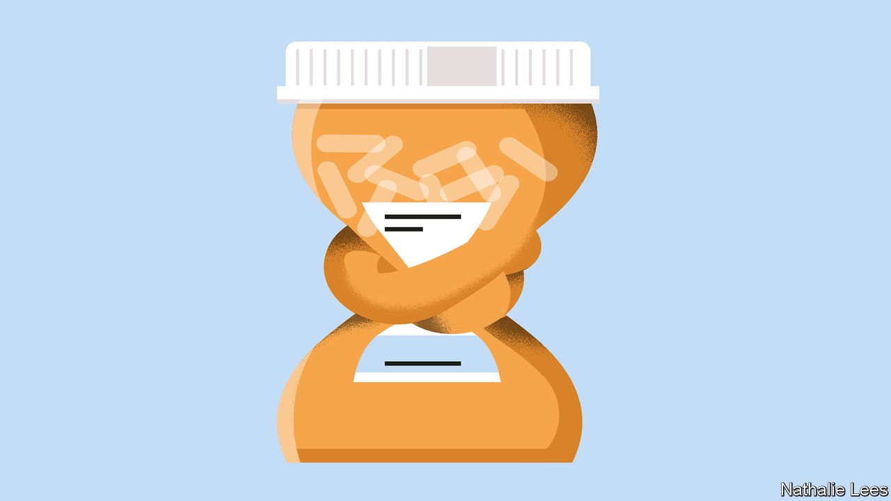

###### On cocaine, Liz Truss, pop music, antidepressants, diets

# Letters to the editor 

##### A selection of correspondence 

 

> Nov 3rd 2022 


Drug highs and lows

You support the legalisation of cocaine (“”, October 15th). A lot is known about the effects of this substance on the brain. Cocaine artificially stimulates certain neurons in a brain circuit known as the “reward system”, which drives behaviour towards stimulants that are critically important for survival, such as food, sex and social interactions, and away from unpleasant and dangerous ones. Attempts to find a cure for addiction have not failed for lack of trying or resources, but because it is a very hard problem. Any pharmacological intervention would meddle with brain processes that govern these fundamental human behaviours. 

The idea that the savings gained from unwinding the war on drugs could be used to find a cure to addiction, thus mitigating the societal damage of the possible more widespread use of cocaine, may not work and is dangerous. 

Angelo Bifone

Professor of neuroimaging

University of Turin

As someone who has long-supported the case for a regulated market in cocaine, based on my personal experience of the cost of the war on drugs in Colombia during Pablo Escobar’s time, I wholeheartedly welcome your reopening of the issue. It is extraordinarily dispiriting that since that time the supply of cocaine has grown greatly and the violence associated with it has spread much more widely in the region. It is a lamentable policy failure.

As you say, the political prospects of achieving change in the drug-consuming countries, despite the damage that the uncontrolled cocaine trade does there too, still appear slim. However the open support for reform from Gustavo Petro, the president of Colombia, and the Peruvian administration puts it back on the agenda. That coca cultivation is one of the causes of deforestation in the Amazon should help to concentrate minds in the international community.

The blanket prohibition on the recreational use of narcotic drugs in the UN conventions is increasingly being called into question, not least because of the legalisation of cannabis in 19 states of the United States (the country that was primarily responsible for the conventions and their enforcement) and Canada and Uruguay as well as the decriminalisation of all drugs in Portugal. 

Sir Keith Morris

British ambassador to Colombia, 1990-94


 


It was her party

Your characterisation of Liz Truss as being the principal cause of her own demise was unfair (“”, October 15th). In fact, Ms Truss represented the culmination of 12 years of Conservative economic and social policies in Britain that good academic research reveals has led to increasing income inequality, low productivity and poor public services. The result is a fraying social contract, political divisiveness and a sluggish economy. Add Brexit to this toxic mix and you have the makings of long-term decline. 

Those attracted to the leadership of such a party are too often the intellectual wanting, driven by an exaggerated hunger for personal wealth accumulation with little concern for the collective well-being of society at large. Britain’s fiasco should be seen for what it is: the failure of laissez-faire neoliberalism and trickle-down economics.

Joseph Ingram

Fellow

Canadian Global Affairs Institute


It is rare indeed that one sees a brand new and universally applicable use of the English language appear fully formed in a veritable instant. Regarding Ms Truss, Johnson must be positively popping with pride that your worthy organ has ensured that forever hence the minimum bar any politician 

in the world must meet is to outlive a head of lettuce.

Michael Royce


In the future, perhaps British school children will remember the fates of the five Conservative prime ministers since 2010 with one word, similar to the way we remember the six wives of Henry VIII. For the first four it will be: Brexited, backstopped, partygated and iceberged. We’ll see if Rishi Sunak comes to be known as “survived”.

Stephen Silvia


 


What’s original in pop?

Yes, a teenager in New York may be “as likely to listen to K-pop and Afrobeats tracks…as American hip-hop” (“”, October 8th). But what do the different points of origin matter compared to the overwhelming sameness of the content? This represents one of the signal cultural triumphs of the post second world war baby-boom that made adolescents the only pop cultural audience that matters. The same dumbing down, the same rhythmic and harmonic impoverishment in pop music everywhere. The remaining differences are mere grace notes, the tease of exoticism, nothing fundamental.

Hilary Hinzmann


 


Over medication

Public awareness is slowly catching up with the charade that has characterised the pharmaceutical industry’s promotion of anti-depressant medications (“”, October 22nd). The limited benefit of antidepressants has been known since the 1990s. I recall discussing with a psychiatric colleague the results of a statistical meta-analysis of controlled trials of Prozac versus a placebo in the 1990s that showed little benefit of the drug in alleviating depression. My colleague responded that he did “not believe that type of study”, which is an interesting comment on interpretive bias, as he did believe in some of the individual studies that provided data for the meta-analysis. 

My colleague’s response shows the fundamental problem with clinicians who rely more on their personal judgment than on outcomes from sound scientific investigation. After all, those ambitious individuals who obtain medical degrees or PhDs do so not just for the money but for the privilege of considering themselves experts in the field. 

It is not just financial incentives that drive the promotion of ineffective treatments but clinicians’ understandable desire to use their idiosyncratic expertise in treating patients. And, as patients, most of us want the “best” doctor or therapist, rather than the scientifically best treatment. Progress in treating mental-health conditions is a slow, arduous process with many trips into dead ends. Health-care consumers are well-advised to take a buyer-beware attitude.

William Koch

Clinical professor emeritus

University of British Columbia Faculty of Medicine


 


Inactive humans

A professor of evolutionary anthropology wonders why, with a diet so similar to ours, palaeolithic humans were so much thinner than we are today (“”, October 15th). Knowing nothing about anthropology or diet, may I suggest the clue is in the name? We call those humans “hunter-gatherers”, not “recliner-gamers” or “sprawler-retweeters”. 

Alan Weatherill


