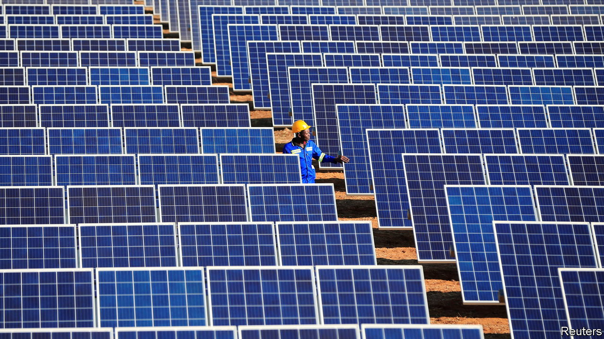

###### The green continent

# Africa will remain poor unless it uses more energy 

##### Greenhouse-gas emissions south of the Sahara are tiny 

 

> Nov 3rd 2022 

A window seat in a helicopter flying south-west from Windhoek, Namibia’s capital, offers an otherworldly diorama. The landscape shifts from earthly desert to Mars-red dunes, then to moonscape as the chopper nears Luderitz. In the early 1900s this tiny port was the hub for a diamond boom that brought the art-nouveau mansions that perch on the town’s slopes. More than a century on, Namibia hopes that the area will again bring riches, this time from sun, wind and land, by hosting one of Africa’s largest renewable-energy projects. 

The plan is that solar plants and wind turbines will provide power to split water into oxygen and  to make ammonia, an important industrial chemical. James Mnyupe, an adviser to Namibia’s president, struck a deal last year with Namibia’s preferred developer, Hyphen, a German-led consortium. It could lead to an investment of $9.4bn—a huge boost for a country with a GDP of about $12bn. 

Namibia’s green-hydrogen project is symbolic of the optimism about renewable energy in Africa. Many hope that the continent will “” past fossil fuels. 

Alas, things are not so simple. In the rich world the big energy challenge is how to make the supply cleaner. In Africa the problem is how to generate more energy. Average consumption per person in sub-Saharan Africa, excluding South Africa, is a mere 185 kilowatt-hours (kWh) a year, compared with about 6,500kWh in Europe and 12,700kWh in America. An American fridge uses more electricity than a typical African person. Low energy use is a consequence of poverty; but it is also a cause of it. If Africa is to grow richer it will need to use a lot more energy, including fossil fuels. 

Yet its efforts to do so put it on a collision course with hypocritical rich countries. The rich world is happy to import fossil fuels for its own use, while at the same time restricting public financing for African gas projects intended for domestic use. “Is the West saying Africa should remain undeveloped?” fumes Matthew Opoku Prempeh, Ghana’s energy minister. 

To be sure, clean-energy technologies are a huge opportunity for the continent. They are already the main sources of power for 22 of Africa’s 54 countries. But to hope that Africa can rely on renewables alone to boost consumption is naive. Take electricity, a source of power that is still not available to some 590m people, or about half of sub-Saharan Africans. 

What electricity there is, is unreliable and costly. Adjusted for purchasing power, households in many African countries pay higher rates than those in the OECD, a club of mostly rich countries. In research published in 2019, Energy for Growth, a think-tank, noted that 78% of African firms experienced power cuts in the past year, while 41% said that electricity was a major constraint. Many businesses and well-off households rely on generators. These have more total capacity than there is in sub-Saharan Africa’s installed renewables.

In a report published in June the International Energy Agency (iea) pointed out that if Africa is to provide universal electricity access by 2030 it would have to almost double its total generation capacity from 260GW (currently 3% of the global total) to 510GW. Renewables could provide 80% of the increase, it reckons. Achieving that would be a mammoth task.

 


Africa is home to 18% of humanity, yet receives less than 5% of global energy investment. Much of this tends to go on producing oil and gas for export. The IEA thinks that total capital spending on energy between 2026 and 2030 in Africa would have to be nearly twice what it was between 2016 and 2020. Investment in clean energy would need to rise six-fold.

All of which sounds highly ambitious. African public finances are in a woeful state. Twenty-two countries are in debt distress or at high risk of it, according to the IMF. Those considering turning to international capital markets are facing eye-watering borrowing costs. China, a source of loans for energy schemes over the past two decades, is becoming more parsimonious. Its lending to domestic African power schemes fell from a peak of nearly $8bn in 2016 to $1.5bn in 2019. 

African firms could invest more in infrastructure. Some governments, such as Kenya’s, are changing regulations to allow pension funds to do so. But pension assets in the ten most developed African countries (a bit more than $300bn) are only slightly greater than those of the California state teachers’ pension fund. Investors rarely lend for long-term projects: 70% of loans are for less than five years.

The iea reckons the gap will be filled by “an unprecedented level” of private foreign capital. Yet investors complain of a shortage of bankable African projects. Coal or gas plants are relatively cheap to build, as most of their lifetime costs come from buying fuel. Solar- or wind-power projects, by contrast, are cheap to run but expensive to build. This means they are very sensitive to the cost of capital. And that cost can be up to seven times higher in Africa than in America and Europe, the iea notes. 

Governments in rich countries have promised climate finance that, among other things, is meant to encourage private investment in renewables. The IEA calculates some $1.2trn will be needed by 2030. Yet the past is filled with broken promises. In 2009 rich countries pledged $100bn a year to poor countries by 2020 to help with climate change (some of it from the private sector). But the annual amount has never surpassed $85bn and much of it has been in the form of loans. Rich countries have now promised they will reach the $100bn target this year. “Talk is cheap,” laments Murefu Barasa of EED Advisory, a Nairobi-based consultancy. “Nobody knows even how to account for that money.” 

Namibia shows that a bankable project can be put together. The government has prioritised the scheme, establishing a “green hydrogen council” to streamline decision-making. It has gone out of its way to minimise the risk of corruption, for instance by installing 24-hour surveillance cameras in the facility where contractors’ bids were scrutinised. The project is attracting concessional finance from the Netherlands and Germany, which has in turn lowered the risk for private investors. But it is just one scheme.

One reason there are not more is because many utilities are struggling. More than half of those in sub-Saharan Africa cannot cover their operating costs—let alone fund investments. Because they bring in revenue, they “are the foundations of the building of the power sector,” says Pedro Antmann, a consultant. If they fail, “the whole building collapses.”

 


Most are state-owned, inefficient and plagued by political interference. Some utilities barely track their finances. Until 2020 Ethiopia’s simply could not say with certainty if the previous year was profitable. Many do not maintain equipment, stop illegal connections or bill properly. The Electricity Company of Ghana suffers from all three problems and loses 28% of its power, admits Samuel Dubik Masubir Mahama, the managing director. (Losses in American utilities are typically about 5%.) It recently ran an amnesty in which some 120,000 people who had meters but were not paying came forward. Mr Mahama had no record of 104,000 of them. How many more might be out there? “I think it’d be quite a number,” he chuckles. 

Most African utilities do not charge tariffs that reflect costs. At root this is a political problem. Andre de Ruyter, the head of Eskom, the South African utility that has overseen record blackouts in 2022, admits it has been “politically expedient” for regulators to keep prices low. This has caused a shortfall of 380bn rand ($23bn) since 1994, he reckons, about the same amount as the company’s debts. Other governments directly subsidise electricity tariffs. Removing subsidies entirely is not easy. “You cannot,” laments Mamadou Fall Kane, who advises Senegal’s president on energy policy. “Politically you will kill yourself.” 

If cheap tariffs were targeted at only the poor, many utilities could stay in the black without government bungs. In 2018 Niger got rid of all subsidised tariffs except for those to the poorest, who are 29% of consumers but use just 1.8% of electricity. 

Plug it in

New technology means that some consumers can bypass utilities. In rural areas, stand-alone “mini grids” linked to small generators such as a solar park are often the cheapest way for villages to get connected. Solar-home systems are booming. 

Going off-grid is only a partial solution, however. Connecting households to the grid remains the cheapest way of lighting up about 45% of unelectrified African households, according to the IEA. But without support the poor often cannot afford the upfront costs of connections. 

Using grids and building connections between African countries would also make it easier to rely more on renewables. That way a cloudy day at a solar park in Senegal could be offset by a dazzling one in Mali. Yet in most parts other than southern Africa, regional interconnections are weak. And these regional links require trust that a neighbouring country will not halt power exports in a crisis. 

 


Africa’s fragmented infrastructure is one reason why gas has played such a big role in powering the continent. In the ten years to 2021 about two-thirds of new generation capacity in Africa came from gas-fired stations. Even if African countries invest heavily in renewables over coming decades, many will still need an on-demand source of electricity to cover the vagaries of the weather. Hydropower can help, but only in places blessed with steep valleys and rivers. And gas remains hard to beat for directly powering heavy industry. 

The view at many of west Africa’s biggest ports provides a reality check for anyone hoping for an all-renewable future. Looming over harbour after harbour are hulking beasts, loaded with glistening pipes, rows of smoke stacks and, squeezed on the end, a power pylon. In recent years the governments of Gambia, Ghana, Guinea Bissau, Ivory Coast, Senegal and Sierra Leone have signed contracts for these floating fossil-fuel power plants. They produce a large share of those countries’ electricity. Some run on heavy fuel oil, but Ghana’s now runs on local gas. Senegal is converting its, too. 

Happily, in much of the continent renewables are already cost-competitive with gas and coal. By 2030 they should be more so. Better and cheaper batteries could eventually help renewables cope more easily with peak demand. But for now, in places with abundant gas reserves, little hydropower potential or frequent outages throughout the day, gas-fired plants may still offer the most compelling combination of flexibility, stability and price—at least for some new generation. 

That is why the West’s reluctance to finance gas projects is in conflict with Africa’s desire to use more energy. Last year 39 countries and organisations including almost all of the world’s big, rich democracies—call them the Virtue-signalling 39, or v39—pledged to stop almost all financing of new fossil-fuel projects internationally by the end of the year. The World Bank is pulling back, too. The hypocrisy is easy to spot: three-quarters of the European members of the v39 are building new fossil-fuel pipelines at home. 

Gas exploration and development are largely financed by private firms, so the ban will not stop gas being found and pumped. Senegal did not need World Bank money to develop its soon-to-produce gas field, points out Mr Fall Kane, “because we have the market and we have world demand”. Russia’s invasion of Ukraine sent gas prices soaring, making private investment even easier to attract. And despite many European countries’ refusal to finance overseas gas projects, the European Union recently labelled the fuel as green, which would allow Europe’s projects to be backed by environmental investors. 

In recent years rich countries and multilateral banks have financed about $4bn in gas-power plants on average per year in low- and middle-income countries. Much of that funding will now be halted. The v39 pledge will not stop Africa’s gas from being extracted. But it will ensure it will be mainly rich countries (including members of the v39) that get to burn it. 

Gaslighting Africa

Africans are understandably angry. They argue, convincingly, that Africans using more gas should not be a cause for climate panic. Consider a thought-experiment in which sub-Saharan Africa (excluding already higher-consuming South Africa) increases its electricity consumption per head overnight by an extraordinary factor of five. That would give it a level of electricity consumption per person akin to that of Indonesia today—a scarcely conceivable transformation for ordinary Africans and one which took Indonesia almost three decades to achieve. Even if all the new electricity came exclusively from gas-fired power stations (which no one is suggesting), these would add the equivalent of about 1% of current global emissions. 

Such calculations hint at a blunt truth. Because so many Africans are poor they are much more vulnerable to the harms of global warming, such as droughts, disease and higher food prices, than people in richer countries. For much of Africa the best way of adapting to a warming planet is to become rich enough to deal with its consequences. Denying Africans cheap and reliable power will make this task much harder, while doing almost nothing to curb global warming. ■

