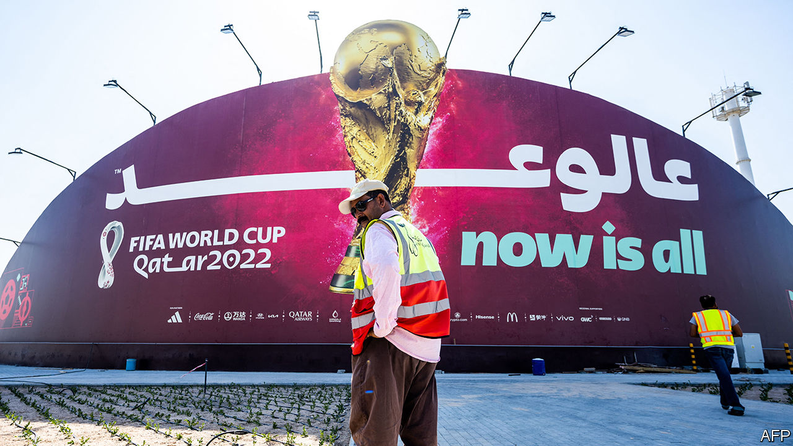

###### Not quite over the goal line

# Qatar races to ready itself for an unusual World Cup 

##### The stadiums are set, the beds are not, and some locals wonder if this was worth $300bn 

 

> Nov 2nd 2022 

THERE is no congestion on the tree-lined, ten-lane motorway out of Doha, the capital. It feels big enough to fit every car in Qatar. As drivers glide north, they pass Lusail stadium, the 80,000-seat bowl that will host the World Cup final in December. It takes just another 20 minutes to reach al-Bayt stadium, where a semi-final will be played. Qatar’s promise to stage a  has been kept: football fans should have no trouble watching more than one match a day.

Its efforts look less impressive if you turn down a narrow road soon after al-Bayt stadium. At the end sits the al-Khor “fan village”, which promises hundreds of guests an “enjoyable and lavish stay” with swimming pool and restaurant. Rooms start at 1,512 rials ($415) a night.

On a visit in late October, the site looked neither enjoyable nor lavish—nor finished. Bulldozers worked the earth. Giant spools of cable sat along the perimeter. Perched amid an expanse of sun-baked dirt, it looked less like a deluxe resort than the sort of desert encampment where Arab regimes like to stick dissidents.

The drive to al-Khor is a microcosm of Qatar’s World Cup preparations. First, the good news. The big-ticket infrastructure is ready. All eight stadiums are done—and creatively designed. Al-Bayt is styled like a nomad’s tent, while “Stadium 974” is a vibrant structure made from 974 recycled shipping containers (the number is Qatar’s international dialling code).

Many new roads have been built. A new $36bn metro will whisk fans around town (free). Doha’s main airport, one of the world’s best, is decked out for the tournament, and the old airfield has reopened to handle overflow. By some estimates the price for all this is close to $300bn.

There are less visible changes, too. Reforms to the hated (sponsorship) system mean most migrant workers may change jobs or leave Qatar without their employer’s permission. The International Labour Organisation estimates the new minimum wage of 1,000 rials gave 400,000 workers a pay rise. Horror stories still abound of unpaid wages and exorbitant recruitment fees. But even many of Qatar’s critics acknowledge that the World Cup forced it to make real reforms.

So far, so good. But fans need somewhere to sleep. Qatar has sold 2m room-nights at everything from five-star hotels to tent villages. Earlier this month it added another 30,000 rooms (or roughly 1m room-nights) for last-minute bookings. Omar al-Jabbar, the official in charge of accommodation, was keen to show off a traditional dhow that would serve as a floating apartment. It looked pleasant, with plush bedding and a hot tub on the top deck (and a curious number of ashtrays strewn everywhere). But there are only 30 dhows available, the largest of which sleeps ten people. Far more fans will end up at places like Barwa Barahat al-Janoub, which offers rooms for 300 rials a night. Mr Jabbar says it will accommodate 10,000 guests. “The heavy construction is all done. They’re fitting some beds, testing the water,” he says. “But we can say 99% is done.”

If so, one wonders how it looked at 98%. Some roads into the neighbourhood are still not paved. The booking website describes it as “inspired by traditional Arab homes built around courtyards”. It neglects to mention that the site is ten kilometres (six miles) from the nearest metro station; officials promise shuttle buses. There are no restaurants or shops for miles, though if fans get truly peckish there is a slaughterhouse across the street.

Officials insist they have not overpromised: “Anything on our portal is finished, it’s ready. We upload only the things which [are] ready,” says Mr Jabbar. And much can change by the time the tournament kicks off on November 20th. Workers are toiling around the clock. For now, though, many places to stay do not seem ready.

Another fan village sits in a free zone near the port. Renderings show grassy pathways between colourful cabins. When your correspondent visited, it was a construction site. Dirt paths were strewn with pallets, boxes and barrels; excavators were digging trenches. The only greenery in sight was piles of rolled-up Astroturf.

Fans will be able to buy beer outside stadiums, but just the non-alcoholic sort inside. This is not unusual (many European countries have similar rules). Away from the stadiums, they will be able to tipple at better hotels and at “designated areas”; organisers are cagey about where these are.

Finding a spot to eat could require patience. At restaurants in souk Waqif, a popular tourist market, almost every table was full on a recent Thursday night. The same was true at the bars of West Bay, an area full of high-end hotels, and the greasy spoons in an older part of Doha. One kebab joint had a 30-minute wait.

All of this worries fans—and locals. Some Qataris are excited about the tournament. Others fear the traffic will be intolerable, the restaurants overflowing and the streets thronged with drunk hooligans. Schools will close for the month; parents wonder how they will entertain their kids. Some plan to spend the month abroad.

Quietly, some also wonder if this was all worth it. Qatar says it would have built much of this glittering infrastructure anyway, as part of its national development plan. But it has a Potemkin feel. The motorways seem too big for a country of just 3m. In fancy new malls cashiers are bored and customers scarce. Perhaps a good tournament makes Qatar a top-tier destination for tourism and big events. If it does not, at least locals heading to al-Khor will never have to worry about beach traffic. ■

