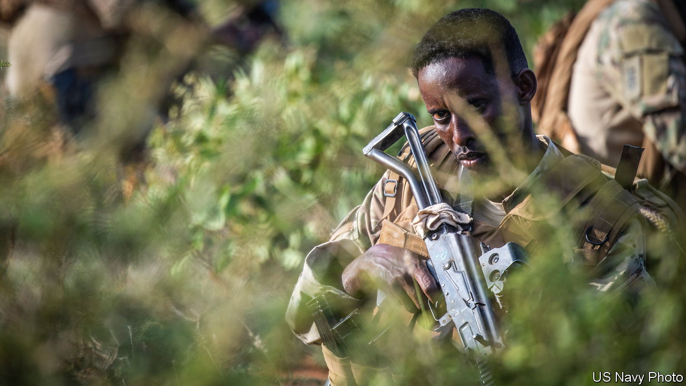
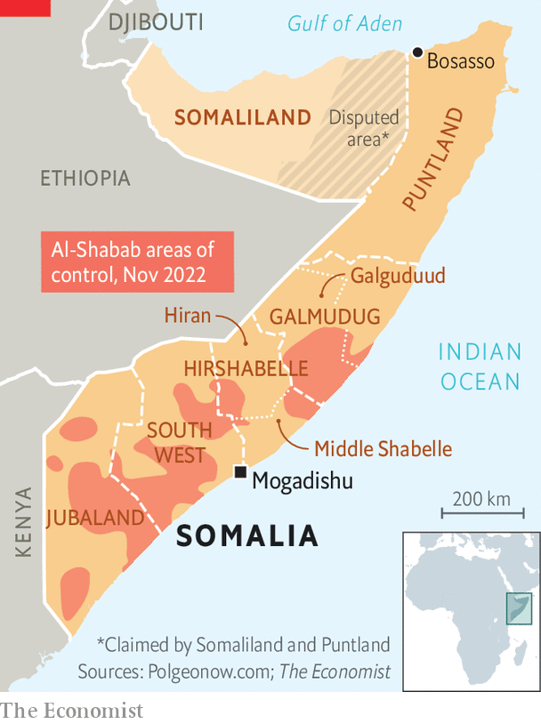

###### Somali clans

# Somali clans are revolting against jihadists 

##### Gains against al-Shabab are a boost for Somalia’s new government 

 

> Nov 3rd 2022 

Muktar Robow, once a feared leader of al-Shabab, , jabs his finger at a map of Somalia. Now a cabinet minister, he rattles off the names of places that have recently been recaptured from his erstwhile comrades. The lands of the Hawadle clan in Hiran, central Somalia? “They’ve liberated all of it.” Almost all of the region’s key roads are also under government control. The next districts to be liberated will probably be Galguduud and Middle Shabelle (see map). And the rest of Somalia? “Al-Shabab is on the back foot,” answers the former terrorist who once had a $5m American bounty on his head. “Gains are being made every day.”

Those gains have, however, come at a bloody price. On October 29th twin car bombings in the capital, Mogadishu, killed at least 100 people. It was the country’s deadliest attack since a blast at the same place five years ago. Al-Shabab swiftly claimed credit, saying their target was the education ministry and calling it an “enemy base” bent on turning Somali children away from their Islamic faith. , who has pledged “total war” against the jihadists since returning to office in May for his second term as president, replied that these revenge attacks showed the government is “winning”.

 


Though such a claim seems premature, it is true that his administration has made real strides against the jihadists in recent months. What began in the summer as a local clan revolt against al-Shabab’s increasingly onerous tax demands—amid the worst drought in four decades—has since spread. Clan militias known as the Ma’awisley have spearheaded uprisings in several districts in Hirshabelle, one of Somalia’s five federal states. The uprisings are now being backed by the national army and by American air power. 

The government says ten big towns and dozens of villages are back under its control. That is sparking hope for a country that has been battling jihadists for more than 15 years. “This is a historic offensive,” says a senior American official. 

Booting the jihadists out of Hiran severs their access to the lucrative trade routes that run right down through central Somalia from the port of Bosasso in the north. It also prevents al-Shabab from using the region as a base to attack neighbouring Ethiopia as it did in July, when several hundred of its fighters crossed the border in its biggest incursion ever. Moreover, whereas most previous offensives were led by African Union troops, “this time it’s Somali-led,” notes Omar Mahmood of the International Crisis Group (icg), a Brussels-based think-tank focused on conflict. 

The president’s new approach consists of three elements: military, ideological and economic. First, the federal government is providing ammunition, fuel and food to the Ma’awisley. The doughty clansmen know their terrain better than the national army and are more motivated to fight. By supporting them the president hopes to encourage a domino effect of revolts across the country, which he likens to how Iraqis eventually rid themselves of Islamic State. To this end he has also called on the presidents of Somalia’s semi-autonomous states to mobilise their own security forces against the militants. He has reportedly asked America to loosen restrictions on its drone strikes targeting al-Shabab. 

Meanwhile, the government is trying harder to rebut al-Shabab’s online propaganda. It is exhorting Muslim leaders to speak out against jihadism. It is also trying to squeeze the group financially by ordering businesses to rebuff its efforts at extortion. Mr Mohamud says the key lesson from his previous term as president, which ran from 2012 to 2017, is that a “military-only approach” does not work. 

In an early signal of his willingness to try new methods, the president appointed Mr Robow as minister of religious affairs. His predecessor, by contrast, had put the former al-Shabab spokesman under house arrest. “He can be an asset,” says Mr Mohamud. He suggests, for example, that Mr Robow could help the government “reclaim the Islamic narrative” from the jihadists. A more delicate but no less important task involves reaching out discreetly to former comrades and encouraging them to defect.

The government’s strategy has its drawbacks. Relying on clan militias could well end badly. Though determined, the militias are ill-trained and brutal. Last month the governor of Hiran even called on them to kill the wives and mothers of al-Shabab members. Their successes may also be hard to replicate in other parts of the country. Clan militias in al-Shabab’s heartland in the south are neither as large nor as well-armed as those in Hirshabelle. And al-Shabab has a record of quickly seizing back territories that it has lost. 

Mr Mahmood of the icg argues that ultimately the government will have to consider negotiating with the jihadists. Yet few Somalis seem to have an appetite for this. “The only language al-Shabab understands is the bullet,” says Mr Robow, whose own son was recently killed fighting the militants. “It must be eliminated.” Al-Shabab, for its part, does not sound very interested in talking either. Even so, Mr Mohamud thinks it is but a matter of time. “When we reach a certain level we’ll open the door for dialogue,” he says. “But for now [the jihadists] are not ready.” ■

