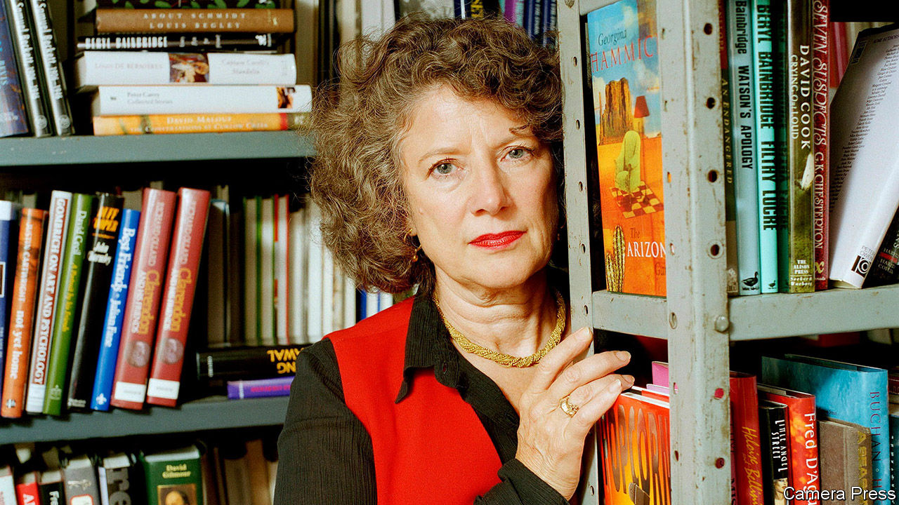

###### Obituary:Carmen Callil

# Carmen Callil changed British reading habits for ever 

##### The Australian-born founder of Virago Press died on October 17th, aged 84 

 

> Nov 3rd 2022 

She championed hundreds, if not thousands, of women writers. But if she could take just one book with her, she told the bbc radio perennial “Desert Island Discs” in 1992, it would be “Maurice Guest” by Henry Handel Richardson, whose real name was Ethel. Richardson was Australian, as was she. The novel is set in 1890s Leipzig, and is suffused with many of the things she adored: music, art, sex and a certain émigré cosmopolitanism that came from being the child of a Maronite Christian and an Irish Catholic whose forebears had made a new life on the other side of the world. She thought “Maurice Guest” was a masterpiece. That it failed to sell when it first came out in 1908, and failed again when she republished it in 1981, only reinforced her conviction that here was a cause worth mounting the barricades for.

Her father was a barrister and a bibliophile, who also taught French at Melbourne University. In his spare time, he bought secondhand books in bundles. Usually he wanted only one; the others (obscure biographies of eccentric English people and the like) he would put in the garden shed, where she would adopt them. When he fell ill with cancer, she was sent to a convent school called the Star of the Sea—in reality, a narrow place of rules, censorship and silence—to wait out the months until he died. She was only eight, but her rage at being shut up (and being told to shut up) was only just beginning. At university she read about the forced emigration of English convicts and destitute Irish sharecroppers to Australia, and her rage grew deeper. Shortly after she graduated, she left for Italy, where she lost her virginity, and then for Britain where she embarked on a life of campaigning in support of neglected and forgotten voices.

British publishing thought of itself as a gentlemanly profession, but the gentlemen it attracted even in the late 1960s, one friend wrote, were patronising, both those on the left and the old-fashioned ones (“beige men”, she called them). The decision to start a company that would publish only books by women was a lightbulb moment for her. She’d been the publicist for Germaine Greer’s “The Female Eunuch”. She knew that books could be an agent for change. 

Flicking through a volume of tales about ancient gods one day, a friend found the perfect name for the new enterprise. Virago, a female warrior. She especially loved its combination of courage, heroism and irreverence. Investing her own money—a £2,000 ($5,000 at 1973 exchange rates) inheritance from her father that she kept in a shoebox—into the venture, she was determined it should be a business, not a co-operative. It had to survive, she later said, to ensure that women writers were not forgotten again. The first title, published in September 1975, was “Fenwomen” by Mary Chamberlain, a moving portrait of an isolated Cambridgeshire village spanning a century and told through the voices of the women who lived there. The initial ten Virago books were published out of her flat. Then the company moved to its first office, up a rickety staircase in Soho, where—ever the idealists—everyone took turns at the cleaning. 

As a business venture, it was tiny to begin with; only three people worked there. But its voice quickly grew stronger. When you read, one writer said, you hear the words in your most intimate organ, the brain. Reading, she added, is a way of becoming the person you’re interested in being. The little convent girl who’d been encouraged to read, but not to speak, understood that there was an audience out there that was hungry for Virago books. She and her fellow editors knew who they were publishing for, wrote Lennie Goodings, a publicist who ended up as chair of the company. They shared their curiosity, their quests and their desires. Ms Goodings went on: “Women wanted a voice, women wanted to understand their history, women wanted to see themselves on the page.” For her and for so many women around her, Virago was the living, breathing realisation of its readers’ needs and wants.

Many of the writers she introduced, or reintroduced to British readers still enthral young women today: Rosamond Lehmann, Stevie Smith, Elizabeth Taylor, Vera Brittain and Antonia White, whose “Frost in May”, a tale about a young girl expelled from a convent school in England before the first world war, had struck her so personally. When they met, Angela Carter confided that her boyfriend had thrown a typewriter at her the previous evening. Should she leave him? Yes, she said, and went on to sign Carter up as one of Virago’s first authors; Carter would write more than half a dozen books for the company and became a household name. 

Virago’s books became part of Britain’s visual landscape with the launch, in 1978, of Virago Modern Classics. Their green spines and their jacket fronts featuring contemporary paintings made them instantly recognisable on any bookshelf. Readers, as well as writers, liked to send in postcards suggesting paintings that might make arresting book covers. “The Well of Loneliness” by Radclyffe Hall, a lesbian novel set in the first world war that first came out in 1928, was forever twinned in readers’ minds with Gluck’s famous self-portrait with her lover Nesta Obermer that featured on the cover when Virago republished it in 1982.

Sybarite

Men who made a pass at her often found she had a sharp tongue, as did men who failed to. At Virago there was a lot of crying in the loo, and hiccups of “Carmen’s not speaking to me.” But she also loved clothes, sunshine, good food. Taking her out for sushi, her friend Rachel Cooke recalled, was “like watching a sea lion eat a mackerel, an entire menu disappearing in seconds”. Virago might have started out small, but it was never a niche publisher. Women make up just over half the population, and are by far the biggest buyers of books in Britain. It took the creation of Virago for the industry to understand that. She never regretted not marrying or having children. What she wanted was to change the world. She didn’t think the one she’d been born into was good enough. ■

