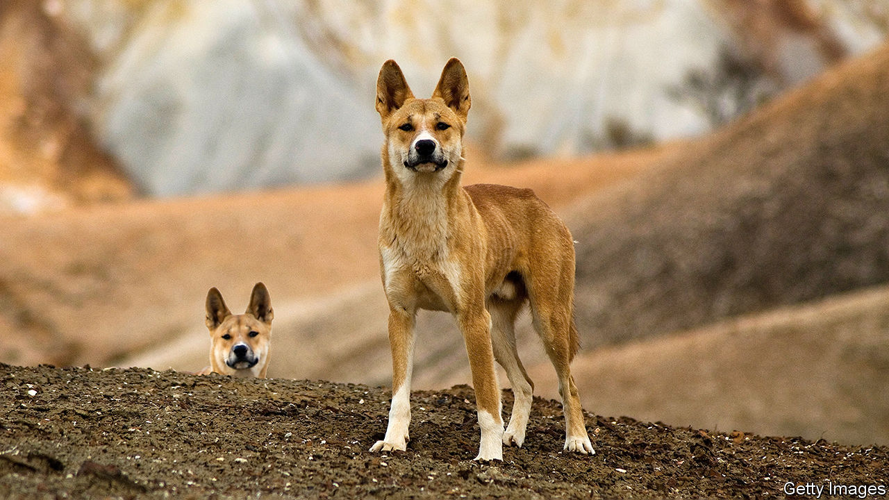

###### In praise of introduced species

# Alien plants and animals are not all bad 

##### Prejudiced nativism should not prevent clear-eyed assessments 

 

> Nov 2nd 2022 

Introduced species have a bad rap. From American grey squirrels displacing European red ones, to Japanese knotweed displacing just about everything everywhere, their purported negative effects on nature are there for all to see. But it is only the human eye which prefers the arboreal rodents in a particular place to be red rather than grey. Ecologically, both occupy the same niche. Nor might people fret about knotweed growing at other plants’ expense if it did not also undermine human constructions such as buildings and roads.

Until the middle of the 20th century, moving  around the world was reckoned a normal, often valuable, thing to do, while the consequences of their accidental movement were rarely considered. It was not until the publication in 1958 of “The Ecology of Invasions by Animals and Plants”, by Charles Elton, one of the founders of scientific ecology, that values began to change.  is, as the name implies, a conservative business. Those involved often value “nativism”—the idea that the species mix in a particular place should remain as unchanged as possible. But this is just an opinion. Other opinions are possible.

A study published recently in  by Dov Sax of Brown University, in Rhode Island, thus asks how the benefits of introduced species might be better assessed, so that opinions can be more informed. Specifically, he and his compadres have recruited the vocabulary of moral philosophy. They thus identify three sets of reasons why an introduced species might be valuable: instrumental, intrinsic and relational.

Man is the measure of all things

Instrumental values are easiest to grasp. They pertain to things that provide direct human advantage. Dr Sax and his colleagues ignored crops, since these are heavily managed by human beings and their benefits are obvious. But they included transplanted grass species that have gone wild, yet provide grazing for stock animals, and introduced forest trees that yield timber for construction. 

One little-regarded but important example of instrumental value is the transport of Old World earthworms to North America, parts of which were left worm-free after the last ice age. The presence of these is reckoned to have increased agricultural productivity by as much as 25% in previously worm-deprived areas, though recent work suggests . 

Honeybees, too, are an Old World species introduced into the New. Their instrumental benefits in the form of honey and wax are obvious. But they also pollinate flowering plants, including many crops.

Honeybees’ role as pollinators also makes them pertinent to the second category, intrinsic values. These pertain to the ecosystem into which the introduction has happened. Since honeybees pollinate wild plants as well as domesticated ones, they have a positive intrinsic effect on their adopted habitats.

Introduced species can bring other benefits. Sometimes, in a manner reminiscent of the nursery rhyme in which an old lady swallows a fly, a spider to catch it, and a bird to catch the spider, an introduction may be made to undo a previous harm. Several introductions of damaging insects have been attacked successfully by further introductions of critters that eat them—though this has not worked so well for voracious introduced molluscs called giant African land snails.

Another attempt to undo a human-induced intrinsic harm is the introduction of Aldabra giant tortoises to Île aux Aigrettes, near Mauritius, to replace an extinct local species that had been crucial to maintaining this island’s ebony forests. Introductions are also sometimes made to reduce the risk of a localised species becoming extinct. Pyne’s ground plum, native to a handful of sites in the central basins of Tennessee but now transplanted to others, falls into this category.

Relational values are the most esoteric, being experienced on an emotional rather than a practical level. Lots of people feel good about native wildlife, which is generally the main motive for its conservation. But that feel-good factor can extend to interlopers as well, especially if the interloping happened a while back. Dingoes (pictured), for example, are the descendants of dogs brought to Australia more than 3,500 years ago, presumably by human agency, but which have lived free there ever since and have entered the mythologies of aboriginal Australians. Similarly, the wild horses and asses (mustangs and burros) of North America, though not as long established as dingoes, have found places in the hearts of sufficient numbers of people to have active lobbies for their conservation.

Relational values can cut both ways, however. For example, ring-necked parakeets, an Asian and African species, have been spreading through Britain for several decades. Some find them a colourful addition to the local wildlife, others a gaudy, noisy competitor for native birds.

It’s the principle of the thing

Having established their intellectual framework, Dr Sax and his colleagues suggest future research might work within it and, in particular, be properly open-minded about the benefits as well as the costs of introductions. Past attempts to do this for significant numbers of species at a time are rare, though they have come up with two. One, published in 2020, examined 105 species. It showed only benefits for 30, only costs for 31 and both for 44. Another, from 2014, came to similar conclusions for 87 marine species introduced into European waters. Seven provided pure benefit, 17 pure cost and 63 both. 

In light of their analysis Dr Sax and his team therefore suggest that researchers studying introduced species should in future follow three principles. First, they should create a clear distinction in their studies between changes that have happened and judgments about the value of those changes. Second, when making those judgments, they should acknowledge all three types of values, rather than focusing narrowly on one or two of them. Third, they should actively consider biases in previous research that might have led to unbalanced conclusions. 

That done, many species will surely still end up on the debit side of the ledger. But others, badly thought of in the past, may not. Dingoes, for one, were originally despised by Australia’s more recent, European, settlers. Now those, too, include partisans seeking the dogs’ preservation. ■


