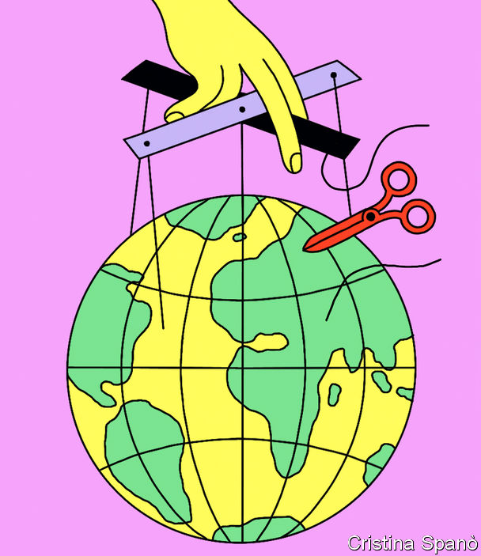

###### Rogue geoengineering

# America’s defence department is looking for rogue geoengineers 

##### AI climate models and game theory will both help 

 

> Nov 2nd 2022 

WHAT IF a country experiencing the bad effects of —crop failures, perhaps, or serious flooding—were to begin, unilaterally and perhaps quietly, to try to modify the climate? Such a project, reckons DARPA, a research arm of America’s defence department, is possible. But it could trigger chaos, and not just of the meteorological sort. The agency, the overall objectives of which include preventing “strategic surprise”, has therefore recently begun to pay for research into how such an event might happen, and how to react to it.

Part of this work is pure science—upgrading the relevant computer models to forecast changing weather patterns that could result from such an irregular  project. The other part is to use a branch of maths called game theory to identify those countries, or even non-state entities, which might, if push came to shove, be most likely to give climate engineering a go.

DARPA’s assumption is that any attempt at unilateral geoengineering would use a technique called stratospheric aerosol injection (SAI). This would employ aircraft to disperse sulphuric acid, or its precursor sulphur dioxide, into the upper atmosphere, to form tiny sulphate particles that would reflect sunlight back into space.

Aerosol can’ts

This would probably work (big volcanic eruptions, which do something similar, have a measurable effect on global temperatures). The costs, though, could be considerable—and not just directly in dollars. A poorly designed SAI programme might break down ozone, a form of oxygen that shields organisms, people included, from harmful ultraviolet radiation. Patterns of precipitation would also change, for cooler air absorbs less moisture, and these effects would undoubtedly vary from region to region. Another problem is the acid rain that would result.

Perhaps most pertinent, though, is that SAI would serve only to mask the effects of greenhouse gases rather than ending them. That brings the risk of “termination shock”, for the injected sulphate is constantly washed out of the atmosphere in rain and snow. The closure of an SAI programme, particularly a long-lasting one, might thus cause a sudden heat jolt more difficult to deal with than the existing, gradual, warming.

It could, indeed, be yet worse than that. Joshua Elliott, head of DARPA’s AI-assisted Climate Tipping-point Modelling (ACTM) programme, fears that a big SAI project might cause the climate to “very suddenly slip” into a new state. Modelling how Earth’s various climatic subsystems could produce such a shift is, he says, extremely difficult. Today’s models do a fair job of calculating the effects of steady changes. But they were not designed to forecast the sudden shifts and subsequent rippling effects that SAI might set off.

Nor is the risk of someone doing something stupid a fantasy. In 2019 Massimo Tavoni, a game theorist at Milan Polytechnic who is unaffiliated with DARPA, organised six games played by 144 students. Participants were given a variety of ideal climate outcomes and allowed to spend toy money they were given on geoengineering projects to achieve them. Those who ended a round with their optimal climate outcome would then receive a payout of real cash. But an overabundance of SAI programmes were launched. To make matters worse, some players tried to counter efforts at cooling which they deemed excessive with attempts to warm the planet, resulting in a chaotic outcome that Dr Tavoni calls “geoengineering wars”. In the end, he says, “everybody loses.”

DARPA sees better AI as crucial to success here. The data sets involved in climate modelling are vast, and even more so when many alternative paths must be processed. For this reason, Dr Elliott says, new AI algorithms are needed to focus processing power on the streams of data that matter most, such as those governing the Atlantic meridional overturning circulation, a large system of ocean currents. 

These algorithms are also to be designed with an eye toward making them as comprehensible as possible to non-specialists. DARPA calls this “explainable AI”. This is important, says Elizabeth Barnes, co-leader of the ACTM project at Colorado State University (CSU) in Fort Collins. The goal is to influence policy, and people are understandably inclined to distrust the outputs of an inscrutable black box.

Another objective is to improve the computational resolution of algorithms that model chemical processes. Many of those employed in CESM, the model the CSU team is using, are ill-suited to dealing with rapid chemical changes of the sort that would probably follow SAI. Beyond this, whole new sets of algorithms are also required, says Dr Barnes. She notes in particular a lack of code to model chemical reactions in the stratosphere, and also to describe how sudden shifts in temperature might alter plant growth in farmland, grasslands and forests.

The researchers are developing, too, “early warning” code to sift through real-world climate data and flag up signs of people undertaking geoengineering mischief on the sly. To test this code, the team runs pairs of parallel simulations. In one, the inputs are actual climate data. In the other, they are tweaked to reflect an SAI programme being under way. Those algorithms quickest off the mark in noticing something amiss are considered the best. This is not easy, Dr Barnes says, for even unengineered weather is full of natural variations that she calls “climate wiggles”.

Acid test

Were such mischief to involve SAI, it might be spotted before any particles were sprayed. Aircraft able to carry heavy loads to the necessary altitude of about 18km do not yet exist, so they would have to be designed, built and tested, which is hard to do in secret. But not, perhaps, impossible. DARPA therefore reckons a better understanding of when and where SAI might be started would still be helpful. Such foresight would assist climate modellers in running more realistic assessments.

Another goal is to help the comity of nations better focus incentives and pressure to prevent ill-advised SAI programmes getting off the ground in the first place. That is where game theory comes in. People and organisations pursue their best interests as they perceive them. This means that if numerical values or rankings are assigned to the goals, motives, power and influenceability of a given set of “players”, their actions and reactions can be modelled. 

Such models are less exact than climate-change forecasting software, some of which has been running long enough to test its mettle, and all of which has been put through “hindcasting” tests, to see if its predictions match what actually happened in the past. Nevertheless, if the values assigned to a player’s drive, capabilities and pliability approximate reality, game theorists say, the resulting predictions of that player’s behaviour can be quite good.

 


The ACTM programme’s game-theory work is being carried out at CSU and at the US Naval War College (NWC) in Newport, Rhode Island. The most straightforward part of it involves identifying entities with sufficient resources to undertake SAI. Curtis Bell, a political forecaster who leads this research at NWC, believes at least two dozen countries could afford it, merely by reshuffling resources in their defence budgets. Groupings of smaller countries might also club together. SAI could even, conceivably, be undertaken by what Stefan Schäfer, a scholar at the Institute for Advanced Sustainability Studies in Potsdam, Germany, calls “self-authorising” billionaires.

It follows that the areas which suffer most from rising temperatures would have greater incentives to take the plunge. Computer simulations are helping with this part of the work. On top of that, the team is poring over data which reveal how hard various countries have been hit in recent years by storms, droughts and wildfires. Refugee flows linked to such ills are also taken into account.

Another factor is how exposed a country is to retaliation. Military power, or lack thereof, thus matters. So, too, does involvement in international trade—as shown by Russia’s economic conflict with the West after its invasion of Ukraine. As Dr Bell points out, energy exporters like Russia are more insulated from such measures than countries that sell less crucial goods.

The political systems of trading partners play a role, too. Historically speaking, democracies have been more willing than autocracies to impose sanctions in attempts to change foreign governments’ behaviour, so Dr Bell reckons countries dependent on trade with the West will probably be less willing than others to go rogue. Taking such factors into account, he aims to give countries “exposures to punishment” scores on a scale of one to 100.

Game, set and match

Some political scientists think the risks of unilateral geoengineering are exclusive to authoritarian regimes. Dr Bell, however, believes a democracy reeling from a string of climate miseries could well demand action from politicians keen to please. For this reason, he says, another of the project’s aims is to study how different sorts of political tipping points have led elected leaders to buck international norms.

Leaders’ ages matter as well. Though SAI would change the climate faster than trimming emissions of greenhouse gases, it would still take years to develop and deploy. Elderly heads of government are known to be less likely than their younger counterparts to begin such lengthy projects. When assessing different leaders’ motivations for SAI, Dr Bell therefore adds points for those who can expect still to be in power to bask in the glory of a hoped-for climate triumph. Taking all these factors into account, Dr Bell, when pressed to list his current top candidates for SAI, says that they include Algeria, Australia, Bangladesh, Egypt, India, Indonesia, Libya, Pakistan, Saudi Arabia and Thailand.

Research into geoengineering is controversial. One fear is that a better understanding of what might happen could encourage someone to try it. Indeed, the ambitions of leaders do sometimes expand in tandem with growing technological capabilities. Even so, reckons James Hurrell, the other leader of the ACTM research at CSU, where he is a professor of atmospheric science, current climate action is clearly insufficient to reverse warming. The chances that SAI would be undertaken somewhere are climbing, he says, so “war gaming” outcomes is prudent. ■


