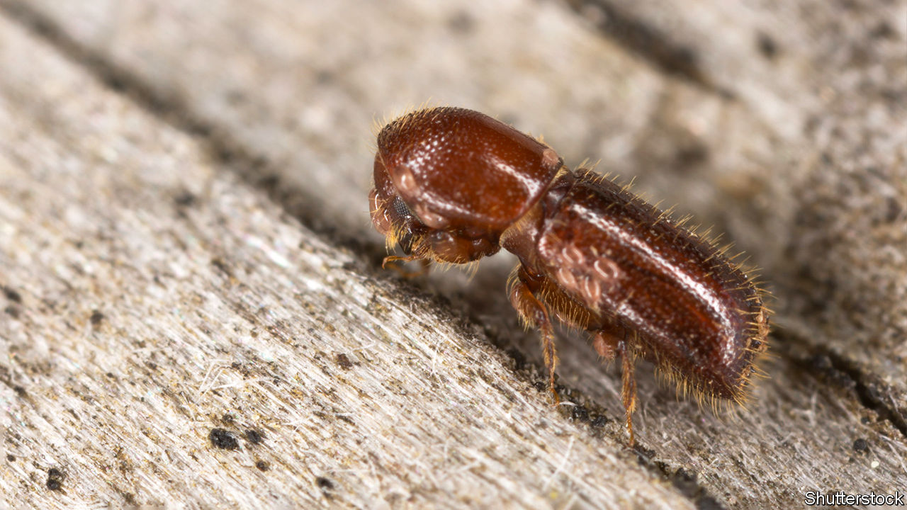

###### Farmer Giles the beetle

# Like some ants and termites, ambrosia beetles grow crops 

##### A new study confirms the agricultural skills of at least one group of coleopterans 

 

> Nov 2nd 2022 

People were not the first farmers. Several groups of ants, and one of termites, were tending fungal plantations for millions of years before  strode the planet. But ants and termites are social insects, able to spread the labour of running their estates among many pairs of jaws. Beetles, by contrast, are solitary. Yet work just published in the  by Janina Diehl and Peter Biedermann of the University of Freiburg, in Germany, confirms the agricultural skills of at least one group of coleopterans.

The fruit-tree pinhole borer, as its name implies, bores holes in fruit trees. It lays its eggs and raises its young in the galleries thus created. Yet ambrosia beetles, of which this is a particularly pesky example, do not feed directly on the wood they bore into. Instead, they devour fungi which grow on the timber thus exposed.

Researchers have long suspected that this is a form of farming, because they have evidence the insects carry spores of their preferred crop, , into their smallholdings—in effect, sowing it there. Now, Dr Diehl and Dr Biedermann have shown they also engage in another crucial agricultural practice, weeding.

Observations of natural fruit-tree pinhole-borer dwellings suggest that  grows in them more abundantly than might be expected, given all the fungal competition around—but not why. To check whether the beetles are, indeed, weeding their crop Dr Diehl and Dr Biedermann did an experiment. They raised 40 captives in enclosures that gave them access to test-tubes filled with compacted beech sawdust which had been enriched with salts, sugar, starch and casein (a protein derived from milk), to mimic the nutrient value for fungi of the sort of wood that pinhole borers bore into. Then they watched what happened.

The beetles lived up to their name, creating galleries in the substitute wood quite similar to those they excavate in trees. As with natural galleries, they rapidly inoculated the walls of these tunnels with  spores. Around ten days later, when the fungi were flourishing, but before the beetles had started laying their eggs, the researchers collected all of the insects. They then returned half to their dwellings while leaving the other labyrinths vacant. Twenty days after that, they sampled the gallery walls for fungi. 

As they had hoped and expected,  was much more abundant in beetle-tended galleries than in those deprived of their residents. In the former, it made up half of the fungal mass extracted. In the latter, less than a third. These beetles, and by implication other species of ambrosia beetle, are indeed weeding their crop. How this weeding happens remains unknown. But happen it does. ■


