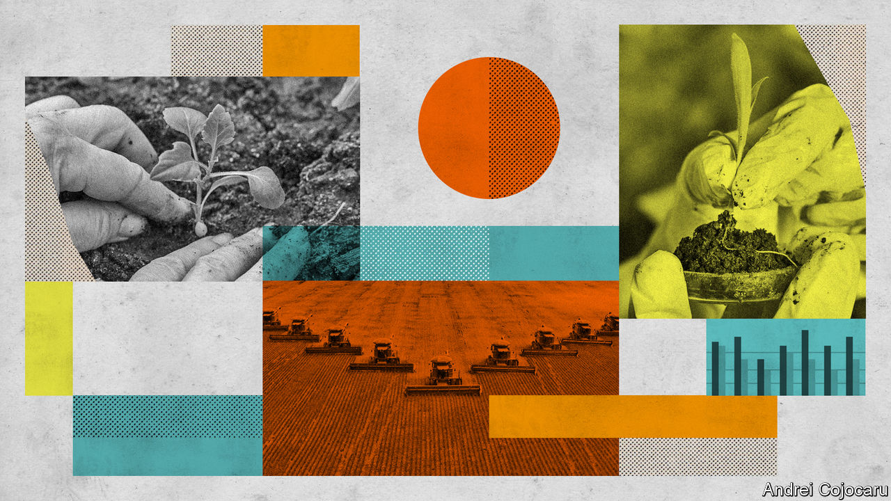
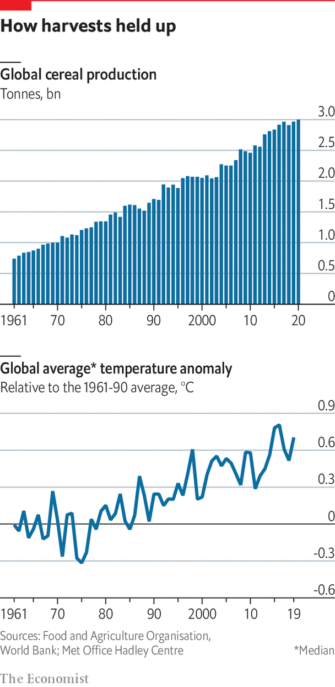

###### Of heat and harvests

# A lot can be done to adapt farming to near-term climate change 

##### But more is still needed 

 

> Nov 1st 2022 

The 1992 Earth Summit in Rio de Janeiro, at which the un Framework Convention on Climate Change (unfccc) was signed, marks the point at which the world started to pay attention to climate change. One of the reasons it did so was fear about the future of agriculture. Farming and its products are crucial to all economies, and frequently big export earners; it is of particular importance to the livelihoods of large parts of the population of developing countries; and it is as exposed as any human activity can be to changes in the weather. The only industry the unfccc singled out as needing help in adaptation was agriculture. 

That same year, according to the World Bank, the planet produced 1.95bn tonnes of wheat, rice, corn (maize) and other cereals. That harvest provided half of the world’s dietary calories. 

By 2020 annual emissions due to fossil fuels were over 50% higher than they had been in 1992. Indeed, half of all the emissions since the industrial revolution took place over those 28 years, in large part as a result of the unexpected speed of China’s growth.

 


But the world’s cereal production had grown even more, reaching an unprecedented 3bn tonnes (see chart). Ever more plentiful harvests did not just outstrip emissions growth; they outstripped population growth as well. There were more cereal calories per person in 2020 than in 1992. And this abundance was brought about without massive increases in the area being farmed. While industrial emissions rocketed, emissions due to land-use change fell by a quarter. In short, in the years since the world really began worrying about climate change, agriculture has boomed. 

That is not because climate change has turned out, Rio, to be good for farmers. It is true that, other things being equal, plants grow better in air richer in carbon dioxide, and that helps. What is more, some temperate latitudes, where yields are often high anyway, now enjoy longer growing seasons. But by far the greatest part of the gains was down to people getting better at farming, just as they did throughout the 20th century. Improved methods, better inputs, better access to inputs and new strains all continued to deliver improvements. Total-factor productivity (tfp) in agriculture—that is, productivity calculated in a way which includes all the costs of labour, land and inputs—has more than doubled worldwide since the beginning of the 1960s. 

In the rich world agribusinesses have developed hardier, higher-yielding strains of many crops. Clever gadgets are also used to boost yields. Sensors that monitor water and nutrients in the soil tell farmers when and how much to water and fertilise their crops. Satellite navigation systems steer farm vehicles around fields, making sure that every inch is sown, treated and harvested. The data from all these devices is also reaped and analysed to help refine farmers’ understanding of optimal varieties, growing conditions and techniques.

Devising new additives, widgets and methods to help farmers is so widespread that it has become an industry in itself, with its own jaunty name: agtech. There are products that can help plants of all types survive with less water. Others offer substances that stimulate plants to fertilise themselves, by harnessing the nitrogen-fixing properties of certain bacteria. Another common idea is to manipulate plants’ biochemical messengers to induce them to grow faster or produce more seeds or fruit.

But if this is all encouraging, it hardly means that there is not a problem. The fact that agricultural productivity has increased does not mean that climate change has done no harm—just that the harm was not large enough to change the shape of the curve. An econometric study by scientists at Stanford and elsewhere published last year argued that the gains in agricultural total-factor productivity seen between 1961 and 2019 were between 10% and 40% smaller than they would have been over the same period in the absence of climate change. The effect grew as climate change became more pronounced and the opportunity cost in terms of lost productivity growth was considerably larger in countries where productivity had started out quite low, which is to say in poor countries. Their figures suggest that in the Sahel region of Africa, for example, climate change ate up almost half of the improvements that the region would otherwise have seen. 

With losses due to climate change likely to rise, the population still increasing (though at a lower rate) and the food that the population wants changing in its nature (the previously poor often have a yen for meat they could not afford before) agricultural adaptation has a great deal more work to do in the decades to come. 

High-yield investments

Most agtech, and indeed much of the other equipment that developed world farmers rely on, is far beyond the reach of poor farmers in the developing world. Many of them have no savings to carry them through bad harvests, much less to invest in their farms. Almost 94% of farmland in Africa has no irrigation; it is watered by rain or not watered at all. The livelihood of hundreds of millions of African farmers therefore depends on whether the rain arrives at the right time in the right quantities. 

But the fact that so many farmers in the developing world have so little also means that it takes relatively little to make a huge difference in their lives. Ville Skinnari, Finland’s Minister for Trade and Development, points out that many governments do not have the equipment or expertise to work out when a dangerous storm is coming, say, or how promising conditions look for the coming growing season. A third of the world’s inhabitants, and fully 60% of Africans, do not receive proper warnings of impending natural disasters, let alone easily understood routine weather forecasts. Nor do they have reliable information about the changes expected due to climate change in the years ahead.

Research conducted on behalf of the World Bank a decade ago concluded that the benefits of upgrading the early-warning systems of poor countries to the standards of the rich world would be anywhere from four to 36 times greater than the cost. It is not an expensive undertaking: providing a national weather service with modern equipment and training costs some $20m-30m, says Jarkko Sairanen of Vaisala, a Finnish manufacturer of meteorological equipment. Vaisala and the Finnish national meteorological office are doing just that in Ethiopia, with funding from the Finnish government. But plenty of other countries need similar help, Mr Sairanen notes. Mozambique, for example, has 32m people, many living in low-lying coastal areas, but not a single weather radar.

By the same token, points out Sonja Vermeulen of the CGIAR, a network of agricultural research institutes, there are already drought-, pest-, salt- and flood-resistant varieties of most crops that would massively improve yields for poor farmers if more widely disseminated, while insulating them against the worst ravages of climate change. 

Take corn. Within a decade or two, the CGIAR predicts, climate change will make it very difficult to grow common strains of maize in some 40% of the area in Africa currently planted with them. That need not spell doom in itself. More than 2m African farmers are already using drought-resistant strains, and harvesting roughly a third more maize as a result. Yet, as Dr Vermeulen notes, there are national seed-distribution services subsisting on as little as $15,000 a year. 

Another cheap way of helping is to teach farmers “no-till” farming, which protects soil from erosion. After harvest, crop residues are left in the fields, rather than cleared or burned, with new seeds planted through them. Anne Beathe Tvinnereim, Norway’s international-aid minister, points to a project in Zambia in which a small cadre of farmers are trained not just to use conservation farming of this sort, but to teach it to others as well. In this way, some 200,000 farmers are now being trained each year. Roughly half of them have adopted conservation farming, and seen their yields rise by 88% on average as a result. 

Close enough, if you have a CGIAR

Julian Lampietti of the World Bank, meanwhile, points to the potential for digital technology to help even poor farmers. Those with mobile phones can receive alerts about the weather by text message. They are also no longer at the mercy of predatory middlemen; they can work out for themselves what the market price for their crop is and haggle accordingly. Mobile money, meanwhile, makes it much easier to access small loans or insurance. 

These simple sorts of assistance work best when combined, says Giriraj Amarnath of the International Water Management Institute, a branch of the CGIAR. He points to a project in Sri Lanka in which farmers were given drought-resistant seeds, access to weather forecasts and advice via their mobile phones and sold simple insurance policies against drought. The insurers were able to make the policies cheaper because they knew the farmers were receiving other help that would reduce the risk. The farmers were more willing to run the risk of trying new seeds because of the other support they were receiving. The cost of this bundle—roughly $15 a year—is far less than farmers pay for diesel to operate farm machinery, Mr Amarnath notes.

In fact, measures like these are not just cheap, they would pay for themselves if universally adopted, by avoiding the expense of importing staples and delivering food aid. The Global Centre on Adaptation (gca), a “solutions broker”, argues that $15bn a year to help farmers in sub-Saharan Africa adapt to climate change would quickly pay for itself in less need than there would otherwise be for disaster relief. And rich governments are not the only ones who should be looking at the most effective spending. India shells out almost $50bn a year, or around 2% of gdp, to provide farmers cheap fertiliser, energy, credit and insurance, among other things. Many poor countries do something similar. That money, says Maria Tapia of gca, could bring much greater benefits in terms of both incomes and resilience if redirected towards adaptation.■

