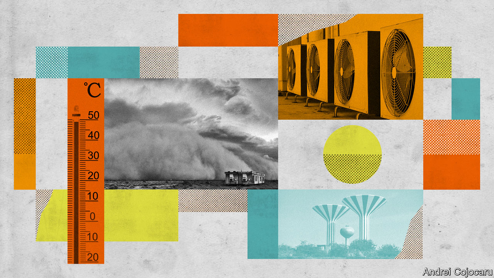
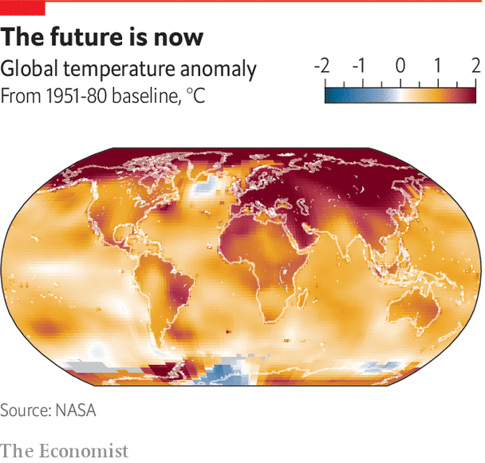

###### To those who have...

# Money and moderately good governance make climate-change adaptation easier 

##### Unfortunately they are not in abundant supply 

 

> Nov 1st 2022 

Farmers are not the only people who need to adapt to the changing climate of southern Iraq. The summer temperatures make air conditioning ever more vital, but it is neither universally affordable nor reliable. War, corruption and mismanagement have left Iraq’s grid unable to keep up with summer demand; during the prolonged spells of extreme heat this summer, Basra suffered frequent power outages. Some Basrawis were able to keep the a/c running with diesel generators; others drove around in their cars simply for the sake of the air conditioning. The rest, including those who had no a/c in the first place, just had to put up with the heat. It will undoubtedly have killed some older and frailer residents, but the city does not compile records of such things.

Then there are the sandstorms. These have been getting more frequent and intense, thanks in large part to the drying up of marshlands to the north of Basra where the Tigris and Euphrates merge. No fewer than eight storms struck the city between mid-April and mid-May, causing or aggravating all manner of respiratory problems. Basrawis have been adapting to such weather by going to the hospital more often: officials say 1,100 sought treatment during one of the recent storms. Locals suspect that the number was probably much bigger.

 


Mahmoud, a lung specialist in a local hospital who does not wish to be further identified, says the numbers of patients admitted with both temporary and lasting respiratory problems is growing each year, along with the number of sandstorms. Whereas he would normally see 25 patients a day, during sandstorms he can see 200 in a couple of hours. If the number of storms continues to grow, he expects the hospital will soon be overwhelmed. 

Iraq has the wherewithal to adapt to much of what climate change is throwing at it. It produces over 4m barrels of oil a day, much of it from wells near Abu Ayman’s ravaged farm. But its former dictatorship, its invasion and the sectarian conflict and corruption that followed have incapacitated the state: a new wing of Mahmoud’s hospital, begun in 2010, stands in uncompleted and derelict testimony to the level of dysfunction. This breakdown hobbles co-ordinated responses to climate change, leaving people to cope on their own or to suffer because they are not able to.

To its credit, the government is developing a “National Adaptation Plan” (NAP), an undertaking which is part of the UN’s Cancun Adaptation Framework, agreed in 2010. These plans aim to identify which people, infrastructure and industries are most vulnerable and work out ways for governments and foreign donors to help them. Over four-fifths of developing countries have begun work on such a plan. But only a third or so have completed one. Most of them, including Iraq, have not yet finished working out what to do, let alone put the resultant plan into action.

It is on the basis of this NAP process, among other sources of data, that the UN Environmental Programme (unep) has estimated that the level of adaptation spending needed in developing countries will be $140bn-300bn a year by 2030, with half of that spent on just two areas: agriculture and infrastructure. 

Doing what comes automatically

Those sums uncomfortably outstrip the spending taking place. The Climate Policy Initiative, an NGO, reckons that in 2019 and 2020 roughly $46bn a year was invested in adaptation globally. Take away that spent in developed countries and UNEP puts investment in developing ones as a fifth to a tenth of what is needed. What is more, its estimate of the need is increasing; as more NAPs are completed previously underappreciated requirements are being identified. 

Kuwait, the city-state that is the closest settlement to Basra of comparable size, completed its NAP in 2019. The document lays out a series of steps to be taken in the short, medium and long term; assigns responsibility for these tasks to specific government agencies; and provides a budget for the initial work. $7.8m is allocated to improve understanding of and plan defences against sea-level rise and coastal erosion, for instance, with responsibility shared among the Environmental Protection Agency, the Ministry of Municipal Affairs, several academic institutes and a planning body. There are similarly detailed plans for fisheries, water and health.

This is undoubtedly a help. But the bulk of the emirate’s planning and spending on climate change predates its nap. It took place in the course of the sort of routine administrative work that a better-run and better-off country takes in its stride—even if, like Kuwait, that country is a paragon neither of bureaucratic efficiency nor of environmental stewardship.

Kuwait has eight desalination plants, for instance; climate change was factored into their planning just as demography and economic growth were. Demand for power, too, is tied to climate, both because of the country’s enthusiasm for air conditioning and because desalination itself consumes a lot of power. The Ministry of Electricity and Water is planning several combined desalination and power plants to cater to future needs. By the same token, the state-funded health service has expanded rapidly in recent years. A big new hospital opened in August which will treat respiratory ailments linked to sandstorms as well as more universal scourges such as heart disease. There is a government push to propagate mangroves along stretches of the coast to protect against storm surges and flooding. 

Kuwaiti academics and bureaucrats study the effects of climate change in elaborate detail. Some staff at the Kuwait Institute of Scientific Research are examining the relationship between the intensifying heat and mortality from various diseases. Others are looking at infrastructure. The institute’s Ali al-Dousari monitors the costs of removing sand that builds up on roads and at oil facilities and military bases. He has also conducted field trials to find out which native plants make the best windbreaks and air filters. His data on clearing costs and planting benefits informs decisions about greenbelt planting schemes. The Kuwaiti authorities have drafted in other experts to help them design new suburbs to minimise the flow of sand through the air. Public-health campaigns instruct people on how to reduce their exposure to the sorts of tiny particles that can cause breathing problems. 

 

Mr al-Dousari has also established that much of the increase in sand and dust falling on Kuwait derives from the same area of dried-out marshland in Iraq that is causing problems in Basra. With the help of the Kuwaiti government’s agency for international aid, he is trying to orchestrate a planting scheme in the region in question to reduce soil erosion. A country’s adaptation needs will not all stop at its borders. The physical mechanisms of the climate and the economic relationships that rest on it both connect places far from one another, sometimes in unexpected ways. A recent report from the Stockholm Environment Institute argues that Sweden is neglecting vulnerabilities at the far end of its supply chains, and at choke points along them, fostering an unrealistically sanguine view of what it needs to do to cope with climate change. 

The same may well hold for Kuwait. It does not need to worry too much about its own agriculture, because it barely has any, but that hardly guarantees food security. And despite its capabilities it is not on top of everything. Barrak Alahmad of Harvard University argues that the authorities have not fully digested the tendency of extreme heat to exacerbate chronic illnesses. The current ban on outdoor work between 11am and 4pm in the hottest months is not nearly adequate, he says; Kuwait needs to base such rules on a much more sophisticated index that takes into account forecasts of temperature, humidity, wind speed and so on. But he does not think the Kuwaiti government is incapable of devising such a system. Quite the reverse: he is campaigning for it to do so.

In rich countries, much adaptation occurs almost invisibly, as a matter of course, without necessarily being labelled as such. If the weather gets hotter, people turn up the air conditioning and water their gardens more. If that pushes up demand for power or water, utilities build more power stations and treatment plants. If things go badly wrong—a fire or a flood, say—there is often insurance to foot the bill. 

Such calamities also prompt wealthy governments to plan more carefully for natural disasters, reducing the damage the next time around. Big businesses, meanwhile, are used to dealing with uncertainty: potential changes in the climate are simply another variable for which they must plan. This does not mean planned adaptation in the rich world is unnecessary, or that it is a matter of course, or that it can cope with everything a changed climate throws at it. It does mean that it is a lot easier.

Trees are not enough

Start off at a disadvantage, though, and planned adaptation becomes more of a priority—you cannot expect substantial parts of it to get done in the normal course of things—and harder to organise. That does not mean that governments, businesses or people do not respond to climate change. It means they are less able to do so well, or efficiently. People who lose their income and become dependent on handouts stretch the capacity of governments already under strain. They may lose their homes, and migrate to slums in cities ill-equipped to receive them, as is happening in Basra , as former farmers like Abu Ayman move to the city. A similar influx was seen in Syrian cities before the civil war Or they may embark on a longer journey, to a country they hope can provide greater economic and physical security—enduring peril along the way and causing consternation on arrival.

Look, again, at Iraq. Serious engagement with climate change is almost completely absent. Abdulkarim al-Romi, who works for Basra’s provincial government, cannot come up with any more resolute response than a vague plan to plant trees. Perhaps every university student should be obliged to plant one before they can graduate, he muses. 

For the moment, however, Iraq’s university students are adapting not by gardening, but by emigrating. In a survey conducted in 2020, 64% of Basrawis said young people did not have a good future in their country. This year another poll found that 37% of Iraqis aged 18-24 were actively trying to emigrate or considering it.

Climate change is not the only or even the main reason that so many Iraqis want to leave home: 40 years of strife, misery and decay play a much bigger part. But climate change is exacerbating economic problems, further diminishing the quality of life across swathes of the country and reinforcing the belief among many Iraqis that their political leaders are simply not up to the task of governing. The worse things get, presumably, the more people will decide to try their luck elsewhere. ■

