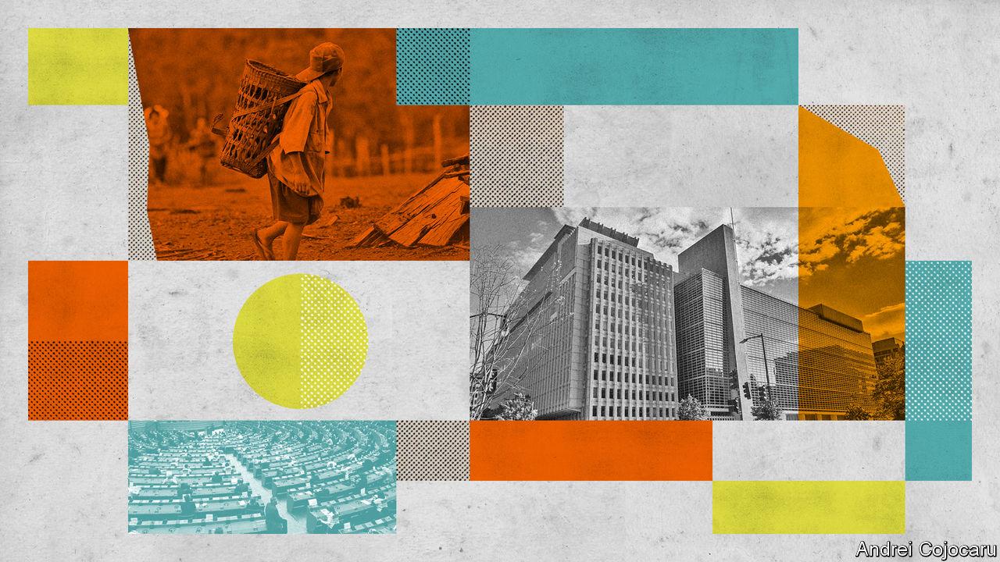
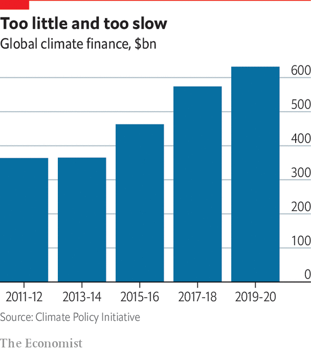

###### Making the money available

# Public money must pave the way for private investment in climate-change adaptation 

##### Otherwise the world will be poorly served 

 

> Nov 1st 2022 

Rich countries, says Macky Sall, the president of Senegal, must “show more solidarity” with developing ones. He means they must compensate those countries for their losses due to climate change and that they must provide them with money for adaptation. The obvious way to pay both bills, he continues, would be to tax businesses in industrialised countries and give the proceeds to poor ones. 

Whatever its merits, Mr Sall’s plan stands no chance of being adopted. For one thing, rich countries are very leery indeed of paying over any money as compensation for what climate negotiations call “loss and damage”. That said, they are in principle open to paying some of the costs of low-carbon development which stops poorer countries from emitting at rich levels and for some of those countries’ adaptation costs. Indeed, they are committed to doing so under the Paris agreement of 2015. But they fight off raising taxes to fight climate change at home, let alone abroad. 

In the Paris agreement of 2015 rich countries promised poor ones $100bn a year in climate finance. In no year have they met that commitment. Last year they agreed that 40% of that should go on adaptation by 2025: a goal that will be missed as surely as the old one was. And officials from assorted European countries say this delinquency will continue for some time. To the extent their countries have any extra aid to dole out, they say, it is all going to Ukraine. Runaway inflation is putting pressure on some to cut their spending. It also means the money they provide goes less far. 

In the face of these political realities there is much airy talk about attracting more private capital to adaptation, and the fact that countries have trotted out this self-serving line for years does not mean it is not true. But though the private sector is beginning to invest in non-fossil-fuel energy in developing countries, it has yet to grapple with adaptation there.

 


A recent study found that only 1.6% of the money spent on adaptation in 2017-18 came from the private sector. That overstates the problem somewhat, because it does not take into account the  private businesses are making to adapt their own operations. But looked at from Mr Sall’s point of view, that does not make a great deal of difference.

The problem is not a lack of returns. The World Bank estimates that on average every dollar spent on adaptation brings $4 in benefits. Projects often have economic, social or environmental benefits that go beyond helping to avert future losses. Planting a barrier of mangroves along a shoreline, for instance, not only makes floods less severe, but also reduces greenhouse-gas emissions and enriches nearby fisheries. 

The problem is that the returns cannot be realised in a way that makes sense to private investors. When pitched mitigation projects such as solar farms they can be offered returns from the revenue that the new kit will produce. There are also some ways, and may in time be more, for investments that reduce emissions to be credited on a carbon market. 

An indirect approach

Climate-proofing things is not quite the same. The investment is likely to earn a good return, in that replacing or repairing storm-damaged infrastructure tends to be much more expensive than forestalling the damage in the first place. But an avoided cost is not a revenue stream to which a banker can easily lay claim. Even if they could, governments tend to underprice unpredictable calamities; that would make such revenue streams too small.

A partial solution is offered by insurance. Receiving enough money to rebuild after things go awry is not a great form of adaptation. But it is better than ruin without recompense; and by making the insurers sensitive to damages it gives them an incentive to help in adaptation. Insurance is being used not only to help farmers cope with the adverse weather climate change brings, but also to help governments respond to the natural disasters it exacerbates. For decades governments (and insurers) have been issuing catastrophe bonds which pay out in the event of an earthquake or storm of a given severity. 

Unfortunately insurance works best as a hedge against stable, quantifiable risks. The perils of climate change, in contrast, are growing, which implies premiums on a constant upwards trajectory. Try and do anything about their rise, though, perhaps through subsidy, and the insurance risks becoming a form of maladaptation, making people confident about staying at risk when they should be doing something.

There are some ways, though, that the signal can be built into the product. Insurers who require those seeking insurance to take certain steps, such as to fireproof their houses or use specified seeds, fertilisers and methods on their smallholdings, can sell policies more cheaply because they can expect to pay out less. Donor governments could subsidise insurance on the same basis. 

Blending adaptation into more conventional investments is another way to mobilise private capital. Making new infrastructure more resilient in this way tends to add only 3-10% to the cost of construction, notes Nitin Jan of the Global Centre on Adaptation. The main difficulty is helping governments with limited know-how to set and enforce the right specifications in public tenders. It is to that end that the World Bank, for instance, is helping Cambodia draw up contracts for the construction and maintenance of rural roads that include stipulations on flood-proofing. 

Kristalina Georgieva, the head of the IMF, takes this logic further. Most adaptation projects, she notes, include some additional benefit beyond simply insulating people from climate change. The additional benefit, Ms Georgieva argues, is often easier to finance. She believes the best way to drum up funds for adaptation quickly is for donors and development agencies to subsidise such investments enough to make the outlay look attractive on the basis of the revenue stream from the additional benefits alone. That gets you all the adaptation for only a fraction of the cost. 

This can be done by making the investment cheaper, less risky, or both. Concessionary lenders could buy equity in projects, thus giving private financiers more confidence in lending to them, or agree to absorb the first losses in the event of a default. Such financial wizardry is reasonably common in projects to cut greenhouse-gas emissions. It remains vanishingly rare in the world of adaptation, where it requires rather more imagination. 

The same applies to “green bonds” used to finance projects with environmental benefits. Only 16% of the $1.5trn in such financing issued since 2007 has gone on adaptation. More than half of those deals involved a single entity, Fannie Mae, an American mortgage lender trying to reduce water use in its portfolio. Yet most of the outfits that certify bonds as green consider adaptation a perfectly acceptable use of funds raised in this way. In 2019 the European Bank for Reconstruction and Development issued the first green bond to be used purely for adaptation. Fiji and Indonesia, among other developing countries, have sold green bonds in part for adaptation. Ivory Coast intends to do the same soon. 

Despite such initiatives, many in the developing world have concluded, with reason, that the fundamental problem is a lack of will on the part of richer countries. That has prompted some climate activists to try to force the rich world to be more generous through the courts. Again, the emphasis is on mitigation, with various governments being sued over emissions-reduction targets the plaintiffs argue to be at odds with some other commitment, such as the rights of future generations. It is not a huge step from arguing in court that rich-world governments and firms have a responsibility to cut emissions to insisting that they should help people adapt to emissions already released. 

The best known such case is Saúl Luciano Lliuya’s suit against rwe, a German utility. Huaraz, the Peruvian town where Mr Luciano Lliuya lives, is located at one end of a narrow valley high in the Andes; at the other end is a growing lake held in place by a shrinking glacier. The glacier, his lawyers argue, is shrinking because carbon emissions have raised the temperature. rwe, they continue on the basis of figures put together by an ngo, is responsible for 0.5% of those emissions. So rwe should foot a similar proportion of the bill for an engineering scheme that will protect Huaraz from flooding. A ruling is expected next year.

Mr Luciano Lliuya is not the only such litigant: several cities in America have sued fossil-fuel companies in pursuit of money for adaptation. Such suits are unlikely to meet a huge amount of the adaptation bill. But they could be a useful spur. Revealed preference suggests that developed countries are just not that interested in meeting their obligations in far-off lands. If things start to cut closer to home, the issue may matter more to them. ■


