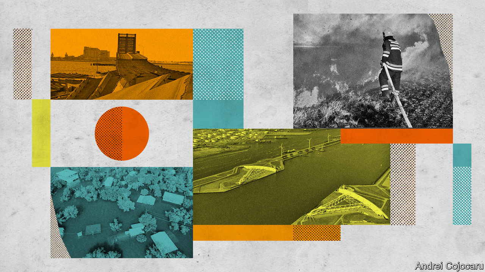

###### The big and the little

# Small climate projects cannot take the place of all large ones 

##### But they can achieve a lot if coordinated 

 

> Nov 1st 2022 

Canute, LEGEND has it, ordered the rising tide to turn back. The tide did not comply. Some say the king—who ruled large parts of England, Denmark and Norway in the 11th century—overestimated his power, others that he was deliberately demonstrating its limits to obsequious courtiers. Either way, all agree that the tide was not to be turned on the say-so of secular authority. 

An alternative reading is that Canute was undercapitalised. This is the interpretation written in earth, concrete and steel at the mouth of the River Maas in the Netherlands. The Maas, as the Rhine’s main outlet into the North Sea, provides shipping with access to Rotterdam, far and away Europe’s busiest port. Unfortunately it provides access for storm surges, too, and much of Rotterdam and the surrounding country are below sea level. Seas are rising; the extremes of rainfall in northern Europe are getting worse. So is the risk that a storm-swollen tide might surge up an overflowing Maas, overwhelm lesser dykes and swamp the city. 

The most spectacular part of the Netherlands’ response is the Maeslantkering—two vast but hollow metal barriers, mounted on even bigger steel arms, which can be swung together to seal off the river from the North Sea when the water is dangerously high. Those gates, built in the 1990s, were designed to cope with anything up to a 1-in-10,000-year extreme event. The circumstances that would merit their closure were expected on average just once every ten years. Twenty-five years on they have yet to be seen even once. But they are coming, and more frequently than the designers thought. With 35cm (14 inches) of sea-level rise—which is in the likely range for 2050—the average time between closures is expected to halve. In a world which sees 85cm of rise—in the likely range for 2100—they could become annual events.

The Maeslantkering cost €450m ($490m in the 1990s, which is $920m in today’s money). But that was hardly a crippling expense for a government whose annual tax take at the time was €136bn. Flood-defence levies charged to residents and businesses comprise roughly 2% of the overall tax burden, or less than 1% of GDP. Whereas the cost of the government’s plans to curb greenhouse-gas emissions causes widespread grumbling, there is almost no carping about the money spent on adaptation. Indeed, it is a matter about which most citizens feel some pride.

The foresight involved was, as is often the case, a function of past trauma. In 1953 a storm surge killed almost 2,000 in the country and flooded 9% of its land; the Maeslantkering was the culmination of decades of engineering aimed at preventing a recurrence. In a similar way, if not as effectively, America began paying more attention to its flood defences after a similar number died in New Orleans at the time of Hurricane Katrina. It took 15,000 deaths in the ferocious heatwave of 2003 for France to set up a network of air-conditioned civic centres where people could shelter rather than stifle. In 2011 a torrential cloudburst in Copenhagen caused almost $1bn in damage in a couple of hours; only then did the Danish authorities rethink how the city’s drains should work.

To be able to respond to big risks with big engineering is one of the benefits of affluence. But it is not always an optimal response, and it can be a damaging one. Sea defences are a case in point. They can be vital; but they are freighted with risks of what experts call “maladaptation”—responses to climate change which simply redistribute, or sometimes increase, the risks which it poses. One problem is a false sense of security. Sea and flood defences which are good enough for the next ten years but not the next 50 encourage people to stay, and invest, in areas that are still at long-term risk. Then there is partiality. Protection that helps one part of a city at the expense of another may lead to the rich getting the lion’s share of the benefits and the poor being forced into the riskiest areas. And there are the risks of not thinking in a joined up manner—concentrating on a particular aspect of the problem at hand in a way that ignores, or even exacerbates, others. 

A good rule of thumb is that projects touted as solutions in and of themselves are peculiarly prone to such problems. Take Jakarta, the capital of Indonesia. Its 11m people live on a coastal plain criss-crossed by rivers and canals which is sinking because of the amount of water being removed from the ground below it. Some 40% is already below sea level.

How to stop a city sinking

The previous city government had planned to reduce the growing flood risk with a series of artificial islands off the coast in the shape of a garuda, a mythical bird that is Indonesia’s national symbol. It was to have been at the same time a protection against storm surges and a catalyst for development. Its total cost, estimated at $40bn, was to be borne mostly by private developers. 

Anies Baswedan, Jakarta’s governor from 2017 to this October, had two misgivings. The project would cause the city’s sewage, most of which is not treated, to collect in the shallow water behind the barrier—an ecological disaster. And a vast seaside development of “Dubai-style, pricey mansions”, in the words of an adviser, Tom Lembong, would only heighten the already yawning gulf between rich and poor in the city. 

So Mr Anies cancelled the scheme and focused on much cheaper measures instead. First, he took advantage of a gradual expansion of the city’s water mains which had been under way since long before he became governor to levy swingeing fees to those who pumped water up from below for their own use. To sort out some of the distributional problem which followed he started sending trucks full of water to poor neighbourhoods that are not served by the municipal pipes.

Mr Anies also ordered the drilling of 29,000 “vertical drains” through which rainy-season floodwater could recharge the aquifer. Sluices in more elevated parts of the city are now temporarily closed to help keep water away from low-lying areas during storms, providing a few hours’ water storage. And developers have been kept away from the city’s last few low-lying green spaces, so that they can continue to act as sponges. The only big, conventional engineering project Mr Anies has retained is a modest dyke which is expected to cost about $6m.

Subsidence haslowed sharply in most of the city and stopped in some of it. Does that make Jakarta sea-level-rise ready? No. But it is better off than it was. And it has demonstrated the most promising way of thinking about adaptation: as something that builds on and is built into other forms of development, which can benefit from private investment, such as in water mains, and which involves lots of small things as well as a few big ones. 

Sous les pavés, l’adaptation

Vidhisha Samarasekara of the International Water Management Institute says that the best way to protect people from flooding is typically routine maintenance and planning coupled with detailed mapping which locates the most flood-prone spots. The Dutch would probably agree; their capacity for very large projects does not lead them to discount the power of micro ones. Rotterdam is keen on “green roofs” from which water drains more slowly than from tile and tin and —the prising up of paving stones in order to expose, and garden, absorbent soil beneath. It takes pride in the fact that last year it prised up 47,942 paving stones to Amsterdam’s 46,484.

One of the reasons that adaptation needs to be piecemeal, even when well planned, is that climate risks and impacts are not something that can be set aside from the rest of life. A wide range of factors will determine who is at risk of what; climate change will rarely be completely dominant. 

Take fires in the west of the United States. Even adjusting for inflation, eight of the ten most expensive fires, in terms of insured property destroyed, have occurred since 2017, according to the Insurance Information Institute, an industry body. This is in part because of hot summers during an unprecedented megadrought. But there are lots of other factors, such as where people choose to live, how they get insured, and what has been done previously to keep the risks low. Stopping all small fires so that the fuel available for big ones builds up is a textbook piece of maladaptation.


The most obvious way to deal with big fires is to put more effort into fighting them. In 2021 the federal government spent $4.4bn putting out wildfires, largely through the Forest Service, double what it spent in 2020. State and local governments are also boosting spending. Growing effort and investment is being put into prevention, too. California’s annual budget for that is more than $1.5bn. The governor has proposed boosting it further. 

According to Michelle Medley-Daniel of the Fire Adapted Communities Learning Network, the main impediment to reducing the damage from wildfires is not a lack of funds, but the diffusion of responsibility and know-how among many different groups, from the federal government to Native American tribes. Her network is trying to remedy that by disseminating information about how settlements can best protect themselves. 

The forms of prevention being adopted vary from place to place, notes Ms Medley-Daniel, depending on the size and preferences of the local community and the ecology of the surrounding countryside. But it tends to be a mixture of emergency planning, to make sure not just humans but also livestock, say, escape fires; efforts to impede future conflagrations, by creating firebreaks, perhaps, or clearing or burning undergrowth that can act as tinder; and measures to help buildings resist the flames, by preventing sparks from getting into heating vents, for instance.

Alarmed property owners, insurers, different levels of government and all manner of NGOs are getting involved. The Fire Adapted Communities Learning Network helps promote prescribed burning, in which neighbours band together to set and control fires to burn off undergrowth. The state of California, for its part, is constantly revising and tightening its building codes, which have special requirements for fire-prone areas. It has also just promulgated regulations that will oblige insurers to reduce premiums for homeowners and businesses that take steps to fireproof their property. The state government did so in part because insurers have been charging higher premiums in fire-prone spots—itself an adaptation-promoting signal to property-owners.

It is all a bit of a hodgepodge, and will doubtless take some time to take effect. But those most at risk of fire now have a variety of incentives and means to adapt. There will still be big, destructive, costly fires in future, but the damage will be much less than it otherwise might have been. In other words, fires will remain a risk of living in California, rather than a bar to it. 

At the moment, the same is true for floods in Bangladesh. Even were there the means, there is no way of protecting its vast coastal plains and islands with hard defences. But as Kristalina Georgieva, head of the IMF, points out, each district has at least one flood- and cyclone-proof building in which residents and their livestock can shelter during storms. And there is a well developed warning system that tells people when to use them. 

As a result the terrible impact of Bhola, a cyclone which drowned 300,000 people in 1970, is all but unthinkable today. The persistent policy push which has seen these redoubts made universal not only saves lives by the tens of thousands, but hugely diminishes the economic damage of similar storms. Since the buildings are typically used for something else during clement weather (as schools, say), the only additional cost to the government has been that of ensuring they are robust enough. 

More recently, a government make-work scheme for poor households has been paying workers to raise homes onto small earth mounds or concrete slabs above the flood line, with similar benefits. None of this means that Bangladesh can face the rising seas with equanimity. But it might have given Canute’s fawning courtiers an idea of what prudent government looks like. ■

