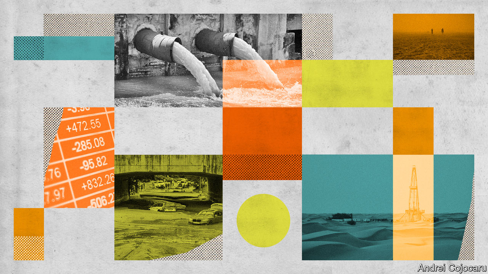

###### Look around you

# The business of businesses is climate-change adaptation 

##### Big ones are waking up to the fact 

 

> Nov 1st 2022 

It can climb stairs, check gauges and send reports. When it’s not busy with work, it takes itself off to its quarters, to rest. It never needs food or water, and can plug itself in to recharge. And although it doesn’t like sandstorms any more than people do, it knows how to batten down the hatches and wait them out. 

Spot is a bright yellow robotic dog designed by Boston Dynamics, an American engineering firm, and deployed at a remote natural-gas-pumping station in the middle of a desert by Saudi Aramco, Saudi Arabia’s state-controlled oil giant. It is not a great place for a human being to hang out: in addition to the sand whipped up by the unobstructed winds, there is blistering sunshine and nothing to drink or eat for miles around. For Aramco’s managers, the fact that climate change is making all this worse is almost beside the point: Spot’s pumping station was always a place where any human presence should be kept to a minimum.

Spot is not an explicit adaptation to climate change, but rather part of an existing programme to reduce the danger and expense of certain tasks using robots. Aramco also has drones that can inspect smokestacks, unmanned submarines that can conduct seismic surveys on the seabed and mechanical “pigs” that can crawl along pipes. Other oil companies are doing much the same, deploying robo-dogs of their own on platforms in the North Sea and the Gulf of Mexico, for instance.

Businesses must always plan ahead and try to anticipate problems, in spite of the big uncertainties that entails. Public companies, moreover, have shareholders, often including environmental activists, who tend to ask pesky questions about climate. And then there are regulators, trying to make sure that businesses get to grips with big problems so that the responsibility does not wind up with the government.

The result is that big corporations, at least, are talking about climate change, giving thought to how it affects their operations and planning how to adapt.

For some, the need is blatant. The region in and around London in which Thames Water, Britain’s biggest water utility, operates, is getting hotter, and although the overall level of rainfall appears stable, it comes in more intense bursts, with longer dry spells in between. That means that Thames has to invest to cope with both more deluges and more droughts.

On the drought side, the company has big plans to plug leaks and to curb demand by installing meters. It will also use an aquifer south of London as a reservoir, pumping water in when it is abundant and out during dry periods, and divert some water from the Severn, a big river outside its service area, using the existing canal network. It also plans to start re-using some of the water that emerges from its sewage plants. 

The main answer to the deluges is the “super-sewer”, as Londoners have dubbed it, a seven-metre-wide, 24km-long tunnel that Thames will manage when it is completed in 2024. The £4.9bn ($5.7bn) tube, which stretches across the city from west to east, will act as a vast overflow drain when cloudbursts overwhelm the normal sewer system. (London’s sewage pipes double as storm drains, a design choice made in the 1860s that is now almost impossible to undo.) All the company’s sewage plants and pumping stations have been assessed to judge whether they, too, are at risk of flooding.

To ensure adequate water supply as far off as 2100, Thames has mapped out a series of “adaptive pathways” which depend on climate change, demography and the economy. Its investments are informed by exhaustive planning and forecasting, using low-, medium- and high-emissions scenarios for the 2020s, 2050s and 2080s, at multiple levels of confidence. And all that despite the fact that, even for Thames, climate change is not the most decisive factor in its investment decisions. Half the shortfall in water supply it foresees by 2045 without extra investments is down to change in demand, largely due to population growth. Climate change only accounts for a quarter. 

Even in industries less obviously affected by climate change, big business is taking adaptation seriously. Unilever, a multinational consumer-goods firm, has tried to quantify the likely impact of climate change on its results in 2030, 2039 and 2050 under three different regulatory scenarios and a range of different temperature increases. This obviously matters to the bottom line. 

Give the owners what they want

Unilever’s latest annual report discusses both the possibility of a €6.4bn boost to annual profits in 2050 from seizing on growing demand for vegan and vegetarian food and the possibility of a hit of €6.1bn if a carbon tax were imposed on its emissions across the board. It also helps it plan adaptation strategies aimed at both direct impacts of climate change and at systemic issues they exacerbate: stricter regulation of agriculture, higher energy prices, growing water scarcity and rising prices for commodities.

Unilever has laid out plans to relocate manufacturing if particular plants are damaged by extreme weather and has lined up emergency suppliers if supply-chains are disrupted. It is developing longer-term contingency plans, too, such as making its shampoos quicker to rinse, in case its customers are obliged to curb their use of water. Most of its dishwasher detergent works in cold water, in anticipation of a world where energy is much pricier.

If maintaining profits were not incentive enough to adapt to climate change, there is also external pressure. Environmental activists tend to be concerned mainly with reducing emissions, which climate wonks call mitigation. But for most investors, or at least longer-term ones, adaptation is also important. Both Thames Water and Unilever detail the steps they are taking to adapt in their annual reports in part because they follow the recommendations of the Task-force on Climate-Related Financial Disclosures (tcFd).


The task-force is an outgrowth of the Financial Stability Board, an international body that seeks to avoid future financial crises through sounder regulation. Companies with a combined market capitalisation of $27trn have signed up to its standards, TcFD says. Regulators in eight jurisdictions, including Britain and the European Union, require public companies to comply with different parts of its guidelines. Businesses dislike alerting investors to gaping potential flaws in their plans, so the act of disclosing such risks spurs adaptation. 

Smaller companies cannot afford to hire consultants to sketch out future-climate-change scenarios and make adaptation plans for 1.5°C, 2°C and 4°C of change. Unlisted ones do not face as much pressure to do so. But they also tend to have less sprawling empires, and so a clearer idea of what the future might have in store. And big or small, public or private, businesses tend to have an unrelenting focus on their own survival. For small businesses in the developing world, and certainly for poor individuals, the problem is not a lack of willingness to adapt, it is a lack of capital. ■

