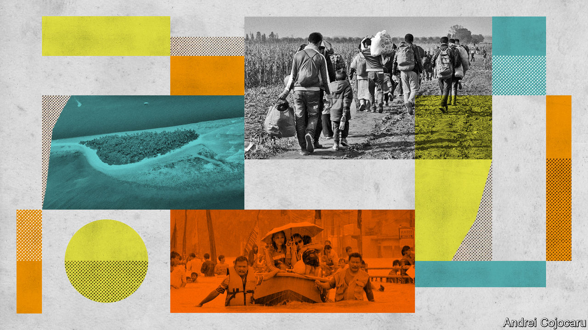

###### Common sense

# The rich world is wrong to think that climate impacts in poor countries don’t matter 

##### There is a compelling moral case for rich countries to do more to help poor ones adapt 

 

> Nov 1st 2022 

Jem bendell, a British academic, is an advocate of what he calls “deep adaptation”. The world, he believes, should prepare for “near-term societal collapse”. He urges not only “resilience”, climate-speak for equipping people to withstand climate change, but also “relinquishment”, by which he means abandoning “assets, behaviours and beliefs” that it will be futile to try to retain, such as living near the coast or expecting to maintain, or attain, a rich-world lifestyle. Politicians and the public are not taking this prescription seriously, he argues, not because it is excessive, but because they are not psychologically prepared to consider it.

The depth of the dislocations he talks about makes Mr Bendell unusual among advocates of adaptation. The fact that he stresses adaptation makes him unusual among those concerned about catastrophic climate change. It was once common for such people to be frank in their distrust of the whole idea of adaptation. They saw it as at best a distraction from the more important task of mitigation, and at worst an alternative to cutting emissions pushed by vested interests. Such suspicions are less common today, but they have not vanished completely. “You can’t adapt your way out of climate change” is still a slogan with currency.

In one sense it is clearly true. Take low-lying atolls. Even with strenuous mitigation, some will be relinquished to the sea. The average elevation of the 1,100 islands which make up the Maldives is a mere 150 centimetres. Although reclamation is building up some of them, others are bound to disappear.

But in another sense, the submergence of much of the country does not mark the sort of “hard limit” to adaptation sceptics like to talk about. The people of the Maldives will not simply stand still as the water rises above their waists; they will resort to ever more radical forms of adaptation, presumably culminating, if need be, in mass emigration. Last year the World Bank concluded that by 2050, without more mitigation and adaptation, 216m people would be displaced within their own countries by climate change, 86m in sub-Saharan Africa alone. Most of these will not travel far from home. Some will, either through aspiration, local hostility or, in the case of island states, necessity. An ageing rich world may need such fluxes. It currently looks unlikely to welcome them.

Viewed from this perspective, mitigation and adaptation are not in competition with one another; they go hand in hand, pat as that may sound. Patrick Verkooijen, the head of the Global Centre on Adaptation, says that the more mitigation there is, the easier his job becomes, as less adaptation will be needed. What is more, in poor countries both adaptation and mitigation are in essence different forms of development work, and should be co-ordinated as such. Building a green power supply or low-emission transport network, for example, might be done in a way that draws people away from vulnerable jobs or places. Adaptation averts the losses and disruption faced by government, businesses and households when the power goes out or the road is washed away. The benefits only increase as climate change intensifies.

Those in the rich world who consider all this worthy but less than urgent should remember that the benefits of investing in adaptation are not limited to the places where the spending occurs. One of the fundamentals of climate science is that causes and effects can be widely separated. Sea temperatures in the eastern Pacific are linked to hurricane frequencies in the Caribbean; tropical volcanic eruptions can warm the poles. The world’s economy and its geopolitics are stuffed with similar “teleconnections”. 

Most analyses of future climate calamities in the developing world focus on local impacts. In practice less adaptation and more suffering in poor countries will inevitably have consequences in wealthier places. At the very least the proliferation of flooded slums and parched fields would increase the pressure on wealthy governments to spend more on disaster relief, a vastly less productive investment than adaptation to forestall disasters. But in all likelihood, the consequences for the rich world would be much more severe. The prices of staple foods may shoot up. Supply-chains would suffer multiple ruptures. Then there is the spectre of those unwanted climate refugees. 

But there is also a compelling moral case for rich countries to do more to help poor ones adapt. The people who are suffering the most as a result of climate change are the ones who have done the least to cause it. It takes money both to generate industrial emissions and to adapt to their consequences. Poor countries are not doing much of either. To leave them to suffer because of the mess created by the rich world and middle-income countries is akin to asking the people of Haiti, Niger and Nepal to pay to decarbonise America’s and Europe’s power supply. 

To put things in Mr Bendell’s terms, to relinquish something by choice may be an act of clear-eyed humility; to be deprived of it as the result of what others have done is more akin to being robbed. Leaders of developing countries are right to fulminate against the world’s selfishness. It is not just climate change that is a problem for everyone; so is dealing with the damage that it does. ■

