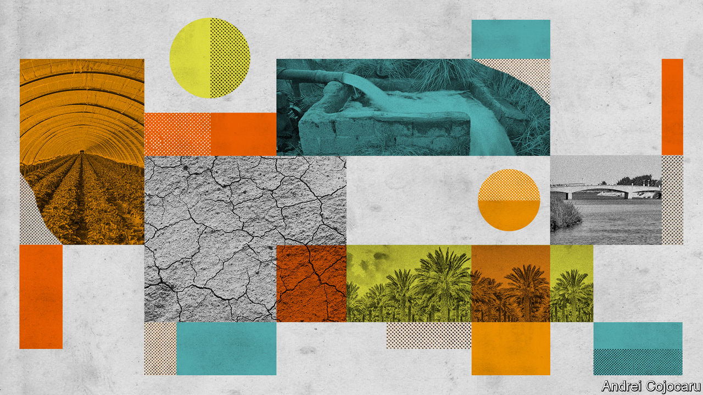
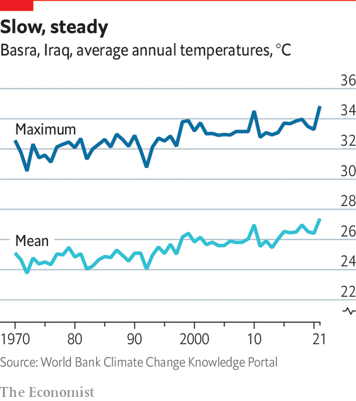

###### The challenge of the age

# The world has to adapt to the climate change it will not avoid 

##### And poor countries will need help to do so 

 

> Nov 1st 2022 

“Barren” does not begin to describe Abu Ayman’s small patch of land in southern Iraq. The sun pounds down, sometimes pushing the temperature above 50°C (122°F). Dry earth and withered weeds crackle underfoot. It used to be a palm plantation, but no trees remain—just rows of untopped trunks. Of uneven height and listing at odd angles, they look like ruined columns from some grand old temple, razed by long-forgotten calamity. 

Except that the calamity is still unfolding, and Abu Ayman has certainly not forgotten. Twenty years ago, he says, the canopy of palm fronds above was so thick that no direct sunlight reached the baking soil on which he is standing. Farming dates and other fruit earned him a good living, he adds as he snaps a salt-bleached twig off a desiccated shrub. Water from a canal fed by the Shatt al-Arab waterway, which glistens in the glare just a kilometre away, was adequate for his needs. 

 


But the world was warming. The mean temperature in Basra, the nearest city to Abu Ayman’s farm, is more than 2.5°C (4.5°F) higher than it was in the 1980s (see chart). In July a new record high was reached, of 53.9°C. High temperatures made the palms more thirsty. But over the same period people living upstream used more of the water that flows into the Shatt al-Arab. And the rains in Anatolia that are the waters’ ultimate source weakened. The long spells of low flow allowed salt water to seep up the river from the Persian Gulf, about 40km to the south. The more Abu Ayman irrigated, the more salt accumulated on his plot, killing off the palms and leaving the land covered by a saline shroud. His livelihood destroyed, Abu Ayman now works as a night watchman at a nearby government office.

Muhammad Obaid, a relative of Abu Ayman’s, lost his palms in just the same way. But his land, right on the bank of the Shatt al-Arab, sits in the welcome shade of their replacements. The crowns of the young palms, still close to the ground, are interspersed with the odd fig or apple tree. The temperature in the shade is a good 10°C cooler than on Abu Ayman’s low and level sands. Birds twitter in the greenery. Having painstakingly pollinated the palm flowers by hand Mr Obaid is expecting a bumper crop of dates this year. 

Mr Obaid has survived as a farmer where Abu Ayman did not for two simple reasons. First, his farm is on the river, which meant he could draw water at times of high flow, when the salt is at bay, rather than making do with what the feuding clerics and militiamen who dominate local politics provide via irrigation canals. After losing his trees to salt he was able to flush the land with river water using just a small diesel pump.

He also has access to another key input: money. When the Shatt al-Arab is too salty he hires a truck to deliver fresh irrigation water. He and his brothers own a small grocery store, and so are able to invest the profits from that business into their farm. That is how they could afford the $150 a sapling needed to revive the plantation and the $35 per tanker of water. Without that money, his land would be as barren as Abu Ayman’s. 

The cousins are a living parable for what policy wonks call adaptation, by which they mean coping with the adverse effects of climate change. How well people cope when weather patterns change depends on the details of their situation—both in terms of geography and politics—and their access to resources. Mr Obaid was close enough to water that he did not need to rely on anything but his pump, his family’s modest means and some changes to how he farms. Abu Ayman had to abandon his land and switch careers. He became poorer, the economy shrank and the burden on the Iraqi state increased. 

In absolute terms, the resources which would have been necessary to set Abu Ayman on the same path as Mr Obaid would have been small beer. Given a minimal degree of sound government he would have needed just a small loan. But he wanted for both. And so do billions of others. Small amounts of planning and cash could ward off many of the worst effects climate change will have on those people. But in most cases no such help is coming. 

The fact that he has access to resources does not make Mr Obaid’s future as a farmer secure. As the heat intensifies, and the river’s flow dwindles, the periods when the water is too salty to use will grow ever longer. The expense of preserving the trees will increase accordingly. It may eventually stop making financial sense to keep going. Mr Obaid’s capacity to adapt, as climate types would put it, is limited—by which they mean that his coping mechanisms are no substitute for fixing the climate. But the decades-long business of stabilising the climate is also no substitute for his coping mechanisms. He cannot wait 50 years to water his trees. And for now, at least, he is much better off than Abu Ayman. ■

