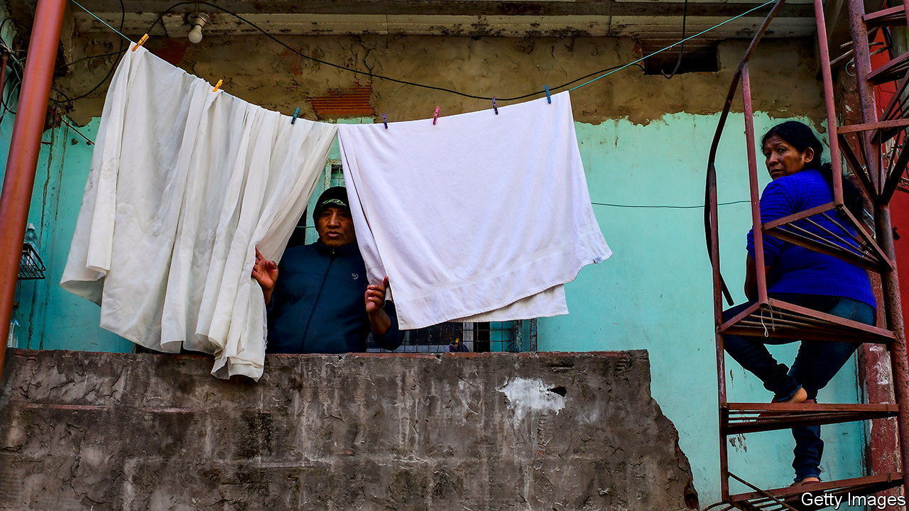
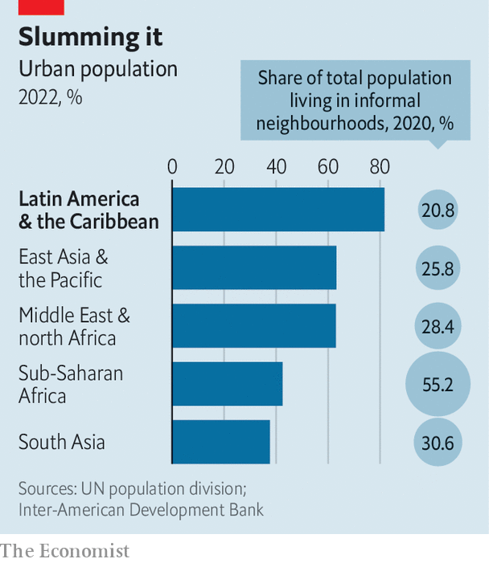

###### Slum dunk

# Argentina’s slum policy is a rare bright spot in the country 

##### One mayor who oversaw the integration of a shantytown wants to become president 

 

> Nov 3rd 2022 

A visitor strolling down Arroyo, a street in Retiro, one of the poshest neighbourhoods in Buenos Aires, can buy a bag of coffee beans for $22 and order a kale pesto salad at a hip restaurant. But a few streets away is the city’s oldest slum, known as Villa 31, which sprawls across 72 hectares (178 acres) and is home to over 40,000 people. A three-bedroom flat on Arroyo will rent for around $3,000 a month; a family in Villa 31 might pay $150-250 for their lodging. Rather than fancy coffee, street vendors there hawk used trainers and bags of cereal.

Yet though it may not be as glamorous, Villa 31 is catching up. Since 2016 the city government, with funds from the World Bank and the Inter-American Development Bank (IDB), has spent more than $300m on paving roads, titling land and laying sewage pipes and electricity cables. The slum used to have only one asphalt road. Today, all streets are paved. In 2016 no public school existed. Now the neighbourhood boasts three. Since 2019 buses go to Villa 31 and a bank has opened there.

Slum integration is a rare point of consistency in Argentina’s . In 2009 a law promoted by Mauricio Macri, then a liberal mayor of Buenos Aires, sought to improve Villa 31’s infrastructure. Progress was halting until 2016, when Horacio Rodríguez Larreta, also a liberal, succeeded him as mayor. In 2017, when Mr Macri was president, a national registry was created to identify slums and upgrading shantytowns became a national priority. This has continued under a government led by the Peronists, a leftist populist movement. On October 27th the Senate approved a law that bans slum evictions for a decade and adds another 1,100 settlements to the registry, taking it to 5,600. 

 


Four-fifths of Latin Americans live in cities. But almost every big city is encircled by slums, which house 120m people, or 20% of the region’s population. They go by different names:  (short for , or miserable village) in Argentina,  in Brazil and  in Mexico. Governments have long tried to improve them. Chile pioneered a market-oriented approach in the 1970s, in which tax breaks were given to construction companies that built social housing. Between 1980 and 2000 about 2m new homes were built for the poor, representing 43% of the total housing stock. Though the effort was considered successful, some families had shoddy houses in areas far from their jobs. 

One of the biggest projects took place in Rio de Janeiro between 1995 and 2008 at a cost of $600m. This sought to integrate 158  home to 250,000 people. But a follow-up report by the IDB suggests that neighbourhoods that took part in the project ended up having worse rubbish collection and sewers. Local gangs often sought to reassert control by destroying the new street lights and road surfaces. Lack of access to steeper, hillier areas meant that much of the new infrastructure could not be maintained. And the project could not keep up with population growth. Between 2000 and 2010 Rio’s population grew by 3.4%, but by almost 30% in the . 

Villa 31 could avoid these problems. Its central location helps. And Buenos Aires has few gangs. Since 2016 an increased police presence in the  has reduced crime further. Omar, a 26-year-old Senegalese street vendor, moved there in April. “Five years ago I would never have come here. There were no police, the roads were made of mud, it was all dark,” he says. 

The biggest change has come for the 1,200 families that once lived under a highway. The city government has built blocks of flats to house them. But in two recent surveys of the new apartments a majority of residents complained of leaks and poor insulation. Higher rents are a sore point. 

Mr Larreta is hoping the publicity from Villa 31 can help him win the presidency next year. Adverts across Buenos Aires push his slogan: “The transformation doesn’t stop.” Mr Larreta, a Harvard-trained technocrat, may lack the pizzazz of his . But Argentina needs competence over charisma. ■

