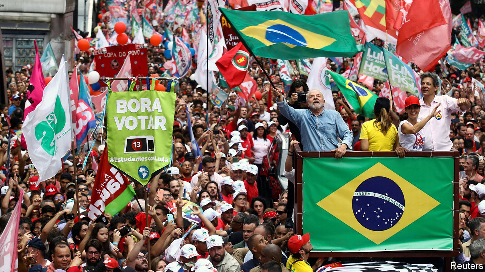
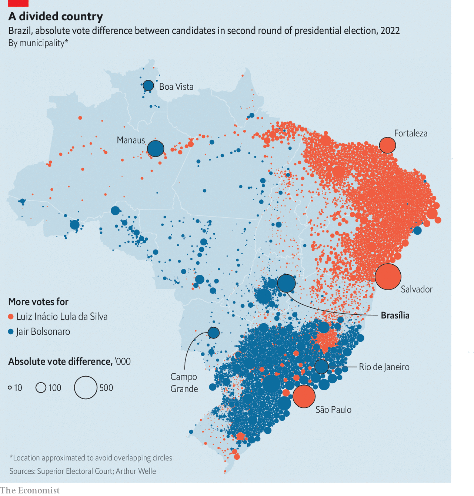

###### Hallelula

# Luiz Inácio Lula da Silva will oversee a more divided Brazil 

##### Protests by supporters of Jair Bolsonaro are just the beginning 

 

> Nov 3rd 2022 

In his victory speech on October 30th, after a white-knuckle election, Brazil’s , Luiz Inácio Lula da Silva, confessed that he was “half happy and half worried”. Avenida Paulista, a buzzy street dominated in recent years by rallies in favour of Jair Bolsonaro, the far-right populist president, was awash in the red of the Workers’ Party, founded by Lula (as he is known). But the result was the  since Brazil’s return to democracy in the 1980s: 50.9% to 49.1%, or just 2.1m votes.

As Lula spoke, lorry drivers had already begun blocking roads throughout the country, burning tyres and calling for military intervention to prevent him from taking office. By the end of October 31st there were more than 300 roadblocks, across most of the 26 states and the federal district of Brasília. The highway police delayed obeying court orders to break them up, but eventually started doing so. 

Some protesters dispersed after Mr Bolsonaro, who did not speak publicly for 45 hours after the result was announced, eventually broke his silence on November 1st. In a two-minute speech, he thanked the 58m Brazilians who voted for him. He said that the roadblocks reflected “a sense of injustice about how the electoral process was carried out”, but asked his followers to refrain from “restricting free movement”. Although he did not explicitly concede defeat, he said he would comply with the constitution. This, along with a video published a day later asking his fans to stop blocking roads, assuaged fears that he would copy his idol Donald Trump by claiming to be a victim of fraud and inciting an insurrection. Many of his allies had quickly recognised Lula’s victory, including Arthur Lira, the head of the lower house of Congress, and Tarcísio de Freitas, the governor-elect of São Paulo.

But even if Mr Bolsonaro lets a peaceful transition take place, Lula will struggle to govern a country that is deeply divided. The slim margin of 1.8 percentage points reflects the fact that both candidates had high rejection rates, says Antonio Lavareda of Ipespe, a polling firm. Mr Bolsonaro’s approval ratings dropped after mismanaging the pandemic. Lula’s legacy was tainted in the eyes of many by a  known as Lava Jato (Car Wash), which came to light in 2014. He spent 19 months in prison; his convictions were annulled by the Supreme Court in 2021. Some voters were also put off by the economic mismanagement of Dilma Rousseff, Lula’s handpicked successor, which led to a deep recession between 2014 and 2016.

 


In the south-east, Brazil’s most populous region, Lula benefited in the run-off after prominent centrist politicians pledged to support him. But he won largely due to votes from poor people concentrated in the north-east (see map ). Many have fond memories of social programmes introduced by his government between 2003 and 2010. In the month before the run-off, Mr Bolsonaro ramped up spending on such voters, launching a new credit line and expanding a cash-transfer programme that pays 600 reais ($113) a month to 21m poor families. These schemes may have been undermined by news that Paulo Guedes, the economy minister, was working on a plan to “de-index” the minimum wage from inflation. 

Policy proposals took a backseat during the campaign in favour of mudslinging on both sides. Lula’s priority is to boost spending to alleviate poverty, which will require tricky economic reforms. His first task is to pick an economy minister who can drum up support in Congress and the markets. Lula will also need to devise a plan to jump-start growth. It is likely to include a big public-private infrastructure programme and tax reform, which will be tough to get through Congress. Lula has also promised that he will curb deforestation in the Amazon rainforest, which soared under Mr Bolsonaro. To do so, he could well turn to allies abroad for help. 

Lula will  with countries such as France and the United States. And he will have a far less turbulent relationship with institutions at home, such as the media and the Supreme Court, than Mr Bolsonaro did. But governing will be much harder than it was when he took office in 2003 amid a commodity boom. Brazil’s fiscal situation is difficult and a large number of pro-Bolsonaro politicians were elected to Congress on October 2nd. Mr Bolsonaro’s Liberal Party is the biggest in both chambers. 

In order to get laws passed, Lula will have to build alliances with centrist parties, such as the Brazilian Democratic Movement and the Social Democratic Party, whose leader, Gilberto Kassab, is a skilled political chameleon. Mr Kassab backed Mr Freitas, the governor-elect of São Paulo, but said in an interview with  that the party is likely to build an alliance with Lula. These negotiations will go hand in hand with Lula’s cabinet picks. Marcos Nobre of the Brazilian Centre for Analysis and Planning, a think-tank, reckons Lula will have better luck building a small majority coalition (55-60% of seats) with parties who support his policies rather than aiming to replicate the “super-majority” (65-75%) coalitions he enjoyed when he was last president.

Mr Bolsonaro may have decided against alleging fraud, as he has been threatening to do for months, because he is in a strong position to lead a powerful opposition. If he avoids criminal investigations—for his handling of covid-19, for example—he could make a comeback in 2026. On November 1st Ciro Nogueira, Mr Bolsonaro’s chief of staff, gave the go-ahead for the transition of power. But some  bureaucrats may “throw oil on the track”, Mr Nobre says, by committing petty acts such as breaking computers. Even without Mr Bolsonaro in power,  will remain a force in Brazil’s politics for years to come. Lula is right to worry. ■

