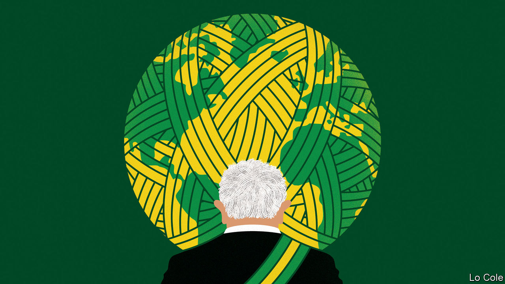

###### Bello

# Lula’s foreign-policy ambitions will be tempered by circumstances 

##### Brazil has changed a lot since he was last in power over a decade ago 

 

> Nov 3rd 2022 

“Brazil is back,” declared Luiz Inácio Lula da Silva on the evening of October 30th. “Brazil is too great to be relegated to the status of a pariah in the world.” With that, the once and future president conjured up the activist global diplomacy he practised in office between 2003 and 2010. Many outsiders now expect a repeat performance. But since Lula left office the world has changed. Brazil has changed, too. 

Under Jair Bolsonaro, Brazil retreated into its shell. His foreign friendships were limited to Donald Trump, Israel and the national-populist regimes in Hungary and Poland, though he also visited Vladimir Putin just before Russia’s invasion of Ukraine. He sent senior diplomats to stamp passports as consuls or to secondary posts. His first foreign minister, Ernesto Araújo, an amateurish ideologue, echoed Mr Trump in bad-mouthing China, Brazil’s top trade partner. That prompted the Senate to force his removal. Mr Bolsonaro’s enthusiastic assault on the Amazon rainforest in the name of development and sovereignty tarnished Brazil’s reputation as a responsible global citizen.

Lula’s foreign policy was very different. Its cornerstone was the search for a “multipolar” world at a time when the United States was hegemonic. Its main instruments were the BRICS group (in which Brazil joined Russia, India, China and South Africa) and initiatives in Latin America and Africa, including the Mercosur trade block with Argentina, Paraguay and Uruguay. “Back then multipolarity seemed reasonably easy to achieve in a quite benign way,” Celso Amorim, who was foreign minister and is now Lula’s chief foreign-policy adviser, told Bello. “Now things are much fuzzier.”

In a world of geopolitical confrontation and war in Europe, Brazil’s traditional balancing act between west and east, south and north, has become harder. The BRICS remain important in economic terms, says Mr Amorim. He would like Argentina to join, to balance Russia and China. Russia is one of the few issues on which Lula and Mr Bolsonaro agree. Brazil condemns the invasion but, like many developing countries, will not cut ties. Though Lula will be friendly to China, his team worry that the two countries’ trade has undermined Brazilian industry.

Another shift is that climate change is now a big global issue. That plays to one of Lula’s strengths. His pledge to crack down on deforestation will be welcomed by both Joe Biden’s administration in the United States and by the European Union. The new government may try to reactivate the Amazon Pact, a treaty of 1978 which links Brazil and seven other countries that share the rainforest. Deforestation was a pretext for the EU’s refusal to ratify a trade agreement with Mercosur concluded in 2019 after 20 years of talks. Lula may press ahead, but he wants tweaks, and that will be unwelcome in Brussels. And Mercosur itself is weaker than it used to be. Uruguay’s centre-right government is increasingly going its own way on trade.

Lula’s victory means that left-wing governments are in charge in all of Latin America’s bigger countries. There are many differences among them. But there is also a sense of solidarity. All look to Lula as their elder statesman, to revive moribund regional talking-shops and to try to broker an agreement between Venezuela’s government and its opposition ahead of a presidential election due in 2024. What Nicolás Maduro, Venezuela’s autocrat, wants is relief from American sanctions. So Brazil would have to work closely with Mr Biden’s people. 

On this, as with climate action, there is scope for co-operation between Brazil and the United States. But there will also be friction. Lula’s Brazil does not divide the world—or Latin America—between democracies and dictatorships. And the two are rivals in the Americas. “Brazil is sufficiently big to say we have to be independent, not part of a backyard,” as Mr Amorim puts it.

Brazil was able to play an important international role during Lula’s previous governments partly because it enjoyed internal stability, notes Oliver Stuenkel of Fundação Getulio Vargas, a university. It also had money: Lula’s Latin American policy was underwritten by cheap credit from the national development bank, much of it tied to corrupt construction contracts. All this has disappeared in the past decade. Lula will head a weaker government facing fiscal constraints in a deeply divided country. And that is likely to limit how much energy and political capital he can devote to foreign policy. Brazil will indeed be back, but possibly in a minor key.■


