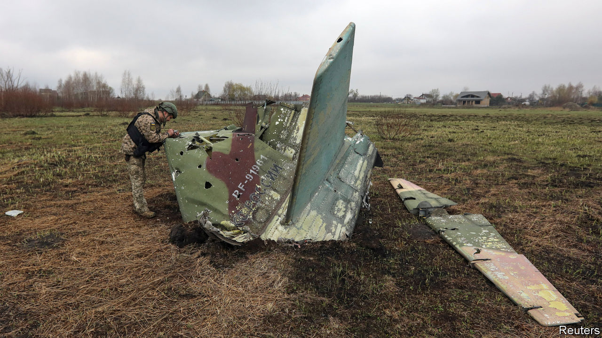

###### The Economist explains

# Has the Ukraine war killed off the ground-attack aircraft? 

##### Russia’s close-air support jets have been decimated 

 

> Nov 1st 2022 

OLD-FASHIONED AIRPOWER has kept a low profile in the conflict in Ukraine, eclipsed by the kamikaze drones and cruise missiles used by both sides. When the Russian air force appeared to step up its activity inside Ukrainian airspace in September, its losses increased sharply. Close-air support (CAS) aircraft have fared particularly badly, raising questions about the future of these planes and the prospect of sending similar American jets to Ukraine.

CAS aircraft support ground troops and fire upon battlefield targets as they appear, rather than carrying out pre-planned bombing raids. Russia’s Su-25 Frogfoot, for example, is designed to fly low and slow, striking ground targets with cannons, rockets and missiles. It is a direct successor to the Soviet Union’s armoured Ilyushin II-2 Shturmovik, which devastated German Panzer units in the second world war. 

Flying so close to the enemy puts CAS aircraft in harm’s way, requiring special protection. The Su-25 is armoured along its belly and sides and carries flares to act as decoys for heat-seeking missiles. In recent months Su-25 pilots, and Ukrainian helicopter pilots, have taken to “” rockets, lobbing them blindly at targets from long range, to avoid exposure to enemy fire. Even so, casualties have been heavy. The biggest danger for the Russian CAS aircraft seems to be small, shoulder-fired anti-aircraft missiles such as the American-supplied Stinger, which are now .

Before the war began Russia reportedly had a fleet of 192 Su-25s. According to Oryx, a Dutch team of independent analysts tracking verified Russian losses, the air force has lost at least 23 Su-25s so far—over one-third of all Russia’s combat aircraft casualties. Unverified reports suggest there are more. Ukrainian sources claim that at least 15 additional Su-25s were shot down in September and October.

The rate of losses suggests CAS aircraft might have had their day. This is bad news for fans of America’s A-10 Thunderbolt II, better known as the Warthog, an iconic jet which has a curiously vocal following. A more extreme CAS machine than the Su-25, the armoured Warthog has been  a giant Gatling gun with wings. An internet meme (“BRRRT”) is based on the sound of its tank-busting cannon spitting out 65 rounds per second. 

The war in Ukraine had looked like the ideal showcase for the Warthog, with many calls to transfer some of America’s fleet to support the Ukrainian forces. Alexander Gorgan, a Ukrainian businessman, infantry officer and Warthog enthusiast, even set up a training facility on the outskirts of Kyiv for Ukrainian pilots to learn to fly the aircraft.

But many analysts, and the US Air Force, remain deeply sceptical that Warthogs could survive against advanced anti-aircraft defences. For years the US Air Force has attempted to retire the Warthog fleet. America has so far declined to send jets of any type to Ukraine, in part for fear of escalation. An adviser to Ukraine’s minister of defence made it clear that they would prefer F-16s, a multi-role combat jet, to Warthogs. These can be used for air-to-air combat and intercepting drones and cruise missiles, as well as strike missions.

The heavy casualties among Russian ground-attack aircraft may end the argument. Increasingly, air strikes can only be safely carried out from long range, and the days of aircraft flying overhead to shoot targets on the ground from close range seem to be over—at least on battlefields where both sides have copious air defence systems. Modern guided weapons may not yet have eliminated ground tanks, but the flying tank is on its way out. ■

