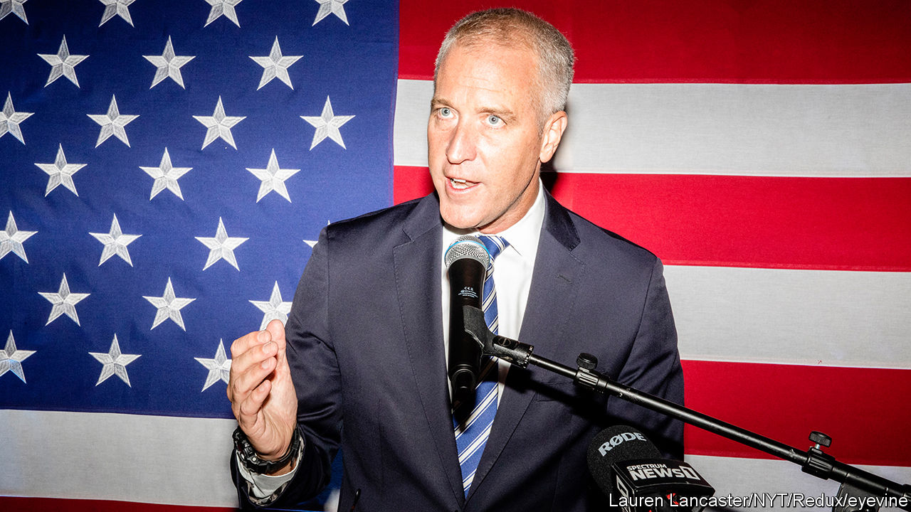

###### The Economist explains

# Why blue New York might turn redder in the midterms 

##### Several of the state’s congressional districts are uncomfortably competitive for Democrats 

 

> Nov 2nd 2022 


THE RACE for New York’s 17th congressional district, in the Hudson Valley, a mostly suburban area north of New York City, is one of the most closely contested in America’s . Republicans are tipped to take the House of Representatives; to do so they only need to gain five seats. One of those may be New York’s 17th. , a non-partisan newsletter, recently changed its assessment of the 17th district from “Lean Democrat” to “Toss-up”. A loss for Sean Patrick Maloney (pictured), who is running there and who happens to be the head of the Democratic Congressional Campaign Committee, the body that raises funds and runs campaigns in marginal seats, could be part of a red wave in New York. Even though Democrats outnumber Republicans by more than two to one in the state, nine of New York’s 26 congressional seats are battlegrounds. “To have that many is really shocking,” says a top Democratic strategist. 

New York’s state Democrats helped to create the . In an attempt to add more Democratic congressional members to the state’s roster, they redrew district maps, using a process that New York’s top court later ruled unconstitutional. A court-appointed official was then put in charge of the redistricting process. The new borders meant that victory was no longer certain for many Democrats. Mr Maloney, for instance, no longer lives in the district he has represented for a decade. Instead of running in the redrawn 18th, he decided to compete in the neighbouring 17th, which is bluer but where he is not as well known. So far the race has been anything but easy. Republicans have spent millions of dollars to try to unseat the fellow whose job it is to keep the House Democratic. 

Other districts, including some New York City suburbs in the Hudson Valley and on Long Island, may turn deepest “ruby red”, as one strategist put it. Democrats who focussed their messaging on national issues may have miscalculated. They thought they would win “if they just shouted about abortion, and about Trump and January 6th”, says Jessica Proud, a state Republican Party spokesperson. It suggested that they were out of touch with what was being discussed at dinner tables, such as the cost of groceries and fuel, and worries about crime. Another problem weighing on Democrats’ chances is the lack of love for President Joe Biden in some corners, even among Democrat voters.

Furthermore, much of the state does not lean as far left as Brooklyn. Many Democrats, especially in upstate New York, are fairly conservative. The district encompassing New York City’s Staten Island has switched from Republican to Democrat and back again over the past three cycles. The 17th has swung from supporting Donald Trump, the former president, in 2016 to going big for President Biden in 2020. Mr Maloney says these midterms are one the closest he has ever seen. “We’re running uphill, and we’re doing well,” he says of the 39 frontline races across the country. A senior Democratic strategist is more pessimistic, especially about a possible red wave in New York. “It looks awful,” he says. “I can’t sugarcoat that.” ■

