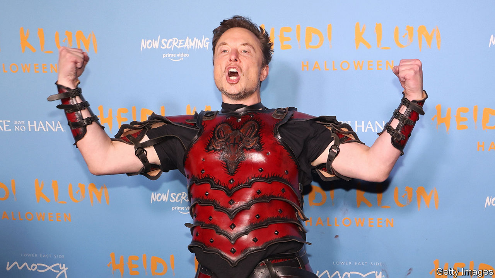

###### The world this week

# Business 

#####  

 

> Nov 3rd 2022 

After months of prevarication and legal limbo,  completed his takeover of  and promptly ousted the chief executive, the chief financial officer, the head of policy and the entire board of directors. Mr Musk had taken issue with senior management, blaming them for misleading him over the number of fake accounts on the platform. As interim CEO he plans big changes, such as to the “current lords and peasants system” for verifying blue-tick marks. Marking a sharp deviation from the company’s platitude of enabling “healthy conversation”, Mr Musk tweeted: “Twitter speaks to the inner masochist in all of us.”

Get real

 share price was battered for several days after the company revealed another big loss at the division developing the “metaverse” and warned of further losses to come. With its share price now down by 75% since the start of the year, some big investors are reportedly furious at Meta’s emphasis on building worlds of virtual reality, but, as Mark Zuckerberg has majority control, there is little they can do. 

Another casualty of the rout in tech stocks, , saw its market capitalisation fall below $1trn for the first time since 2020 after it issued a disappointing sales forecast. The company’s share price is back to where it was around the start of the pandemic.

The  raised its benchmark interest rate by three-quarters of a percentage point for the fourth consecutive time, taking it to a range of between 3.75% and 4%. Markets looked for signals from the central bank about when it might ease the pace of increases. Jerome Powell, the Fed’s chairman, hinted that the next rate rise may not be so large, but warned that the “ultimate level of interest rates will be higher than expected”. Stockmarkets swooned. 

The  raised its main interest rate by three-quarters of a percentage point to 3%. It is the biggest single increase the central bank has made to the rate since 1989. The British government will present a plan on November 17th that is intended to plug a gaping fiscal hole in the public purse with a combination of tax rises and spending cuts. 

Annual inflation in the  hit another record in October, of 10.7%. In Germany consumer prices were up by 11.6%, year on year. Although the country unexpectedly avoided an economic contraction in the second quarter (GDP rose by 0.3% on the previous quarter) its economy is expected to shrink in the final three months of 2022. The  recently raised its key interest rate by another three-quarters of a percentage point, to 1.5%, but it softened its guidance on further increases, a nod to concerns over the economic impact of the fast pace of tightening. 

The world’s biggest  reported eye-watering profits for the third quarter. ExxonMobil’s $19.7bn net income was its best ever. BP’s underlying profit more than doubled, year on year, to $8.2bn. Chevron’s profit of $11.2bn and Shell’s of $9.5bn were the second-highest ever at both companies. Saudi Aramco dwarfed them all with a net profit of $42.4bn. The companies’ riches have prompted more calls in the West to impose windfall taxes. Joe Biden accused America’s oil giants of “profiteering” from the war in Ukraine, and warned of a potential tax on “excess” profits. 

CVS, America’s biggest chain of pharmacies, and Walgreens, a rival, each agreed to pay $5bn to settle claims from states and local municipalities related to the sale of . Walmart was reported to have agreed to a $3bn settlement. Around 700,000 people have died in America over 20 years from overdosing on the painkillers. 

There was more evidence of the rebound in the airline industry since the pandemic. Despite flying with lower capacity, International Airline Group, which owns , reported that revenue in the third quarter had exceeded that for the same three months in 2019, before covid-19 struck. That is despite continuing restrictions at Heathrow and Asian airports. It also upgraded its forecast of annual profit. 

 was reportedly shifting production away from its main hub in China to other parts of the country because of a covid-19 outbreak. Workers at the Zhengzhou factory, which assembles the iPhone, were seen fleeing the site. They had been quarantined for several weeks. It is not clear how production of the iPhone and other devices will be affected ahead of the Christmas season. 

A judge in Washington blockedtakeover of . The Justice Department, which brought the case, argued that a merger of the two publishing houses would reduce competition in the rights for bestselling books. It’s not the final chapter. Penguin is to appeal against the ruling. 

The watcher

 launched a cheaper subscription plan that includes advertisements for the first time in the films and programmes it streams. It hopes this will entice more subscribers as well as provide it with a new source of lucrative revenue. Some content will not be available, as studios are still negotiating rights, and waiting to see if Netflix’s cheaper plan proves to be a hit.

