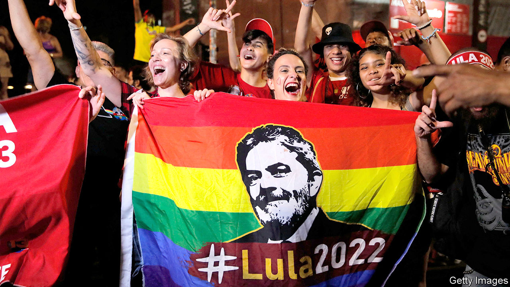
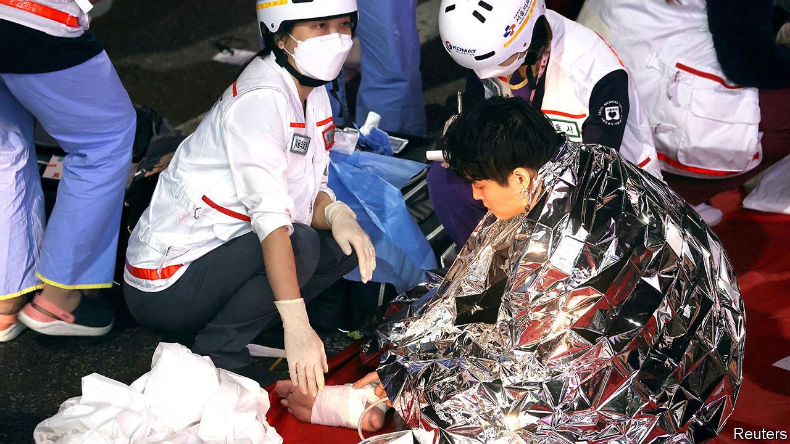

###### The world this week

# Politics 

#####  

 

> Nov 3rd 2022 

, a leftist former president, won  election, beating Jair Bolsonaro, the populist right-wing incumbent. Lula, as he is known, won 50.9% of the votes to Mr Bolsonaro’s 49.1%, the narrowest winning margin since Brazil’s return to democracy in the 1980s. After the result was declared, Mr Bolsonaro refused to speak publicly for 45 hours. He eventually gave a two-minute speech and said he would comply with the constitution. He also asked supporters who had taken to the streets to stop blocking roads with lorries. Although Mr Bolsonaro did not explicitly concede, his chief of staff said that the transition of power would proceed smoothly.

,  longest-serving prime minister, seemed to be on track to return to office after a parliamentary election. His bloc of religious and right-wing parties was set to take 62 to 65 of the 120 seats in the Knesset, Israel’s parliament.

An end to war

 and the leaders of the rebel region of Tigray agreed to stop fighting, offering hope of an end to a two-year civil war that has taken thousands of lives and starved millions of people under blockade in Tigray. In talks mediated by the African Union the two sides also agreed to a disarmament plan and to allow the flow of humanitarian aid.

Twin bombings in  capital, Mogadishu, killed at least 100 people in an attack claimed by , a jihadist group affiliated to al-Qaeda. In recent weeks government forces have captured ten major towns from al-Shabab in an offensive supported by clan militias.

government slashed public spending, as it tries to contain a debt crisis that has caused interest rates to soar and its currency to sink. It is in talks with the IMF over a rescue package.

 arrested dozens of people accused of preparing anti-government protests coinciding with the COP27 environmental summit, which starts on November 6th. 

Rishi Sunak, Britain’s new prime minister, said he would attend the  , reversing an earlier decision not to go because he was too busy. In his appointments to government jobs, Mr Sunak demoted the status of the minister for climate policies. Tackling concerns that he is less committed to reducing emissions than Boris Johnson was, Mr Sunak said: “There is no long-term prosperity without action on climate change.” 

 home secretary, Suella Braverman, faced more controversy over immigration. Ms Braverman referred to migrants who  illegally as an “invasion”, as figures revealed that 40,000 have made the dangerous trip so far this year. That is already 40% more than in all of 2021, and up from 300 in 2018. Without directly criticising Ms Braverman, the immigration minister said words surrounding the issue should be chosen “very carefully”. A processing centre for migrants was petrol-bombed; the facility is meant to detain 1,000 people but was holding four times that many. 

Russia again pounded  cities with missiles and kamikaze drones, apparently aiming for power stations and . Ukraine said it had managed to shoot down most of the incoming bombs, and had quickly repaired much of the damage from those that had landed.

Russia rejoined a deal backed by the UN that allows for the safe transport of  from ports on the Black Sea, having briefly suspended its participation when some of its navy ships were damaged by explosions in Sevastopol. Russia blamed Ukraine for the attack, but says it has received guarantees that the grain-transport safe-zone will not be used for military gain. Turkey brokered talks between both sides. 

 general election returned the centre-left to power, a relief for , the prime minister. Ms Frederiksen called the election amid growing criticism of an illegal cull of mink in 2020 that was intended to stop covid-19 transmissions but which also devastated the country’s important mink industry. Her Social Democrats got the most support in 20 years at the polls. Ms Frederiksen has said she wants to cobble together a broad governing coalition, possibly bringing in the Moderate party. 

 


An evening out to celebrate Halloween ended in tragedy in , the capital of South Korea. More than 150 people were killed in a crush in a small alleyway, caused by overcrowding and a lack of planning and police control. Yoon Suk-yeol, the president, has promised a full inquiry.

Tragedy also struck in  western state of Gujarat, when a newly refurbished footbridge collapsed, plunging over 130 people to their deaths in the river below. The state government pointed the finger at local officials and private contractors responsible for renovating the structure. 

Mutual hostilities between the Koreas continued, with  launching at least 23 missiles, including one that crossed the maritime border between the countries for the first time since the Korean war of 1950-53.  retaliated by firing three missiles north over the line. The North says it was provoked into action by joint American-South Korean military drills. 

A man was charged with trying to kidnap , the speaker of America’s House of Representatives, from her home in San Francisco shortly ahead of the midterm elections. Mrs Pelosi was in Washington at the time, but the intruder attacked her husband with a hammer, fracturing his skull. The suspect is a far-right conspiracy theorist. 

America’s Supreme Court heard challenges to race-based  at Harvard and the University of North Carolina. The tough questioning from the conservative majority on the court suggests that it will overturn 44 years of precedent in one of the big planks of affirmative action when it rules on the case next year. 

Taxing times

The chief justice of the Supreme Court, John Roberts, issued an order that temporarily stops the House Ways and Means Committee from obtaining  until the matter is taken up by the court, which will be after the midterms. Mr Trump had asked the court to intervene ahead of a deadline by which the Treasury Department would have been compelled to provide the committee with his tax records, which he stubbornly refuses to make public. 

