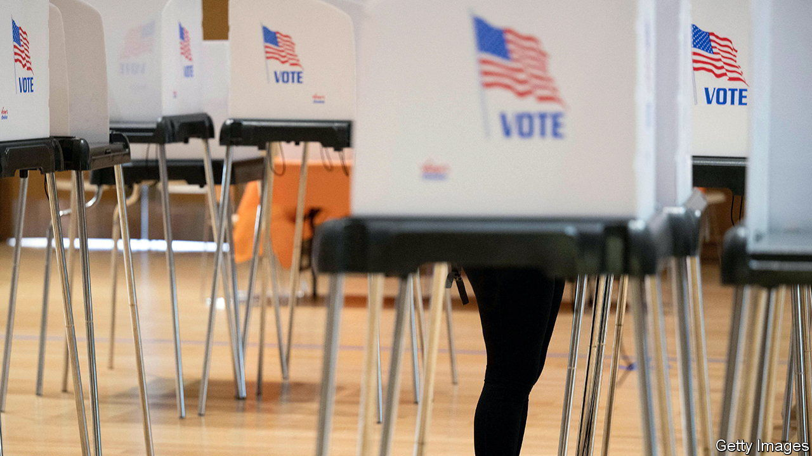
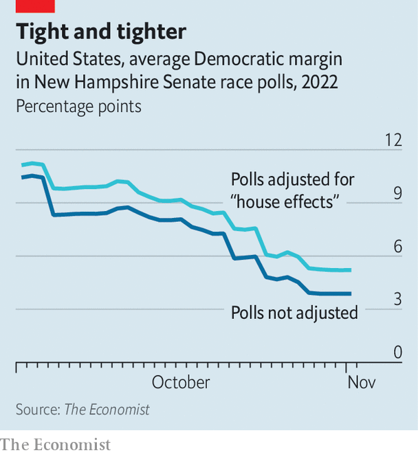

###### Midterm maths

# Are Democrats’ chances being underplayed? 

##### How our poll-of-polls is dealing with a bunch of Republican-aligned surveys 

 

> Nov 3rd 2022 


For the past two months, Midterm maths has been battling bias in polls. More often we have looked at potential errors that, like in 2016 and 2020, would push surveys to overestimate support for Democrats. That is the misfire most observers are worried about. After all, little would change in the Senate if the party won 52 seats, up from the 50 they hold today. But if the Democrats win only 47 or 48, the federal government would look very different.

Yet what if polls are underestimating support for the Democrats? Many surveys published in the closing weeks of this midterm campaign have come from firms that are either explicitly affiliated with Republican clients or simply publish numbers that are favourable to the party—what pollsters call a “house effect”. According to our poll-of-polls in New Hampshire’s senate race, for example, all seven polls released since October 1st were conducted by firms that we think are publishing numbers that are overly favourable to Republicans.

 


Like a fine craft beer, the secret to a good poll-of-polls is in how the ingredients are blended together. (A mash that is too cold will be dry; too hot, and it will taste too much of bread.) The model that generates our polls-of-polls makes three adjustments for the predicted bias of a polling firm. The first is based on a pollster’s historical record. We compare each firm’s accuracy to that of pollsters who released surveys in the same or similar races. If a firm is more favourable to either Democrats or Republicans in one year, they tend to overestimate support for the same party in the next election cycle too. 

By this measure, five of the seven pollsters who have surveyed New Hampshire’s Senate race since October 1st have overestimated support for Republicans in the past. One example is Emerson College, a prominent firm that releases surveys of races all around the country. In elections from 2000 through 2020, our model finds Emerson College’s polls overestimated support for Republican candidates for office by one percentage point, compared with the average of pollsters that surveyed the same race. So we moved their polls this year one point toward the Democrats.


The second adjustment takes into account whether a poll has been conducted for or was released by a partisan group or candidate. We use a statistical model to compare the historical bias of non-partisan polls with those associated with Democratic or Republican clients, after controlling for the firm-level biases we calculated in the first step. A poll conducted for a partisan candidate or organisation overestimates the corresponding party’s vote margin by about 6.6 points. If we input into our poll-of-polls a partisan Republican poll showing a Democrat down by seven points, in other words, the algorithm adjusts the survey to see a tied race.

Finally, our model assesses whether a pollster has released polls that are still biased after controlling for the above sources of error—our so-called “house effect” adjustment. All these adjustments, particularly the last one, make a significant difference to the results of our model. In New Hampshire, for instance, our estimate of the Democrats’ margin in the polls today is 3.1 points if we don’t account for a firm’s house effect or whether a poll is explicitly partisan. When we do, their expected margin rises to 4.3 points.

In other words we spend a lot of time removing empirical bias from polls of firms that lean systematically toward one party. But accounting for past bias can only get us so far. That’s because while being smarter about the polls can help you on the margins, if all the polls are off there is nothing forecasters can do about it.

After all this calculating, our best estimate is that Republicans will win the House comfortably. The Senate is too close to call, though Republicans appear to have an edge there too. Candidate quality (or lack of it) does not seem to be hurting Donald Trump’s party much. ■


