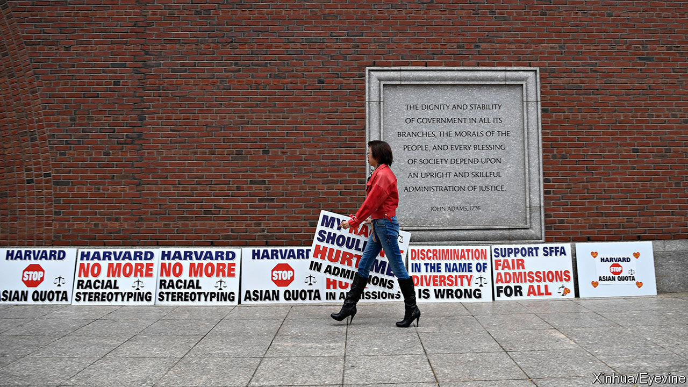

###### Holistic cow

# How affirmative action works in practice 

##### Legacy admissions and athletes also get a big boost 

 

> Nov 3rd 2022 

In a typical year Harvard, a $53bn endowment with a university attached, receives nearly four times as many candidates with perfect grade-point averages as it has places available. It distinguishes between these well-qualified candidates using four criteria: academic achievement, extra-curricular activities, personal qualities and athletic abilities. Admissions officers also need to keep that endowment growing, which means admitting the children of alumni and of big donors. And they strive to create a racially diverse class. The process is opaque but goes by a soothing name: holistic admissions.

Students for Fair Admissions (SFFA), a non-profit organisation, which is a plaintiff in both of the affirmative action cases before the Supreme Court, argues that 51% of Harvard’s class should be Asian-American if academics alone (test scores and grades) were the sole consideration. Harvard’s first-year students for 2021-22 were 53% white and 24% Asian, an increase from previous years but a far cry from 51%. The organisation alleges that Harvard and the University of North Carolina (unc) are discriminating against Asian-Americans.

The court has in the past ruled that race could be considered among other admissions criteria, on the grounds that everyone on campus benefits from a diverse student body. This is what Harvard and unc say they are doing without discriminating against Asian-Americans, an argument supported by an analysis commissioned by Harvard and written by David Card, a Nobel prize-winning economist.

In addition to considering an applicant’s facility with a lacrosse stick or , under holistic admissions universities may take into account what kind of high school a student has come from, looking at factors such as the number of advanced courses offered, average SAT scores, class size and crime levels in the surrounding neighbourhood. Whether the prospective student has ties to the college can matter, too. It helps if a family member has attended the college, is employed there or has donated money to it. Many colleges also consider a student’s ability to pay the fees.

Lots of universities have concerns beyond recruiting the best and brightest. Most, with the exception of the richest institutions, need to worry about financial solvency. This requires generous donors and a certain number of students paying full tuition. “Until someone drops another $2bn in our endowment, we will continue to be need-sensitive,” says Joanne Berger-Sweeney, president of Trinity College, a selective liberal-arts college in Connecticut.

Race may therefore not be the only factor working against Asian-Americans. Legacy students (those with a family member who attended the college) are three to five times more likely to be admitted to highly selective colleges, according to a Harvard study of 30 institutions. A primary legacy—having a parent who attended the institution as an undergraduate—boosts the chances of admission up to 15 times.

Harvard reported that 16% of its class that will graduate in 2025 has at least one parent who attended Harvard. This tends to benefit white students: 19% of white, 15% of Asian, 9% of Hispanic and 6% of black students were legacies. Peter Arcidiacono, an economist at Duke University and expert witness for SFFA, found that when legacy preferences are removed, the number of white admissions falls by about 4%, while the number of black, Hispanic and Asian ones increases by 4-5%. 

Other non-academic factors also come into play. Athletes are four times more likely than non-athletes to be admitted to elite private institutions. In Mr Arcidiacono’s study of Harvard, removing athletic preferences decreased white admissions by 6% and increased the number of Hispanic and Asian students by 7-9%. Children of faculty and staff are also given special consideration. Mr Arcidiacono found that over 43% of white students at Harvard were athletes, legacies, children of faculty or staff, or were the subject of special interest by deans and directors, compared with less than 16% among black, Hispanic and Asian students. Nearly 75% of these white students would have been rejected if they had been treated as white students without status. That’s hardly a meritocracy. But, hey, it’s holistic. ■


