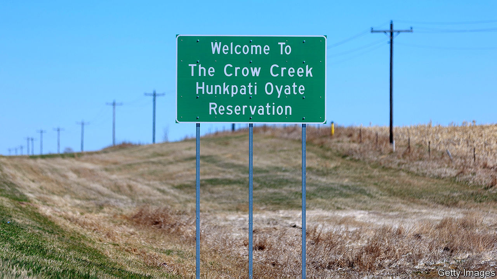

###### 12 years late

# Obamacare’s slow victory 

##### South Dakota may become the latest conservative state to expand Medicaid 

 

> Nov 3rd 2022 

After returning home to the prairie from serving overseas in the Marines, Peter Lengkeek began suffering from ptsd. Struggling to cope he became addicted to alcohol, meth and sex. The Indian Health Service (IHS), unable to offer him proper medical care, ushered him to a hospital off the reservation. Since his job provided no insurance and he was ineligible for Medicaid he was soon saddled with $40,000 in medical bills and a terrible credit history.

Today Mr Lengkeek is the chairman of the Hunkpati tribe on Crow Creek reservation, 160 miles west of Sioux Falls, South Dakota. Life expectancy for a man on this reservation is just 45 years, nearly 30 years below the national average. The county has both the lowest median household income and the highest suicide rate in the country. Addiction, diabetes and heart disease are rampant. Covid-19 killed one in every six tribe members. 

Over a decade ago the Affordable Care Act aimed to help those like Mr Lengkeek caught in the “coverage gap”, who found themselves unqualified for Medicare or Medicaid but unable to afford private insurance. The federal government vowed to pay at least 90% of the costs of expanding Medicaid, a health-care programme for the poor. But when the Supreme Court gave individual states the right to refuse the scheme many did. Republicans feared federal intervention and bemoaned big welfare spending.

For years the national party was relentless in its efforts to “repeal and replace” Obamacare. But when Barack Obama left office Medicaid expansion gradually became popular with voters. In six states—most recently Missouri and Oklahoma—citizens voted to expand it when their legislatures would not. As of early 2022 as many as 21m Americans had gained coverage thanks to Medicaid expansion. South Dakota, a beacon of conservatism governed by Trump devotee Kristi Noem, is one of just a dozen states still holding out.

That could change when South Dakotans cast their votes on a referendum on the issue next week. More than 40,000 South Dakotans would qualify. The state’s big hospitals and the farmers’ union both support the change. They reckon that more federal dollars would prop up struggling rural clinics and allow the IHS, which is underfunded, to offer better preventive care. Extending Medicaid would help farmers and ranchers, who pay pricey premiums because of the risky nature of their work, see doctors when crops are thin or diesel is expensive. “Jesus would be doing this,” reckons Lynn Marie Welbig, a nun from Dell Rapids.

What polling there is suggests that voters support adding Medicaid expansion to the state’s constitution. A fierce campaign has made that more likely, but so has the opposition’s lacklustre efforts. Rather than fighting the initiative head-on they campaigned to make the ballot measure itself tougher to pass. The disheartened opponents of Medicaid expansion have raised about $4,000. The proponents have raked in over $4m.

Just two other states—Florida and Wyoming—could still expand Medicaid by direct vote, though not this year. The other holdout states do not allow citizens to propose ballot measures. But amid a pandemic that highlighted the costs of underlying maladies, President Joe Biden’s administration tempted holdout states with even sweeter federal matching rates. Some Republicans have since had a change of heart. After years of resistance North Carolina lawmakers nearly expanded Medicaid this past spring. A Republican political operative in Georgia suggested that Brian Kemp, the governor, “steal the issue” from Democrats by expanding Medicaid. Alabama’s former governor, who refused to expand Medicaid while in office, is nudging his successor to do so. 

Back in South Dakota Mr Lengkeek is furiously trying to get members of his tribe registered to vote before the midterm elections on November 8th. That is unusual. Having been disappointed by the federal government’s empty promises in the past, the Hunkpati tribe usually stays far from politics. “This time is different,” the former Marine asserts. “Expanding Medicaid would give life to my people.”■


