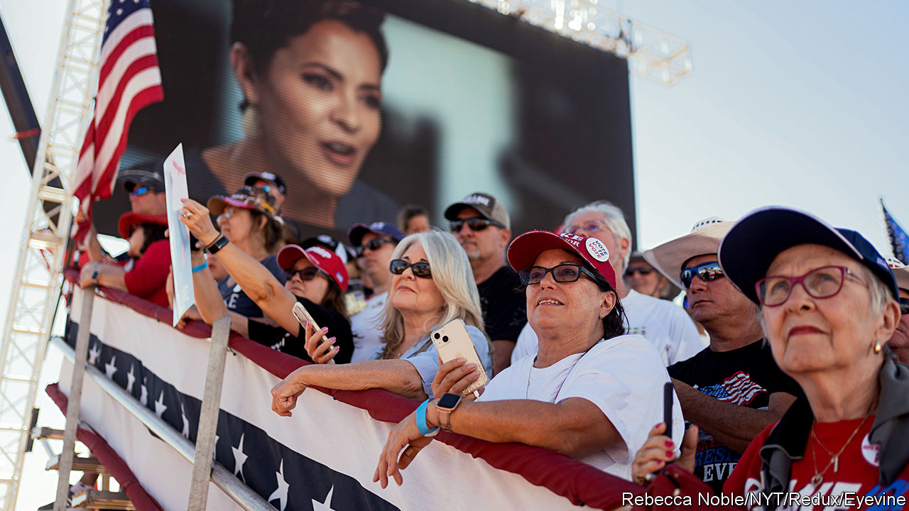

###### Flush money

# Spending in America’s midterms is breaking records 

##### That is partly because Google and Meta are trying to be virtuous 

 

> Nov 3rd 2022 


IN 1952 DWIGHT EISENHOWER became the first politician to mount an advertising campaign on television. His opponent, Adlai Stevenson, was critical of the strategy. “The idea that you can merchandise candidates for high office like breakfast cereal”, he complained, “is the ultimate indignity to the democratic process.” In the end, it was Stevenson who suffered the indignity of losing to Eisenhower, twice. Today “merchandising candidates” is called campaigning and political advertising a massive business. This year will see record spending for a midterm election. AdImpact, a research firm, forecasts that $9.7bn will be spent, 144% more than in 2018. 

Why the soaring spending? As Democrats and Republicans duke it out for control of Congress ahead of the election on November 8th, “every race is important, because it could be the tipping point of one party having control” in Washington, DC, says Erika Franklin Fowler, a professor and director of the Wesleyan Media Project, which tracks political advertising. Spending on Senate and House campaigns will be 136% and 60% higher, respectively, than in 2018, according to AdImpact’s forecasts; spending on gubernatorial races will double. Political advertising will contribute around 4% to the revenues of American media companies this year, reckons GroupM, an advertising firm. 


Four of the most expensive House primaries of all time have occurred this year. State candidates for secretary of state, a once-obscure office that helps oversee elections, are raising record sums. Since 2020 more states have offered early voting, and that increases the amount that candidates spend in order to reach voters. 

Watching the flow of money reveals several things about how America is changing. One is where the battlegrounds are. Spending in Arizona, Georgia, Nevada and Pennsylvania, four tight races, will each exceed $200m this cycle; in 2018, only two states pushed past the $100m mark. For the first time in decades, Florida, the consummate swing state, is occupying a less prominent role, as Republican candidates enjoy sizeable leads and the number of registered Republican voters has been rising. “A lot of the media owners in Florida, which are used to seeing money come in by the bushels, have been shocked that more money isn’t coming in,” says Steve Passwaiter of Kantar, a research firm. 

Much of this has to do with how uncompetitive the governor’s race is. Whereas the past three in Florida were decided by about a percentage point or less, this time Ron DeSantis, the incumbent, is running far ahead of his Democratic rival, Charlie Crist, with polls showing Mr DeSantis leading by ten points. Mr DeSantis recently broke a fundraising record, attracting more than $180m through October 14th, more than any governor in history and six-and-a-half times that of Mr Crist. The race for the Senate, which pits the Cuban-American incumbent, Marco Rubio, against Val Demings, a former police chief in Orlando, is not proving to be as competitive as expected either, with Mr Rubio leading by seven points.

The second shift is the amount of money flooding across state lines from both small and large donors. More races have become nationalised, and that is changing how candidates advertise. In Pennsylvania, for example, 88% of advertising on Facebook by the Republican Senate candidate, Mehmet Oz, is targeted outside the state, with the intention of boosting donations. Software, such as ActBlue for Democrats and WinRed for Republicans, has made it easier for smaller donors to contribute. This year donors contributing $200 or less have given $1.1bn to candidates, about twice as much as in 2018. 

Large donors have been piling in too, boosted by growing fortunes during the pandemic, as the stockmarket rose. Up to the end of July, billionaires contributed $675m ($360m to Republicans and $300m to Democrats), accounting for more than 10% of all federal political spending, according to analysis by usa Today. There is a “biggy” backing effect, with a billionaire’s contributions prompting other mega-donors to pile in. For example, J.B. Pritzker, the incumbent Democratic governor in Illinois who is himself a billionaire, has self-financed his campaign with more than $132m, prompting mega-gifts to the Republicans running against him in what is likely to end up among the most expensive gubernatorial races ever.

Third, political advertising shows how Americans’ media habits are evolving. Just as 2012 will be remembered as the “social media” election, because candidates used social networks to reach voters, 2022 will be remembered as the “streaming” election. About $1.4bn will be spent on political advertising on internet-connected TVs and streaming, ten times what was spent in 2018. Half of TV viewers now watch four or more services, and advertisers need to reach them wherever they are in the fractured marketplace, says Mike Schneider of Bully Pulpit Interactive, an agency. 

Advertising this way has advantages. Connected TV and streaming allow for “micro-targeting” of viewers down to the household level, which is not possible through local broadcast television, where media markets are much larger. This is especially advantageous for candidates running for local office who do not want to do a large media buy and need to advertise to smaller and more precise audience, but it is also attractive to campaigns targeting users in greater detail than Facebook and YouTube now allow.

After it was revealed that Russians used Facebook to buy ads in roubles and stoke division ahead of the 2016 election, Meta (Facebook’s parent company) and YouTube (owned by Google) have become more restrictive in what sort of targeting they allow political advertisers to do. For example, neither platform allows campaigns to target adverts based on the political affiliation of users or what political content they engage with. They also offer searchable ad “libraries” where people can see the adverts that the platforms have hosted. Other platforms, such as TikTok and Twitter, have decided that political advertising is not worth the potential reputational risk and do not accept it. 

Ironically, Facebook’s and YouTube’s strictness has caused money to flow to platforms without strong safeguards. By restricting targeting, Facebook and YouTube have sparked “frustration” among advertisers, who are taking money away from them and putting them toward newer connected TV and streaming firms, says Grace Briscoe of Basis Technologies, a marketing firm. These newer players lack the same strict standards. According to a report by researchers at the Centre on Technology Policy at the University of North Carolina at Chapel Hill, around half of the 61 companies they surveyed lacked an explicit political ads policy, and only half of them barred misinformation. 

After the midterms, people are sure to start asking how voters were reached differently this cycle, and whether newer advertising platforms are adequately transparent about who is seeing which adverts and how they are targeted. Money may follow eyeballs, as they say in advertising circles, but scrutiny does too. ■


