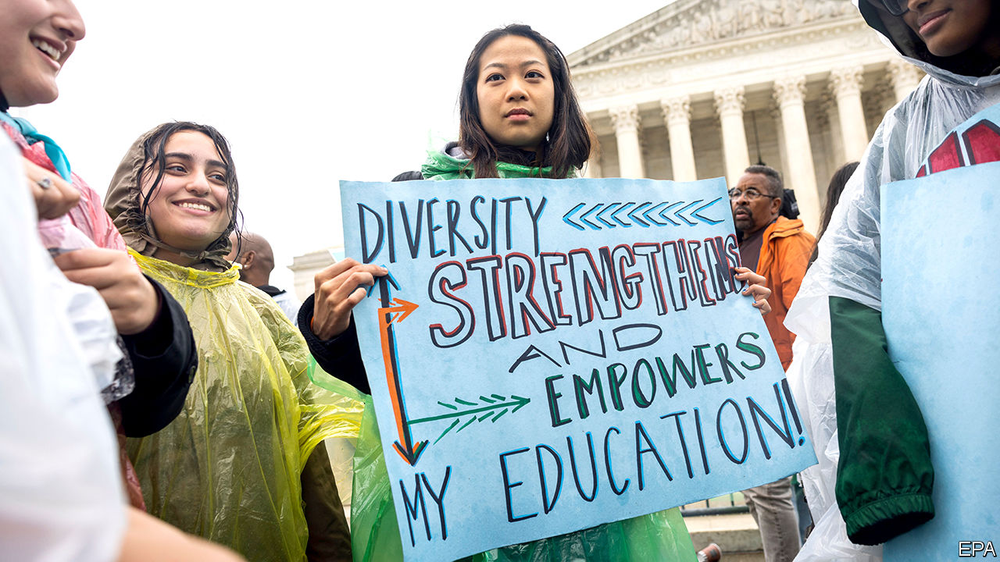

###### Off colour

# The Supreme Court seems ready to toss out affirmative action 

##### Race-conscious admissions policies have vocal but dwindling support 

 

> Nov 1st 2022 

“FIVE VOTES”, Justice William Brennan perennially told his law clerks, “can do anything around here.” When the Supreme Court first blessed limited racial preferences in university admissions in 1978, the margin was 5-4. In decided in 2003, the same count upheld the University of Michigan law school’s admissions policy seeking a “critical mass” of under-represented minority applicants. In 2016, another one-vote margin salvaged affirmative action in .

Six years later, with six conservatives on the court, the balance has shifted. All are sceptical of, if not openly hostile to, using racial criteria. In nearly five hours of oral argument on October 31st, challenges to admissions policies at  and the University of North Carolina (UNC) found a receptive audience. The dissenters in 2016—Justices Samuel Alito and Clarence Thomas, along with the chief, John Roberts—seem to have Donald Trump’s three appointees on board to overturn 44 years of precedent. When decisions arrive, probably in the spring, public and private universities alike may no longer be permitted to give preferential treatment to students from certain under-represented groups. Without that licence, both sets of universities say, their pursuit of racial diversity would falter.

The heart of affirmative action came under attack with Justice Thomas’s first question for UNC’s lawyer, Ryan Park. “I’ve heard the word ‘diversity’ quite a few times,” he told Mr Park, “and I don’t have a clue what it means. It seems to mean everything for everyone.” Justice Thomas pooh-poohed the purported benefits of diversity at several points in the hearings. He told Mr Park that parents don’t send children to college “to have fun or feel good” but to “learn physics or chemistry”. Justice Thomas admitted to David Hinojosa, the lawyer representing a group of UNC students, that he might be “tone deaf” about college life today. 

But it was the universities’ admissions procedures—not the goal of diversity itself—that became the prime target for the other five conservatives.  allowed universities to turn to race as an explicit admissions factor only if “race-neutral” means of enhancing diversity—those that do not classify students by race—came up short. Cameron Norris, a lawyer for Students for Fair Admissions (SFFA, the plaintiff behind both cases), noted that Harvard only seriously considered such alternatives in 2017, three years after SFFA sued the school. He said Harvard could achieve nearly as diverse a student body—and become “far less white, wealthy and privileged”—if it eliminated preferences for the children of alumni or big donors. 

Seth Waxman, Harvard’s lawyer, contested this conclusion, arguing that the university could not reach its diversity goals without expressly taking account of students’ race as one factor in the admissions calculus. Harvard “need not blind itself to race” under the law, he said, and needs to keep its eye on applicants’ identities to provide “benefits to the nation”—including enhanced critical thinking, more innovative businesses and a more cohesive military. Mr Waxman parried charges that Harvard discriminates against Asian-American applicants by pointing to the trial court’s conclusion—with testimony from 30 witnesses and “detailed expert analysis”—that no such bias haunts Harvard’s system. 

Elizabeth Prelogar, President Joe Biden’s solicitor general, emphasised the value of affirmative action to the military. “Our armed forces know from hard experience that when we do not have a diverse officer corps that is broadly reflective of a diverse fighting force, our strength and cohesion and military readiness suffer,” she said. Ms Prelogar faced a question from Justice Alito about the government’s shift in position, as Donald Trump’s Department of Justice had opposed Harvard’s policy. But her bracing presentation led Chief Justice Roberts to muse that the court might consider carving America’s service academies—including West Point and the Naval Academy—out of a ruling barring affirmative action. Justice Kagan piggybacked on this. If there is a “very convincing case on behalf of the military”, she said, might there be a case to be made for similar claims for “medical facilities”, “businesses” or other institutions that are “critical to the well-being of this country”?

Chief Justice Roberts asked Patrick Strawbridge, another lawyer for SFFA, whether he was opposed to race-neutral alternatives for reaching demographic goals. Mr Strawbridge replied that measures to expand diversity could be illicit, too, if they were motivated only by race. But he suggested that programmes like the University of Texas’s Top Ten Percent plan (which offers admission to the top decile of every high school in the state) could be kosher if they can be justified by appeals to “socioeconomic” or “geographic”, rather than racial, diversity. 

Conservative lawyers and justices alike distinguished between flat-footed and more nuanced considerations of race. Using a racial check-box as a factor may be highly suspicious, but admissions officers could legitimately consider how students present their racial struggles—or other experiences—in an essay. Mr Waxman found this wanting: race should (potentially) matter for all candidates, not only for those applicants whose racial identity is of “such compelling importance that they write about it”. In another exchange, Justice Kavanaugh asked Mr Norris if preferences for descendants of slaves may be used. No, he said, as such considerations are “still problematic under this court’s precedents”. 

Two hours into the marathon hearings, Justice Kagan asked Ms Prelogar whether a “committed originalist” like most members of the conservative majority would find the 14th Amendment’s equal-protection clause to bar race-consciousness. There is “nothing in history” to support a principle of race-blindness in the amendments passed in the wake of the Civil War, she said. They were specifically designed “to bring African-American citizens to a point of equality in our society”. Justice Ketanji Brown Jackson built on this. Isn’t clear historical evidence necessary, she said, before overruling a long-standing precedent? She also wondered why it would be acceptable to give a boost to a fifth-generation North Carolinian who is a descendant of slave owners but not to a fifth-generation North Carolinian whose ancestors were enslaved.■


