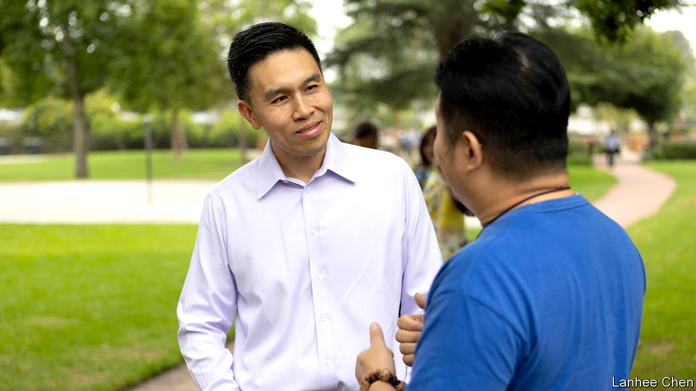

###### The golden mean

# The life and death of California Republicanism 

##### Is there room in the party for a pro-choice moderate who disavows Donald Trump? 

 

> Nov 3rd 2022 


KEVIN BARROT left the Republican Party in 2010. The 32-year-old from Anaheim says he was disheartened by racist reactions to Barack Obama’s presidency. As an Asian man, he wondered if his fellow Republicans felt the same animosity towards him. These days he considers himself an independent. “All Republicans are crazy now,” he says quietly. 

Mr Barrot recently joined a few dozen other voters in a backyard garden just south of  to hear from Lanhee Chen, a Republican running to be California’s next controller, or chief fiscal officer. Mr Chen is a moderate technocrat, a vanishing breed in Republican politics. The son of Taiwanese immigrants, he grew up in southern California, studied at Harvard, advised Mitt Romney during his 2012 presidential campaign, and taught at Stanford University. He supports a woman’s right to an abortion, and recently revealed that he could not bring himself to vote for Donald Trump in 2016 or 2020. 

Mr Chen’s campaign slogan, “watchdog not lapdog”, resonates with voters wondering how billions of dollars splashed out on  and  are being spent. He laments the “policy sclerosis” he believes has gripped the state under Democratic control. Californians are intrigued. He was the top vote-getter in the nonpartisan primary in June. If Mr Chen is victorious on November 8th, he would be the first Republican to win state-wide office since 2006, and the first Republican controller since Ronald Reagan was governor.

But it is unclear whether Mr Chen’s campaign is a relic of the Republican Party’s past or a glimpse of its possible future. Many California Republicans once commonly held positions to the left of the national party. Democrats still laud Arnold Schwarzenegger for championing climate-change legislation when he was governor. Mike Madrid, a veteran Republican consultant, argues that the party began to move away from its big-tent coalition when it doubled down on courting white voters while the state became more diverse. 


Most of the state party’s official platform is national Republicanism distilled: marriage should be between a man and a woman, abortion is immoral and gun control is totalitarian. “California is a cultural vanguard of the country, for better or for worse,” says Mr Madrid, suggesting that Republicans ignore Californian values at their peril. Democrats have controlled both chambers of the state legislature since 1997. Republicans hold just 11 of California’s 53 congressional seats. , a billionaire and long-time Republican, defected to the Democrats to bolster his chances of being elected mayor of Los Angeles. 

Some soul searching is taking place in the party’s top ranks. Jessica Millan Patterson, its chairwoman, bemoans the fact that her predecessors “neglected” black, Hispanic and Asian voters. She envisions a “comeback” focused on broadening her party’s appeal. But as long as Mr Trump remains the party’s standard-bearer, California’s Republicans will find it hard to compete. Some 47% of Californians are registered Democrats. But 67% of Californian voters think it would benefit the country to bring charges against the former president should prosecutors find enough evidence to do so. “He has contributed to an environment in California that makes Republican candidates and Republican ideas unattractive,” says Mr Chen. But were Mr Chen to win, that could cap a good night for California Republicans. , a Bakersfield Republican, is the favourite to become the next Speaker of the House of Representatives should Nancy Pelosi, a San Francisco Democrat, lose her Speaker’s gavel—as looks likely.

Mr Chen says he feels at home in the Republican Party. But he chuckles when asked which of his fellow Republicans he admires. Eventually he names Mr Romney and Glenn Youngkin, the governor of Virginia. Controller is among the least partisan jobs in Californian politics. Still, a victory for Mr Chen may signal to voters like Mr Barrot, who got whiplash from the party’s hard-right turn, that the fever dream of big-tent Republicanism is not dead yet—at least in liberal California.■


