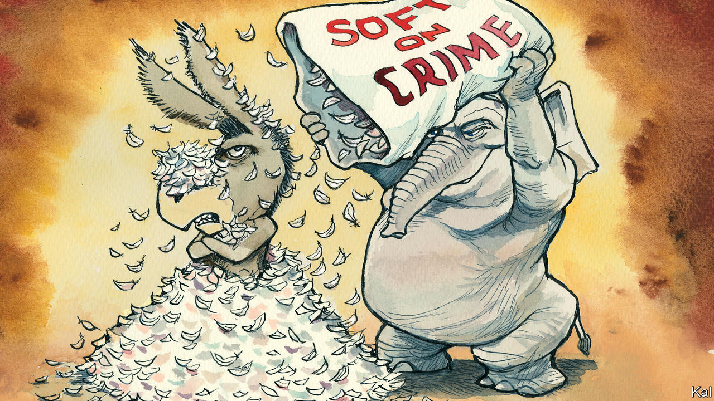

###### Lexington

# What Democrats can learn from the midterm campaigns 

##### Many of them have once again proved insensitive to voters’ fears 

 

> Nov 3rd 2022 


If the Democratic Party could muster the discipline, it would compel prospective candidates to watch a mock presidential debate held by “Saturday Night Live”, a comedy sketch show, 34 years ago. During the skit vice-president George H.W. Bush, played by Dana Carvey, stammers through an incoherent answer to a question about his homeless policy, insisting he does not have enough time to explain as, in obvious panic, he tries to run out the clock. 

At long last the moderator releases him and turns for a rebuttal to the supremely rational Democratic governor of Massachusetts, Michael Dukakis, played by Jon Lovitz. Mr Lovitz shakes his head, raises both hands palms up in a gesture of helplessness, looks into the camera and says, “I can’t believe I’m losing to this guy.”

The Democrats are having another of their I-can’t-believe-I’m-losing-to-this-guy moments. In danger of losing not only their majority in the House but also their one-seat edge in the Senate, they are baffled at how Republican candidates with meagre credentials, extreme positions and fealty to Donald Trump could possibly be popular—and not just in benighted red flyover states but in groovy blue playgrounds like New York and Oregon. Mr Lovitz’s plangent notes echoed down through the years when Nancy Pelosi, the speaker of the House, recently told the , “I cannot believe anybody would vote for these people.”

Yet under almost any circumstances it would be astonishing if the Democrats held onto their flimsy majorities (and they still have a good shot at doing so in the Senate). The party of the serving president has lost seats in 36 of the 39 midterm elections since the Civil War. The most recent exception was the midterm election following the 9/11 attacks. For that reason, this is shaping up as a fairly typical midterm cycle. 

That reality has been obscured for months by another midterm dynamic that is almost as predictable: the party in power tends to talk itself into believing this time things will be different. The Democrats saw two factors disrupting the pattern this year. The Supreme Court struck down a federally protected right to abortion, and Donald Trump hit the campaign trail, reminding most Americans how much they disliked him just as the January 6th committee and a Justice Department investigation into possibly purloined classified documents gave them more reasons to do so.

These developments do matter. Usually in midterms, partisans of the president are apathetic, and many do not turn up to vote, as during the “blue wave” midterm of 2018. This year a large Democratic turnout may limit the party’s losses. But the court’s decision and Mr Trump’s antics, so shocking to Democrats, do not seem to be enough to make Democratic candidates acceptable to most independent voters, let alone many Republicans.

So Democrats have reason to wonder what they are doing wrong. Former President Barack Obama says Democrats can be a “buzzkill”, annoying people with outrage at minor mistakes. Senator Bernie Sanders says Democrats must sharply contrast their economic plan with Republicans’. What is also clear is that Democrats need, once again, to learn from the travails of Mr Dukakis. 

Mr Bush’s campaign tied Mr Dukakis to Willie Horton, a convicted murderer who raped a woman and stabbed her boyfriend while on furlough from a Massachusetts prison. Democrats accused Mr Bush of stoking racism, because Mr Horton was black and his victims white; Mr Dukakis noted he inherited the furlough program from a Republican. They were right, but they failed to address fears of crime or persuade voters that a “Massachusetts liberal”, as Mr Bush branded him, shared their sense of urgency. 


Across the country this fall, Republicans threw Democrats on defence with an advertising blitz focused on crime. They spent $64.5m on such ads in the first three weeks of October alone, one-quarter their total spent on ads in that period, according to CNN. With some types of crime on the rise after Democrats flirted with radical-chic ideas such as defunding the police, it was a predictable attack. But many Democrats were caught flat-footed.

In New York the Republican running for governor, Congressman Lee Zeldin, opposes abortion rights and refused to certify Donald Trump lost in 2020. Yet he closed to within single digits of Kathy Hochul, the Democratic governor, with slashing attacks over crime. In a recent debate, he sounded like a hysterical caller to 911 as he described “people who are afraid of being pushed in front of oncoming subway cars, they’re being stabbed, beaten to death on the street with hammers.” When Ms Hochul responded that “data is still being collected” and “sound policy” beats “sound bites,” she was taking a page from the Dukakis playbook. 

Paging Snake Plissken

In a state where registered Democrats outnumber Republicans more than 2 to 1, Ms Hochul has a margin for error. But the party’s failure to inoculate itself on crime has made the climb steeper for Democrats who have run excellent campaigns in red or purple states, like Tim Ryan, who is running for Senate in Ohio. 

Yes, Republicans are being demagogues. Asked on Fox News about the attack on Ms Pelosi’s husband, Paul, Ronna McDaniel, the party chair, turned her answer into an assault on Democratic laxity. “If this weren’t Paul Pelosi,” she said, “this criminal would probably be out on the street tomorrow.” But Democrats, smart and righteous as they imagine themselves, should not condescend by being astonished that voters could fall for the other guy. Before 2024, they need instead to learn to hold two jostling ideas in their minds at once. They need to recognise that just as Americans would be more open to citizenship for immigrants who entered illegally if the border were secure, they would be more supportive of police reform if they felt the streets were safe. 

In fairness to the real Mr Dukakis, a good man, he did not blame voters for choosing the other guy. “I lost because I ran a lousy campaign,” he said. ■


