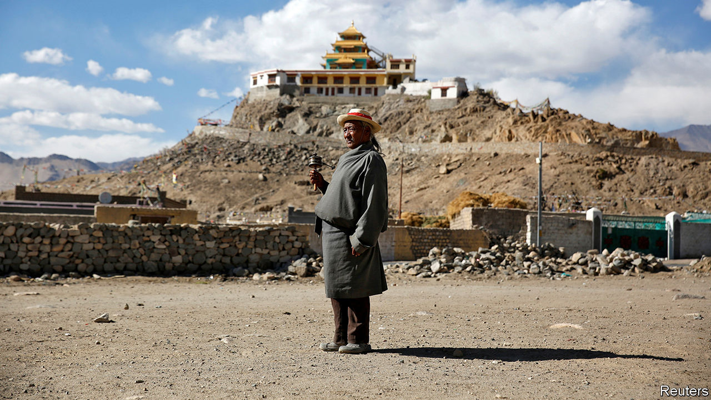
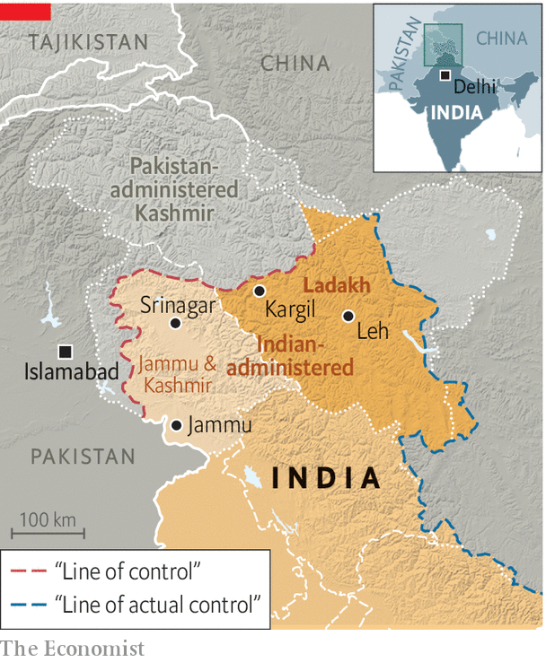

###### Outside in

# A remote corner of India realises it preferred being neglected 

##### Ladakh rejoiced when it was separated from Kashmir. Now it is discovering downsides 

 

> Nov 10th 2022 

LADAKH, a territory at the northern end of India, is so high up in the clouds that those arriving by plane are advised to stay in bed for the first 24 hours, to acclimatise to the thin air. Outside Leh, the main settlement, it is a place of Buddhist monasteries, vast skies and empty expanses scattered over 59,000 sq km of high-altitude desert and mountains. On all sides are towering peaks—the Himalayas, Karakoram, Ladakh and Zanskar—shielding it from China, Pakistan and the rest of India. Before a  between Indian and Chinese forces along the disputed border in 2020, it was a place so remote and so unreal that it was easy to forget it existed. 

That was, for Ladakhis, the problem. Until a few years ago, Ladakh was one of three regions in the state of Jammu and Kashmir, which is home to 12.5m people. But national governments focused on Kashmir, the Muslim-majority, militant-ridden part of the state. Even politicians in Srinagar, the state capital (in the Kashmir region), paid little attention to Ladakh’s 300,000 people. And when the government in Delhi clamped down on the state in the name of fighting terrorists—cutting off all internet, for example—Ladakhis suffered too, locals complained. 

 


In 2019 the Bharatiya Janata Party (BJP), newly re-elected nationally, , turning it into two “union territories” (see map) run directly from Delhi, the national capital. Liberal Indians lamented what they saw as a violation of a constitutional promise of autonomy for the state. Ladakhis, however, rejoiced. They had long demanded separation from the rest of Jammu and Kashmir.

Three years on, they are disappointed. The bureaucrats who govern from Delhi have, if anything, less sense of the place and no more enthusiasm for accommodating local mores than politicians in Srinagar. Moreover, union-territory status means only national elections determine who rules the region. 

Many locals now admit that they overestimated the benefits and underestimated the risks of their new status. “People expected more rights, more representation, more power, better jobs,” says Namgyal (some Ladakhis use only one name), the opposition leader of the Ladakh Autonomous Hill Development Council (LAHDC) in Leh, a relatively powerless local body. 

The central government’s main focus is Ladakh’s long-neglected basic infrastructure, says Tashi Gyalson, a BJP man who heads the Leh chapter of LAHDC. Some administrative wrinkles remain to be ironed out, he says, but the government has expanded water, electricity and road connections in remote areas, hired more doctors and pushed for more sustainable tourism.

But migrant workers from poor states are cheaper, and outside contractors import them, say locals. Meanwhile the central government agencies in charge of improving Ladakh’s infrastructure are doing so with little consultation with residents, says the opposition’s Mr Namgyal. “They will just start work in a village without telling the local councillor, so there will suddenly be people digging up a road and nobody knows why.” 

Ladakhis say they feel overrun by “outsiders” and fear a loss of identity. Business people fret that they are unable to compete with bigger investors from elsewhere in India. Tourism accounts for about half the local economy, but the revised set-up has opened the door to newcomers. As long as Ladakh was part of Jammu and Kashmir, non-residents were barred from buying land. Those laws no longer exist. This year, nearly half a million people visited Leh, compared with 280,000 in 2019. A quarter of a million arrived in June and July alone, straining its infrastructure. Travel agents and taxi drivers are boycotting hotels and restaurants owned by non-residents. 

With no provincial elections, some disgruntled locals have taken to the streets. Earlier this month groups from both Leh and Muslim-majority Kargil, along the disputed border with Pakistan, organised a joint protest to demand more rights. They want full statehood, a ban on outsiders owning land and jobs reserved for locals. They are unlikely to get their wish. Even if they do, that will not turn the clock back on Ladakh’s relationship with the outside world. For better or worse, the remote mountain plateau is neglected no more. ■

