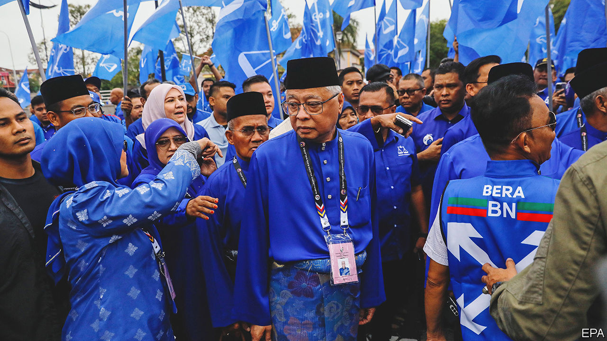
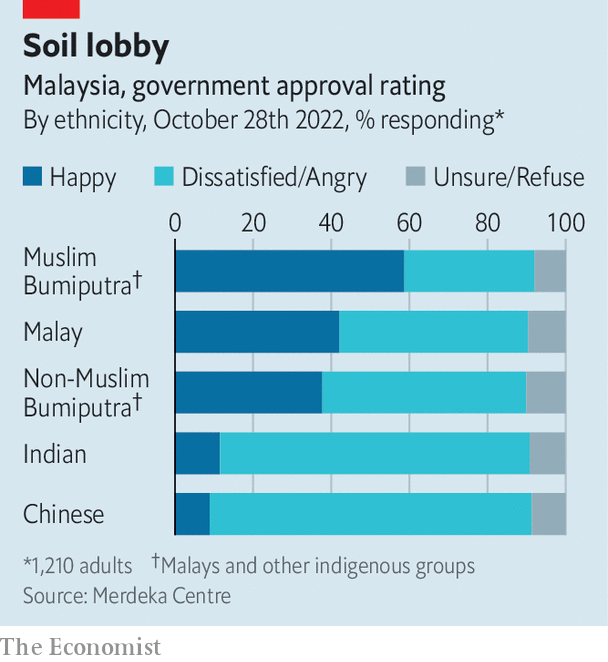

###### Um, maybe

# Malaysia’s grand old party eyes a comeback 

##### The political chaos of the past few years gives UMNO a chance at regaining power 

 

> Nov 10th 2022 

ZAMBRY ABDUL KADIR is giving his fifth pep talk of the day. A dozen men and women crowd around a table in the humid kitchen of a home in Lekir, a village in the western Malaysian seat of Lumut where Mr Zambry is standing for parliament. At his side is a whiteboard on which an aide has scrawled the electoral maths: 1,183 votes are up for grabs in this and nearby villages. A solid 583 are already in the bag, according to his ground operation. But more voters can be won over. 

Mr Zambry hopes to score a crucial victory for his party, the United Malays National Organisation (UMNO), which held power continuously for 61 years until 2018, when it was booted out after a corruption megascandal that implicated the prime minister at the time, Najib Razak. An opposition coalition rode to power in elections that year. But it soon  amid infighting at the top, ushering in an era of rolling political chaos. 

In 2020 UMNO lent its support to a new coalition, but stayed in the background. Last year it installed  when that arrangement, too, proved unviable. But the new man, Ismail Sabri Yaakob (pictured), the country’s third leader in three years, has not been able to tinker much with the cabinet he inherited. Now the grand old party is eyeing a comeback on its own terms, leading a coalition known as Barisan Nasional. Malaysians will decide its fate, and their own, in general elections on November 19th. 

The country might benefit from stability. With 33m people and a median age of 29, it needs many more jobs, especially for youngsters. Last year unemployment among 15- to 24-year-olds rose to 15.6%, the highest level in two decades. Though Malaysia is better off than some of its neighbours, GDP per person, at around $11,300, has been flat since 2014. As in much of the world, the currency has fallen sharply against the dollar, making imports pricier. 

Malaysia is at least enjoying a respectable recovery from the pandemic. The IMF expects growth for the full year to clock in at 5.4%. That explains Mr Ismail Sabri’s decision to call an early election despite the risk of disruption posed by the monsoon. The prime minister is keen to take advantage of “the tailwind of a full economic reopening”, reckons Suhaimi bin Ilias of Maybank Investment Bank. 

That UMNO should so quickly be a contender to take power once more is astounding. Some $4.5bn disappeared from Malaysia’s treasury between 2009 and 2015 on Mr Najib’s watch. Nearly $700m of that haul  into his personal bank account. Millions of dollars of public money were lavished on art, diamonds, a superyacht and other baubles. Mr Najib was found guilty of a litany of crimes, including money-laundering, and sentenced to 12 years in prison. In August the country’s highest court rejected his final appeal and prevented him from campaigning. 

 


UMNO built its dominance on a politics that favours the ethnic Malays and other indigenous groups who together make up 69% of the country and who believe that they deserve privileges at the expense of Chinese (23%) and Indian (7%) Malaysians. Although those privileges tend to enrich the friends of UMNO politicians and bypass the poor, many ordinary Malays seem not to notice (see chart). Meanwhile, much of the non-Malay third of the population hew to the opposition for the sake of dignity as much as for political change. 

But with an electoral system biased towards seats where rural Malays live, other parties, too, must appeal to them. Anwar Ibrahim, the face of the main opposition coalition, known as Pakatan Harapan, is running in a heavily Malay seat in the state of Perak to prove his bona fides and attract media attention. On the campaign trail this month, he watched a display of a Malay martial art, before vowing to the crowd that he would preserve Malay culture. 

One wild card at this year’s election is the admission of a new cohort into the electorate after the voting age was lowered from 21 to 18 last year. The election commission reckons they make up 1.2m of the 5.8m first-time voters in the 21m-strong electorate. Many are attracted by Mr Anwar’s message of change and cleaning up corruption. But the young are also enticed by PAS, an Islamic party that has become the main force in a third front, known as Perikatan Nasional.

Many Muslims, who are 63% of the population, want more Islam in politics. Among them is Muhammad Asyraf, who sells flowers on the side of the road near Petronas Technological University in Perak. He says he wants to see a more openly Islamic state and will vote for PAS “so the people are taken care of, so they are safe and so they do not stray from their religion”. Support among Malay Muslims for  (Islamic law), which PAS endorses but UMNO does not, has risen from 52% in 2011 to 75% today, says Ben Suffian of the Merdeka Centre, a pollster. Though PAS has been a member of the ruling coalition for the past two years, it remained junior to other parties. As its popularity rises, it is eating into UMNO’s share of Malay voters. 

Polls show a tight race with lots of undecided voters. UMNO has been buoyed in the past year with some bellwether . But in recent weeks its coalition’s lead has been dropping as PAS’s group gains ground. No one coalition is likely to be able to command a majority in the 222-seat legislature without help from another. The non-Malays who vote for Mr Anwar’s coalition despise the Islamists of PAS. Still, the possibility that Mr Anwar, an old graduate of UMNO and a perennial prime ministerial hopeful, strikes a deal with his former party cannot be ruled out. Unless that happens, a PAS-UMNO alliance may be on the cards.

For ordinary Malaysians, all this wrangling means that little thought is being given to fixing the country’s problems. Politicians will continue to fear for their own positions instead of asking themselves what Malaysia should look like 20 years from now, sighs one diplomat. There is a chance, then, that voters will look to UMNO and decide that, whatever its faults, it offers stability. That is a basis on which to run a country, but a miserable one. ■

